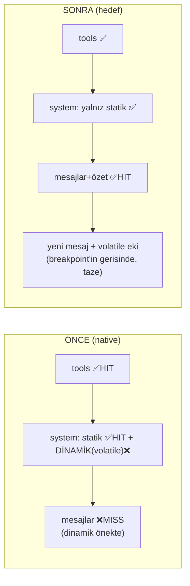

# 50 — Claude Code Cache/Context Paritesi Planı

> **Amaç:** TionSwarm'nun **native sağlayıcı** (anthropic / OpenAI-compat) context "paketini",
> Claude Code'un prompt-cache + compaction mekaniğine yaklaştırmak — **SDK'ya bağımlı
> olmadan** (çok-sağlayıcı, anahtarsız claude-cli, dosya-tabanlı felsefe korunur).
>
> Referanslar: `observed-behavior` (`services/api/promptCacheBreakDetection.ts`,
> `services/compact/{compact,apiMicrocompact,microCompact}.ts`, `services/api/claude.ts`)
> ve `external-agent-oss` (context/cache'i **Claude Agent SDK / native `claude` binary'ye
> devrediyor** — kendi cache/compaction kodu yok). Bağlam: `_Docs\17-TOKEN-OPTIMIZASYON.md`.

## 0. Tespit — mevcut durum (kod doğrulandı 2026-07-04)

| Yol | Cache breakpoint'leri | Gerçek durum |
|-----|----------------------|--------------|
| **claude-cli** | `--resume` warm prefix (System + ilk N mesaj server-side) | **Zaten Claude Code-benzeri.** Dinamik bağlam bilinçli olarak **son kullanıcı mesajına** dokunuyor (`claudecli_session.go withDynamic(lastUserText…)`) → sıcak prefix bozulmuyor. |
| **anthropic** (native) | 3 breakpoint: son tool, statik System, **son mesajda rolling history** (`anthropic.go` `systemField`/`attachHistoryBreakpoint`), 1h TTL | Tools + statik System **HIT** alıyor. **Ama** volatile Dinamik, `systemField`'de statik System'in ardında (yani tools+mesajların ÖNÜNDE `system` alanında) → **history breakpoint her tur ISKALIYOR** (prefix dinamikte ayrışıyor). Rolling history breakpoint pratikte **ölü**. |
| **OpenAI-compat** (minimax/openrouter) | statik System breakpoint + transcript-tail breakpoint (`minimax.go buildSystemMessage`/`attachHistoryBreakpoint`) | Aynı sorun: dinamik system mesajının içinde → tail breakpoint ıskalıyor. Yalnız statik prefix HIT. |
| **Compaction** | `session.Summary` + `SummaryMsgCount`; özet `conversationSummaryBlock` ile **Dinamik'e** enjekte | Özet volatile bölgede → **hiç cache'lenmiyor**, her tur taze. Katlanan mesajlar düşürülüyor (doğru). |

**Kök neden:** Native yolda büyüyen kısım (mesaj geçmişi + özet) cache breakpoint'inin
gerisinde ama **önünde duran volatile Dinamik** onları her tur geçersizleştiriyor. Tools ve
statik System (küçük, sabit) HIT alıyor; asıl tasarruf potansiyeli olan **geçmiş** alamıyor.

## 1. Hedef mekanik (Claude Code deseni)

1. **System tamamen STATİK ve cache'li.** Volatile içerik system alanından çıkar.
2. **Volatile per-tur içerik, cache breakpoint'inin GERİSİNDE** — yalnız **uçuştaki (yeni)
   kullanıcı mesajına** eklenir, **persist edilmez**. Rolling breakpoint son **persist edilmiş**
   mesaja (önceki turun sonu) konur → cache öneki tamamen değişmez (immutable) → **HIT**.
   (Bu, claude-cli'nin zaten yaptığı desenin native'e genellenmesi.)
3. **Özet = cache'li mesaj akışının parçası** (compact boundary mesajı), volatile blok değil.
4. **Tek rolling history breakpoint** son stabil mesajda; anthropic ≤4 breakpoint limitinde
   (tools + system + history = 3).
5. (Opsiyonel) **API-native context editing** (anthropic `clear_tool_uses_20250919`) ile
   eski tool-result'ları cache'i bozmadan yerinde buda — Claude Code microcompact muadili.
6. **Cache-break tespiti + telemetri** debug journal'a.

## 2. İş paketleri

### P1 — Volatile dinamiği system'den mesaj kuyruğuna taşı (native paritesi) — *en büyük kazanç* ✅ UYGULANDI (2026-07-04)
> **Durum:** anthropic + OpenAI-compat (openrouter) yollarında uygulandı; yalnız `extendedCache`/
> `cacheSystem` açıkken devreye girer (cache kapalı yol birebir korundu). `anthropic.go`:
> `systemField` artık statik-only, `toAnthropicMessages(msgs, cache, dynamic)` dinamiği son
> mesaja breakpoint'ten SONRA trailing blok olarak ekler. `minimax.go`: `buildSystemMessage`
> statik-only, `attachHistoryBreakpoint` işaretlediği indeksi döndürür, dinamik o mesaja eklenir.
> Testler: `anthropic_test.go` (yeni: `TestToAnthropicMessages_DynamicTrailsAfterBreakpoint`,
> `TestToAnthropicMessages_DynamicIgnoredWhenCacheOff`, güncellenen systemField testleri) +
> `minimax_test.go` `TestOpenRouter_SystemCacheControl` yeni yerleşimi doğrular. **289 test yeşil.**
> **Canlı doğrulandı (2026-07-05, OpenRouter `anthropic/claude-haiku-4.5`):** statik System
> (~8.2k tok) + geçmiş, dinamik **her tur değişmesine rağmen** turn-2'de `cache_read=8197`
> HIT aldı → dinamiğin mesaj tail'ine taşınması önekin cache'ini bozmuyor. (P1'den önce
> dinamik system'de olduğu için bu 0 olurdu.)

- **Değişim:** `composeTurnRequest`/provider'lar `req.SystemDynamic`'i artık `system` alanına
  koymasın; **son (yeni) kullanıcı mesajına ek metin bloğu** olarak eklesin, **persist etmeden**.
- **anthropic.go:** `systemField` yalnız statik System döndürsün (breakpoint statik'te).
  `attachHistoryBreakpoint` rolling breakpoint'i **son persist edilmiş** mesaja koysun; volatile
  ek onun gerisinde ayrı bir content-block olsun.
- **minimax.go:** `buildSystemMessage` yalnız statik; dinamik son user mesajına eklensin.
- **Invariant (kritik):** cache öneki YALNIZ immutable içerik barındırmalı → volatile ek
  **hiçbir zaman persist edilmez**, sadece uçuştaki mesaja binlir; breakpoint son persist
  edilmiş mesajda. (claude-cli deseni birebir.)
- **Ne taşınır:** date/time, recall (memory ContextBlock), todo/artifact özetleri → volatile
  (tail). **Değerlendir:** core-memory persona + goal + cwd nispeten *stabil* — istenirse bunlar
  statik-yakını cache'li konumda kalabilir (Faz P1b), ama ilk sürümde tümünü tail'e taşımak en
  basit ve claude-cli ile simetrik.
- **Kod:** muhtemelen `providers.Request`'e `DynamicPlacement` ipucu veya provider'da ortak
  `appendVolatileToLastUser(msgs, dynamic)` helper'ı.
- **Kabul:** turn-2'de volatile dinamik varken `cache_read > 0` (yeni live test).

### P2 — Özeti mesaja çevir (compact boundary), cache'lenebilir yap ✅ UYGULANDI (2026-07-05)
> **Durum:** Özet artık volatile Dinamik'ten çıktı; `providers.Request.Summary` alanıyla
> taşınıyor. Native yollar (anthropic + openrouter) onu **sentetik head user mesajı** olarak
> cache'li önekin başına koyuyor (`prependSummaryMessage`, `internal/providers/summary.go`) →
> rolling breakpoint son mesajda kaldığı için özet iki katlama arası **cache-read**. Cache
> KAPALI yolda özet `system`'e geri katlanıyor (pre-P2 paritesi). **claude-cli native-only
> kararı gereği DEĞİŞMEDİ** — özet hâlâ `[Context]` tail'ine dokunularak her tur taze gider
> (warm delta yolunda katlama sonrası bayat kalmasın diye; `joinNonEmpty(dynamic, summary)`).
> Önizleme (P6): `cachePreview.SummaryCached` + "Özet" bölümü yeşil + cache-read notu; token
> `req.Summary` üzerinden. Testler: `anthropic_test.go` (`TestPrependSummaryMessage`,
> `TestBuildSystemAndMessages_SummaryHeadCachedWhenOn` / `...FoldsIntoSystemWhenOff`),
> `minimax_test.go` (`TestOpenRouter_SummaryHeadMessage`, `TestMinimax_SummaryFoldsIntoSystem`),
> `claudecli_live_test.go` (özet [Context] tail regresyon guard'ı). **311 test yeşil, tsc temiz.**
> **Canlı doğrulandı (2026-07-05, OpenRouter):** turn-1 özet head'i yazıldıktan sonra turn-2
> aynı özet + geçmiş için `cache_read=8216` HIT aldı → stabil özet head'i cache'li önekin
> parçası, her tur taze gönderilmiyor.

- **Değişim:** `conversationSummaryBlock`'u Dinamik'ten çıkar; özeti canlı mesaj dizisinin
  **başına** bir mesaj olarak koy (ör. `role=user`, `"[Önceki konuşmanın özeti]\n
"`),
  böylece cache önekinin parçası olur.
- **Depolama aynı:** `session.Summary`/`SummaryMsgCount` dosya-tabanlı kalır; yalnız istek-kurma
  anında blok yerine **head-message** olarak enjekte edilir.
- **Cache davranışı:** özet iki fold arasında sabit → cache'li önekte **HIT**. Fold anında özet
  mesajı değişir (bir cache-write), sonra stabil (Claude Code compact-boundary ile aynı).
- **Önizleme:** "Özet" bölümü (zaten var, `_Docs`/bu oturumda eklendi) artık **cache'li mesaj**
  olarak işaretlenir (yeşil); "Artık gönderilmeyen" turuncu grup korunur.
- **Bağımlılık:** P1'den sonra temiz (dinamik tail'de → özet head-message ile çakışmaz).

### P3 — API-native context editing (opsiyonel, anthropic-only) — *microcompact muadili* ✅ UYGULANDI (2026-07-05)
> **Durum:** `anthropic.go` — `context_management` beta (`context-management-2025-06-27` header).
> `anthropicReq.ContextManagement` + `contextMgmt()` yalnız `contextEditing` açıkken bir
> `clear_tool_uses_20250919` edit'i ekler (trigger 100k input_tokens, keep 3 tool_uses,
> clear_at_least 5k). `WithBetas(extendedCache, contextEditing)` genişledi; `ResolvedConfig.
> ContextEditing` + `Registry.betaContextEditing` + `SetAnthropicBetas(...)`. Ayar
> `AnthropicContextEditing` (settings.go/store.go, **vars. kapalı**), `api/server.go` canlı
> uygular. Frontend: ContextPanel'de yeni toggle + `AppSettings.anthropicContextEditing`.
> Default skill `tionswarm-settings` belgeler. Testler: `TestContextEditing_Off/On`
> (contextMgmt + betaHeader + body serileştirme). Client-side fold'a **ek**, alternatif değil.

- Anthropic `context_management` beta: `clear_tool_uses_20250919` (trigger `input_tokens`,
  `keep` son N tool_use, `clear_at_least`) + `clear_thinking_20251015`.
- Sunucu, cache'li önekteki eski tool-result/thinking'i **yerinde** siler (`cache_edits`),
  önek tam yeniden yazılmaz → sıcak kalır. (Not: o dönemki built-in tool-output
  sıkıştırması — Sistem A/B, `CompactSavedBytes` — 2026-07-10'da kaldırıldı;
  bu iş artık harici `rtk`/`sqz` katmanında, bkz. `17-TOKEN-OPTIMIZASYON.md`.)
- `anthropic.go`'ya `extendedCache` açıkken ekle; beta header gerekir; ayar
  `anthropicContextEditing` (vars. kapalı). Client-side fold'a alternatif/ek.

### P4 — Cache-break tespiti + telemetri (debug journal) ✅ UYGULANDI (2026-07-05)
> **Durum:** `internal/agent/cachebreak.go` — `Runtime.cacheProbes` (sync.Map, oturum-başına
> `{prefixSig, model, warmed}`) turlar-arası durum tutar. `noteCacheOutcome` her ana konuşma
> turu provider çağrısında (recordedComplete ×2 + recordedStream; yalnız `isConversationKind`:
> chat/task/schedule/flow/spawn — yardımcı title/summary/reflect/compact/subagent hariç) sıcak
> önek kaybını yakalar: **warmed && cacheRead==0 && cacheWrite≥2000** → `cache_break` debug
> olayı, sebep atıflı (`attributeCacheBreak`: model-changed / prompt-or-tools-changed /
> ttl-or-server-eviction). `cachePrefixSig` yalnız statik System + araç adı/şemasını hash'ler
> (dinamik/mesajlar hariç — P1/P2 sonrası önek dışı). `db.DebugCacheBreak` sabiti + `DebugSummary`
> `CacheBreaks`/`LastCacheBreak` + anomali (1→info, ≥2→warn). Frontend: Debug kartında "Cache
> kırılması" pill + event filtresi + etiket. Testler: `cachebreak_test.go` (sig/atıf/kind),
> `debug_journal_test.go TestDebugSummaryCacheBreaks`. **go test yeşil, tsc temiz.**
> **Canlı doğrulama (2026-07-05) sırasında bulunan iyileştirme:** OpenRouter cache-write
> sayacını raporlamıyor (soğuk öneki düz `input` olarak faturalıyor). Tetik koşulu
> `cacheWrite≥floor`'dan **`cacheWrite+input≥floor`**'a genişletildi → kırılma hem native
> Anthropic'te (prefix cache_creation'da) hem OpenRouter'da (prefix input'ta) yakalanır.
> Canlı: sistem öneki başından değişince `cache_read` 8216→0, soğuk önek input=8222 → tetiklenir.

- `promptCacheBreakDetection.ts` deseni: oturum-başına system+tools+cache_control hash'le,
  turdan tura karşılaştır; `cache_read` %5+ ve 2k+ token düşerse sebep ata (systemPromptChanged
  / toolSchemasChanged / modelChanged / TTL-expiry / server-side).
- Yeni debug olayı `cache_break` (`_Docs\38-SESSION-DEBUG.md`); Debug kartı + `computeDebugAnomalies`.
- Veri zaten var (`Usage.CacheRead/CacheWrite`) → yalnız atıf/attribution eklenir. P1/P2'nin
  gerçekten HIT ürettiğini **kanıtlamak** için şart.

### P5 — TTL / breakpoint kararlılığı (hardening) ✅ UYGULANDI (2026-07-05)
> **Durum:** Tüm anthropic breakpoint'leri (tools + statik System + rolling history) artık
> tek `cacheTTL = "1h"` sabitinden türer (`anthropic.go`) → istek-içi TTL drift'i (Anthropic'in
> "sonraki breakpoint daha kısa TTL taşıyamaz" kuralını bozacak karışık-TTL) imkânsız. P1/P2
> sonrası tek-stabil-marker ilkesi test'le kilitlendi: `TestCacheBreakpointStability` bir tam
> istekte (tools+system+summary head+dynamic+mesajlar) **tam olarak bir** rolling mesaj
> breakpoint'i olduğunu ve son **persist** blokta durduğunu (volatile dinamik trailer'da veya
> özet head'inde DEĞİL), ve tüm TTL'lerin `cacheTTL` olduğunu doğrular. openrouter/minimax
> yolu tek tip `ephemeral` kullanır (TTL yok → drift riski yok). Mid-session flip yalnız
> kullanıcı ayarı değişince olur (beklenen; P4 detektörü yakalar).

- Claude Code 1h eligibility'yi **oturum-stabil latch**'liyor (mid-session flip cache bozar).
  TionSwarm tüm breakpoint'lerde sabit 1h TTL kullanıyor → doğrula: hiçbir ayar mid-session
  TTL/scope flip'i yapmıyor.
- "Tek mesaj-seviyesi marker" ilkesi: TionSwarm 3 breakpoint (limit 4) — history breakpoint P1
  sonrası **son stabil mesajda** (volatile ekte değil) olmalı.

### P6 — Önizleme cache haritasını gerçeğe hizala ✅ UYGULANDI (2026-07-04)
> `computeCachePreview` anthropic dalı: `CachedMsgCount = msgCount-1` (rolling), Araçlar+Sistem+
> geçmiş cache'li, dinamik "tail/taze" notu. `hasDynamic` artık system'de değil.

- P1/P2 sonrası `computeCachePreview` (anthropic dalı): `cachedMsgCount = msgCount-1` (rolling),
  `toolsCached`/`systemCached` = true, **özet mesajı cache'li**. Dinamik notu: "tail, cache-dışı,
  her tur taze". Bu, bu oturumda konuştuğumuz **önizleme-doğruluk boşluğunu** da kapatır.

### P7 — Chat yüzeyi: kırılımı sohbette göster ✅ UYGULANDI (2026-08-11)
> **Durum:** P4 tespiti/atfı zaten vardı ama yalnız oturum-seviyesi Debug kartında görünüyordu;
> mesaj başına hiç yoktu (`GetTurnDebug` `cache_break` olayını toplamıyordu). Beş yüzey eklendi
> — detay ve kasıt tablosu: `_Docs\07-CHAT-UX.md` → "Prompt-cache görünürlüğü".
>
> - **Backend:** `db.TurnDebug` += `CacheBreaks/CacheBreakReason/CacheBreakDetail/
>   CoolingWasteUSD/CoolingWasteEstimated` + `GetTurnDebug`'a `DebugCacheBreak` dalı (olaylar
>   zaten `TurnID` damgalı — `emitDebug`). Yeni `agent.StepCacheBreak` adımı +
>   `TurnStep.ColdTokens`; `noteCacheOutcome` "bir şey değişti" sebeplerinde
>   `Runtime.pendingCacheBreaks`'e tek-atımlık not bırakır, `ConsumeCacheBreak` boşaltır,
>   `api.consumeCacheBreakLead` turun kalıcı izinin **başına** ekler (canlı SSE yok — sebep
>   `07`'de). TTL kırılımı bilerek kartsız.
> - **Frontend:** `CacheBreakCard` (katlanabilir, `prompt-or-tools-changed`'de epoch uyarısı +
>   "Bağlamı yenile" aksiyonu), `CacheWarmthStrip` (composer üstü geri sayım + oturumun soğuk
>   tur sayısı), `ColdCacheDivider` (transkriptte TTL'i aşan boşluk ayracı), `CacheWarmthDot`
>   (tur altbilgisinde 🔥/❄), `MessageDebugPanel`'de sebep + kaçınılabilir fazla ödeme.
> - **Testler:** `db.TestGetTurnDebugCacheBreak` (tur izolasyonu + waste), `agent.
>   TestInlineCacheBreak` / `TestConsumeCacheBreak` / `TestCacheBreakStep`. Tüm Go suite +
>   frontend `tsc`/vitest/build yeşil.

## 3. Sıralama / bağımlılıklar
`P1` (mesaj cache'ini açar) → `P2` (özet cache'i) → `P6` (önizleme hizası) → `P4` (telemetriyle
kanıt) → `P3`/`P5` (opsiyonel/sağlamlaştırma). claude-cli yolu zaten optimal — **regresyon
yaptırma**; tüm değişiklikler **native-only**.

## 4. Riskler & azaltımlar
- **İçerik yeri (system↔message):** persona/core-memory system'de daha iyi olabilir. Azaltım:
  P1b'de stabil-dinamik (persona/goal/cwd) cache'li konumda tut, yalnız gerçek volatile (saat/
  recall/özet-tazeleme) tail'e. İlk sürüm: hepsi tail (basit, claude-cli simetrik), kalite ölç.
- **Persist tutarlılığı:** volatile ek **asla persist edilmemeli** (yoksa sonraki tur önek
  uyuşmazlığı → miss). Invariant testi ile kilitle.
- **İlk-tur maliyeti:** her değişiklikten sonraki ilk tur cache-write (ödenir); steady-state
  kazandırır — uzun oturumda net pozitif (`_Docs\17` resume≈−43% ölçümü metodolojisiyle doğrula).
- **Sağlayıcı paritesi:** OpenAI-compat'te tail-dinamik + head-özet aynı şekilde çalışmalı;
  openrouter 2 breakpoint sınırına dikkat.

## 5. Test / doğrulama
- **Live (native):** turn-2 volatile dinamikle `cache_read>0` (mirror `claudecli_live_test`).
- **Unit:** `composeTurnRequest` özeti head-message, dinamiği tail koyar; `systemField` statik-only.
- **Preview:** `cachedMsgCount` rolling'i yansıtır; SES2-benzeri oturumda özet cache'li görünür.
- **Bütçe ekranı:** 3-tur ölçümü ile cache tasarrufu artışını önce/sonra karşılaştır.

## 6. Kapsam dışı (bilinçli)
- **SDK'ya geçiş YOK** (external-agent gibi native `claude` binary'ye devretmek) — çok-sağlayıcı
  felsefesi korunur. Yalnız **mekanik/desen** ödünç alınır.
- Pi SDK / Claude-olmayan modeller: caching sağlayıcı-native kalır.

## 7. Özet — tek cümle
En büyük kazanç **P1**: native yolda volatile dinamiği system'den çıkarıp (claude-cli'nin zaten
yaptığı gibi) uçuştaki mesaja taşımak → **tools+System zaten HIT olan yapıya mesaj-geçmişi
cache'ini de eklemek**; ardından **P2** ile özeti cache'li mesaja çevirmek.

## 8. claude-cli süreç modeli ölçümü — respawn+resume vs kalıcı süreç (2026-07-05)

> Bağlam: claude-cli yolunda cache YERLEŞİM disiplini `external-agent-oss` ile aynı (statik
> system + volatil mesaj-kuyruğu). Tek gerçek fark **süreç sıcaklık modeli**: Craft her tur
> subprocess'i **respawn+`--resume`** eder; TionSwarm buna ek olarak **kalıcı süreç havuzu**
> (`claudecli_session.go`) sunar. Bu ikisini aynı statik system + aynı volatil saatle, aynı 3
> turda kafa-kafaya ölçen benchmark: `providers.TestLiveCacheCompareModes`
> (`claudecli_cachebench_test.go`, `TIONSWARM_LIVE_CLI=1` ile).

### İlk koşu (3 tur, n=2 warm) — GÜRÜLTÜLÜ, aşağıda düzeltildi
warm-tur ort. persistent 4851 ms vs respawn 7143 ms → görünüşte ~%32. Ama n=2, bir 8446 ms
aykırı değer ve çapraz-koşu cache bulaşması (persistent tur-1 read=37998) sonucu şişirdi.

### Sağlamlaştırılmış koşu (6 tur, n=5 warm, mod-başına benzersiz prefix nonce) — 2026-07-05

| mod | tur | wall_ms | input | cache_read | cache_write |
|-----|-----|---------|-------|-----------|-------------|
| respawn+resume | 1 | 8876 | 3654 | 37998 | 5580 |
| respawn+resume | 2 | 7574 | 1570 | 48093 | 9549 |
| respawn+resume | 3 | 5922 | 2 | 57642 | 1644 |
| respawn+resume | 4 | 5421 | 2 | 59286 | 70 |
| respawn+resume | 5 | 5839 | 2 | 59356 | 78 |
| respawn+resume | 6 | 5572 | 2 | 59434 | 70 |
| persistent | 1 | 8317 | 3654 | 37998 | 5754 |
| persistent | 2 | 5414 | 2412 | 54622 | 9537 |
| persistent | 3 | 6102 | 2 | 64159 | 2486 |
| persistent | 4 | 7638 | 2 | 66645 | 70 |
| persistent | 5 | 4623 | 2 | 66715 | 78 |
| persistent | 6 | 4777 | 2 | 66793 | 70 |

warm (2–6, n=5): **respawn** wall mean=6065 median=5839, cache_read mean=56762 · **persistent**
wall mean=5710 median=5414, cache_read mean=63786.

**Düzeltilmiş bulgular:**
- **Latency avantajı ~%32 DEĞİL, ~%6–7** (medyan 5414 vs 5839 ms). Sağlamlaştırma (N↑, benzersiz
  prefix, medyan) ilk koşunun gürültüsünü ayıkladı — **hardening'in asıl değeri: yanlış sonucu düzeltti.**
- **Cache_read'de persistent ~%12 yüksek** (63786 vs 56762) — kalıcı süreç in-memory tam transcript'i
  tutup her tur daha büyük warm prefix okuyor.
- İki modun da **tur-1 cache_read=37998** okuması → bizim (nonce'lu) prefix'imiz değil, **claude CLI'ın
  kendi sabit preset'i** (global server-side cache) — gerçekçi, bulaşma değil.
- Medyan < ortalama (persistent tur-4'te 7638 ms aykırı) → küçük N'de medyan daha dürüst.

**Sonuç:** §0'daki *"claude-cli yolu zaten optimal (cache yerleşimi)"* doğrulandı. Kalıcı havuzun
katkısı ölçülü: **warm-latency ~%6–7 + cache_read ~%12** — dramatik değil ama pozitif. Varsayılan
açmadan önce çok-koşulu (repeat) + TTL-ayrık ölçümle teyit et. Test: `TestLiveCacheCompareModes`.
