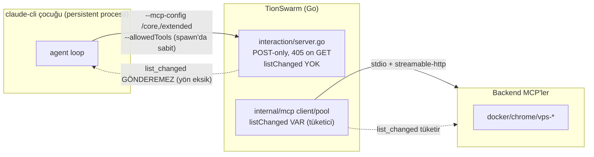

# 52 — Go-Native MCP Gateway Entegrasyonu (Planlama)

> **Durum: TASLAK / PLANLAMA.** Bu doküman kod değişikliği içermez. Önceki oturumun
> `gateway-integration-brief.md`'i + bu oturumda `codebase-memory-mcp` ile TionSwarm
> kaynak doğrulaması + `mcp-server` (TS `gateway-manager v3`) incelemesine dayanır.
> Amaç: gateway desenini TionSwarm'a katmanın **faz-faz uygulama planı** + Bilal'in
> onaylayacağı **açık kararlar**. İlgili: `11-INTERACTION-MCP.md`, `19-LAZY-TOOL-LOADING.md`.

---

## 0. Yönetici özeti (TL;DR)

Brief'in tezi — *"TionSwarm zaten %70 gateway, eksik olan tek şey `tools/list_changed`"* —
**yarı doğru**. Doğrulama şunu gösterdi:

- ✅ **Backend'e bakan yön** (TionSwarm = MCP **client**) `tools/list_changed`'i tam
  destekliyor: `internal/mcp/client.go` + `http.go` `listChanged:true` ilan ediyor,
  bildirim gelince `pool.go` cache'i geçersiz kılıyor. Test kapsamı var.
- ❌ **Gateway için gereken yön** (TionSwarm = MCP **server**, claude-cli'ye doğru)
  **hiç yok**. `internal/interaction/server.go` **stateless, yalnız-POST** bir endpoint:
  GET (server→client SSE akışı) **405** dönüyor, `initialize` `capabilities.tools:{}`
  ilan ediyor (**`listChanged` yok**), oturum durumu tutmuyor, bildirim gönderecek
  açık bir bağlantı **yok**.

Yani "gateway'i Go'da yeniden yaz" gerçekte **Interaction MCP server'ını stateful,
akışlı (SSE-tutan), list_changed gönderebilen bir MCP sunucusuna dönüştürmek**tir —
bu %20 tweak değil, **yeni bir bileşen**. Backend-client makinesi yeniden kullanılabilir,
ama server-push tarafı sıfırdan.

Dahası, planlanmamış bir **ön koşul bulgusu** çıktı (§3-D): bugün **persistent session +
MCP birlikte açıkken her tur cold-restart oluyor** (config temp yolu her tur değişiyor +
`defer cleanup` onu siliyor → fingerprint churn). Gateway deseninin cache faydası bu
düzeltilmeden **imkânsız**. Bu, Faz 0'ın list_changed'den bile önce çözmesi gereken
gerçek bloklayıcı.

**Öneri:** **Seçenek 2** (gateway desenini TionSwarm içine kat), **Faz 3 (harici sunum)
opsiyonel**. Ama önce **Faz 0 spike'ı 3 bağımsız bilinmeyeni ölçmeli** (aşağıda). Faz 0
kırmızı dönerse iş buraya kadar — mevcut "sonraki-tur re-allowlist" (hidden tier) zaten
gateway'in tur-ötesi faydasını sağlıyor; tur-içi fayda spike'a bağlı.

---

## 1. Doğrulanan mevcut mimari (kaynak okundu)

### 1.1 İki-tel gerçeği

**Kritik asimetri:** gateway deseni `IS -.-> A` okunu gerektirir; o ok bugün yok.

### 1.2 Interaction MCP server (`internal/interaction/server.go`)

- Sadece 4 metod: `initialize`, `notifications/initialized`, `tools/list`, `tools/call`.
- `initialize` → `capabilities: {tools: {}}` (**`listChanged:true` YOK**).
- **GET → 405** (kod yorumu: *"MVP returns tool results inline on the POST response, so
  we don't open one"*). Server→client akışı **yok** → bildirim gönderilecek kanal yok.
- Her istek bağımsız request/response; **oturum durumu yok** (`Mcp-Session-Id = Bearer
  token`, ama sadece round-trip için, state tutulmuyor).
- İki tier tek endpoint'e path son-ekiyle bağlanır: `tierFromPath` (`/core`,`/extended`).

### 1.3 CLI köprü config'i (`internal/agent/climcp.go`)

- `tionswarm_interaction` (**core, `alwaysLoad:true`**) → CLI ToolSearch'ten muaf, eager.
- `tionswarm_extended` (**extended**) → `ENABLE_TOOL_SEARCH=auto` ile deferral CLI'a bırakılır.
- Allowlist:
  - Dış MCP'ler için **sunucu-seviyesi wildcard**: `allowed += "mcp__"+key` (satır 102).
  - Interaction extended için **per-tool**: `allowed += "mcp__tionswarm_extended__"+t`
    (satır 133-134). → **Buradaki fark linchpin** (bkz. §4).
- `--strict-mcp-config` set ediliyor → yalnız config'teki sunucular kullanılır.

### 1.4 Persistent session (`internal/providers/claudecli_session.go`)

- `startPersistent`: `--mcp-config`, `--allowedTools`, `--disallowedTools`, appended
  system prompt **process spawn'ında sabitlenir**.
- `persistentFingerprint` = hash(model, permissionMode, **mcpConfigPath**, settingsPath,
  permissionPromptTool, **allowedTools**, **disallowedTools**, sys). Herhangi biri
  değişirse → **cold restart** (process kill + tam transcript yeniden gönderilir → cache soğur).
- Anahtar: `sid + "|" + agent.ID` (session+agent başına bir warm process).

### 1.5 Native activate_tools/tool_search (`internal/tools/builtin_activate.go`)

- **MCP teli yok.** `tool_search` registry entry'lerini grep'leyip metin döner;
  `activate_tools` registry görünürlüğünü mutate eder → sonraki `ActiveDefs` snapshot'ı
  aracı içerir. Yani native "activation" = **in-process registry mutasyonu**, gateway
  "activation" = **MCP `registerTool` + tel bildirimi**. İki farklı mekanik (bkz. §4, madde 3).

---

## 2. Brief §6 envanter doğrulaması (madde-madde)

| Parça | Brief iddiası | Doğrulama |
|---|---|---|
| `pool.go` ref-counted kalıcı havuz | var | ✅ Doğru. `mcpPool` workspace-ömürlü; ama bu **backend** havuzu, claude-cli oturumları değil. |
| `internal/mcp` client `list_changed` → re-list | "var mı? DOĞRULA" | ✅ **Var, ama yalnız backend yönünde** (client tüketir). Server yönü yok. |
| `registry.go` AttachMCP / activate_tools / tool_search | var | ✅ Var (`builtin_activate.go`). Native-only, tel bildirimi yok. |
| `mcp_interaction.go` iki-tier core/extended | var | ✅ Var (`cliTier`, `splitInteractionTiers`, `Tools(token,tier)`). |
| `climcp.go` writeCLIMCPConfig (allowlist, alwaysLoad) | var | ✅ Var. Extended per-tool allowlist (linchpin). |
| `ClaudePersistentSession` tek canlı process | var | ✅ Var, ama **allowlist spawn'da sabit + config churn** (§3-D). |
| Self-management audit muadili (debug.jsonl) | var | ✅ Var; gateway-audit.jsonl paritesi için uygun. |

---

## 3. Faz 0 spike — ÖLÇÜLECEK bilinmeyenler (make-or-break)

Gateway deseni CLI-yolunda **gerçekten token kazandırır** demeden önce, **üç bağımsız
bilinmeyen** doğrulanmalı. Hepsi doğruysa desen inşa edilir; Q1 yanlışsa tur-içi fayda
yok (mevcut hidden-tier zaten tur-ötesini sağlıyor).

### Q1 — claude-cli mid-session `tools/list_changed`'i onurlandırıp aracı AYNI turda çağırabiliyor mu?
- MCP spec "SHOULD re-list" der; claude-cli'nın agent-loop ORTASINDA re-list edip yeni
  aracı **aynı asistan turunda** çağırıp çağıramadığı **doğrulanmadı**.
- **Test:** Küçük stateful stdio/streamable-http MCP; başta 1 araç ilan et; `grow` çağrılınca
  `registerTool`+`list_changed` gönder; modelden `grow` sonrası yeni aracı **aynı turda**
  çağırmasını iste. Aynı-tur çağrı çalışıyor mu, yoksa sonraki tur mu?

### Q2 — Sunucu-seviyesi wildcard allowlist, sonradan gelen aracı kapsıyor mu (restart'sız)?
- `--allowedTools mcp__tionswarm_extended` (spawn'da sabit), list_changed ile **sonradan**
  eklenen `mcp__tionswarm_extended__foo`'yu izinli sayıyor mu? `--strict-mcp-config` +
  permission katmanı kabul ediyor mu?
- Doğruysa: allowlist değişmez → fingerprint değişmez → **restart yok** → cache korunur.
  (Dış MCP'lerde wildcard zaten kullanılıyor; extended'e taşımak yeterli olabilir.)

### Q3 — Mid-session list_changed prompt-cache prefix'ini geçersiz kılıyor mu?
- Araç şemaları cached system prefix'in parçası. Tur-içi araç eklemek **cache
  invalidation** yaparsa gateway tasarrufu kısmen geri ödenir. Maliyet/fayda ölç.

### Q0 (YENİ — §3-D bloklayıcısı) — persistent + MCP config kararlılığı
- Aşağıdaki bulgu doğrulanmalı ve düzeltme prototiplenmeli (stable config path +
  stable token + wildcard allowlist), yoksa Q1-Q3 anlamsız (session zaten her tur soğuk).

### 3-D. YENİ BULGU — persistent+MCP bugün her tur cold-restart oluyor

`toolloop.go:253` her tur `writeCLIMCPConfig` çağırır → `os.CreateTemp(... "tionswarm-mcp-*.json")`
**her tur YENİ yol** üretir, `defer cleanup()` **tur sonunda siler**. Sonra
`ConfigureMCP(path,...)` → `c.mcpConfigPath = <yeni yol>`. `persistentFingerprint` bu yolu
içerdiğinden → **her tur fingerprint değişir → cold restart**. Ek olarak persistent process
hâlâ o dosyaya referans verirken dosya siliniyor (Windows'ta açık handle sorunu).

> **Sonuç:** Bugün `ClaudePersistentSession` + `MCPEnabled` birlikteyken warm-reuse
> pratikte hiç gerçekleşmiyor — her tur tam prefix yeniden gönderiliyor. Bu **mevcut,
> muhtemelen fark edilmemiş bir regresyon** ve gateway işinin ilk düzeltmesi olmalı:
> config dosyasını **session-ömürlü, kararlı bir yola** yaz (temp churn yok), token'ı
> session-ömürlü yap, allowlist'i wildcard'a çevir. Ancak o zaman list_changed ile
> tur-içi büyütme cache'i bozmadan çalışabilir.

**Faz 0 çıktısı:** Q0/Q1/Q2/Q3 için evet/hayır + token sayıları tablosu; `52`'ye işlenir.

---

## 4. Mimari kritiği + karar

### Seçenek karşılaştırması

| | S1: Ayrı Go binary | **S2: TionSwarm içine kat (ÖNERİLEN)** | S3: Hibrit (S2 + sonra harici) |
|---|---|---|---|
| Backend pool | 2. havuzu kopyalar | mevcut `mcpPool` yeniden kullanılır | mevcut |
| CLI köprü fix'i | çözmez (ayrı servis) | **doğrudan çözer** | çözer |
| Harici Claude Code sunumu | evet | Faz 3'e ertelenir | evet (Faz 3) |
| Emek | yüksek (TS'i Go'ya port) | orta (server-push + config kararlılığı) | orta+ |

**Karar önerisi: S2, Faz 3'ü opsiyonel bırak.** Gerekçe: asıl ölçülen sorun CLI köprüsü;
ikinci pool israf; harici sunum ayrı ROI kararı (§7-madde17).

### Brief'in 4 numaralı içgörüsünün düzeltmesi
Brief "activate server → o server'ın tüm araçları; per-tool granülariteyi KORU" diyor.
Doğru — ama TionSwarm'ın gerçek gateway'i **backend MCP sunucuları** değil, **Interaction
MCP extended tier'ıdır**. Yani "server" burada `tionswarm_extended` (tek sunucu); "araçlar"
onun built-in + bridged self-management + NameOnly araçları. Gateway aktivasyonu =
"extended sunucusunun tools/list'ini boştan → istenen alt kümeye büyüt". Dış backend MCP'ler
(docker vb.) **ayrı** ve zaten `mcp__<key>` wildcard'la per-server ilan ediliyor.

---

## 5. Faz planı (uygulama)

### Faz 0 — Spike + kararlılık ön koşulu (önce bu)
1. `52`'ye Q0-Q3 harness'i + sonuç tablosu.
2. **Config kararlılığı düzeltmesi (prototip):** session-ömürlü mcp-config yolu (temp
   churn yok, tur sonunda silme yok), session-ömürlü interaction token, extended tier
   allowlist'i **wildcard `mcp__tionswarm_extended`**'e çevir. Fingerprint'ten `mcpConfigPath`
   yerine **config içeriği hash'i** kullan (yol değişse de içerik aynıysa warm kalsın).
3. Küçük stateful list_changed MCP ile Q1/Q2/Q3 ölç. **Kırmızıysa dur, S2'yi yeniden değerlendir.**

### Faz 1 — Dinamik extended yüzeyi (stateful Interaction server)
- `interaction/server.go`'yu **stateful streamable-HTTP** yap: GET SSE akışını **session
  başına açık tut**, `initialize` → `capabilities.tools.listChanged:true`.
- Extended `tools/list` başta **boş/az** ilan etsin (schema göndermeme = gerçek tasarruf).
- Native `activate_tools` extended bir aracı görünür yaptığında → server o session'ın SSE
  akışına `notifications/tools/list_changed` **push** etsin → CLI re-list eder.
- Server içi **pub/sub**: tool-call handler (activate) → stream-writer sinyali. Tek
  `activate` semantiği (§madde 3): native mutasyon **+** köprü list_changed'i birlikte tetikler.

### Faz 2 — Meta-araç konsolidasyonu
- `list_servers`/`enable_server`/`disable_server` (self-management) ↔ gateway meta seti
  eşlensin; model tek arayüz görsün. İki `activate_tools`'u tek semantiğe indir (Faz 1'de başlar).

### Faz 3 — Harici gateway endpoint'i (OPSİYONEL, ayrı ROI)
- `/mcp/gateway`: dış client (harici Claude Code) sunumu → TS `gateway-manager`'ı emekliye ayır.
- Göç yükü: `config.json` formatı, VPS streamable-http zincirleme, Tailscale portu, auth token.
- **Güvenlik ŞART** (§7-madde9): loopback default + `GATEWAY_AUTH_TOKEN` muadili.

### Faz 4 — Ölçüm + doküman
- Aynı harness (izole backend + gerçek claude-cli turu + `claude.exe` cmdline + debug.jsonl
  token) ile öncesi/sonrası. Beklenti: name-only'nin yapamadığı gerçek tasarruf. `52` + `11`/`19` güncelle.

---

## 6. Dosya-dokunuş envanteri (tahmin)

| Dosya | Değişiklik |
|---|---|
| `internal/interaction/server.go` | **Ana iş.** Stateful session, GET SSE akışı, `listChanged:true`, list_changed push, pub/sub. |
| `internal/interaction/*_test.go` | list_changed push + stateful session testleri. |
| `internal/agent/climcp.go` | extended tier allowlist → wildcard `mcp__tionswarm_extended`; config yolu kararlılığı. |
| `internal/providers/claudecli_session.go` | `persistentFingerprint` → yol yerine içerik-hash; config dosyası ömrü. |
| `internal/providers/claudecli.go` | `ConfigureMCP` çağrı ömrü / token kararlılığı. |
| `internal/agent/toolloop.go` | `writeCLIMCPConfig` çağrı yeri: session-ömürlü config, `defer cleanup` kaldır/koşullandır. |
| `internal/api/mcp_interaction.go` | extended `Tools()` başta boş; activate ile büyüme; visOf ile list_changed tetikleme. |
| `internal/tools/builtin_activate.go` | native `activate_tools` → extended köprü list_changed tetikleyicisiyle lockstep. |
| `internal/mcp/*` | (yeniden kullan) backend list_changed makinesi referans; yeni kod az. |
| `_Docs/11`, `_Docs/19` | tier↔gateway modeli güncelle; §7-madde15 birleştirme. |

---

## 7. Beyin fırtınası — kapatma + genişletme

| # | Konu | Bu oturumun sonucu |
|---|---|---|
| 1 | Kalıcı-session ↔ list_changed sinerjisi | **Ön koşul doğru + daha derin:** kalıcı-session şart AMA bugün MCP'yle her tur soğuk (§3-D). Önce config kararlılığı, sonra list_changed. Fresh-process modunda desen çalışmaz → fallback "sonraki tur re-allowlist" (zaten var). |
| 2 | Persistent'te allowlist dinamik mi | **Hayır (spawn'da sabit).** Çözüm netleşti: **wildcard `mcp__tionswarm_extended`** (dış MCP'lerde zaten kullanılan desen) → sonradan gelen araç otomatik izinli, restart yok. Q2'de doğrula. |
| 3 | İki activate_tools çakışması | **Tek semantik:** native activate = kaynak-of-truth; extended sunucusu list_changed'i onunla lockstep push eder. Model tek `activate_tools` görür. |
| 4 | Per-tool vs per-server granülerlik | TionSwarm per-tool granülerliği KORUNUR; "activate server" = şeker sözdizimi. Gerçek "gateway server" = `tionswarm_extended` (tek), dış MCP'ler `mcp__<key>` wildcard ile ayrı. |
| 5 | Reactive/otonom auto-activate | tool_search bulamayınca otomatik activate+list_changed → ara-bul-kullan. **Q1'e bağlı** (aynı-tur çağrı). Q1 hayırsa "bul → sonraki tur kullan". |
| 6 | Built-in'ler de deferse girsin mi | Davranışsal-core (`coreInteractionTools`: permission_prompt, shell, ask_user, todo/artifact/skill) **daima eager**. Gerisi extended'e girebilir. Sınır korunur. |
| 7 | Harici sunum = TS gateway emekli | Faz 3. Göç yükü: config format + VPS zincir + Tailscale + auth. ROI ayrı karar. |
| 8 | Uzak gateway zincirleme | TionSwarm zaten streamable-http backend destekliyor → vps-* URL'li kaynak. Gateway-of-gateways ucuz. |
| 9 | Güvenlik | Harici sunumda: loopback default + `GATEWAY_AUTH_TOKEN` muadili ŞART. Interaction endpoint'in Bearer auth'u yeniden kullanılabilir (bkz. YENİ-F). |
| 10 | Audit/observability | Proxied çağrılar zaten debug.jsonl + logbuf'a gidiyor. Harici sunumda gateway-audit.jsonl paritesi kur. |
| 11 | Ref-count & yaşam döngüsü | Backend pool workspace-ömürlü; dış+iç paylaşımda kapatma politikası Faz 3'te (ref-count). |
| 12 | list_changed client desteği | claude-cli MCP client'ı spec gereği desteklemeli; **Q1 doğrular**. Native (non-CLI) API yolu list_changed görmez → orada mevcut native activate_tools zaten çalışıyor; desen **CLI-yolu düzeltmesi**. |
| 13 | Cache etkisi | **Q3.** Mid-session araç ekleme cache prefix invalidation yapabilir → ölç, maliyet/fayda. |
| 14 | Failure/timeout | Backend pool'da `withTimeout`/health-check muadili var mı? Interaction server push'unda activate asılırsa modele temiz hata, tur kilitlenmesin. |
| 15 | Migration & geriye uyum | **Birleştirme:** gateway gelince CLI-yolunda `hidden` = "tools/list'te yok ama list_changed ile çağrılabilir" = gerçek deferred-usable. summary/name-only CLI'da anlamsız kalır (yalnız native). Temiz son model: CLI projeksiyonu **2-durum** (core=alwaysLoad · extended=gateway-managed, gerçekten token-free), native 4-tier kalır. |
| 16 | Test/doğrulama | Önceki harness yeniden kullanılır (izole backend + gerçek tur + cmdline + debug token). |
| 17 | Neden Go | Tek binary, aynı process/pool, çapraz-derleme, TS runtime bağımlılığı gider. Ama TS gateway çalışıyor → **harici sunum göçü** ayrı ROI; iç CLI-fix göçten bağımsız değerli. |

### YENİ açılar (brief'te yoktu)

- **YENİ-A — permission_prompt ↔ dinamik araç:** "ask"/"read-only" modda CLI, aracı
  çalıştırmadan önce `permission_prompt` çağırır. Mid-turn list_changed ile eklenen araç
  çağrılınca permission round-trip'i çalışıyor mu? (permission_prompt core/alwaysLoad'da →
  kanal hazır, ama yeni aracın adının handler'ca tanınması gerekir.) Faz 1'de doğrula.
- **YENİ-B — `--strict-mcp-config` uyumu:** list_changed **sunucu eklemez, mevcut sunucuya
  araç ekler** → strict-mcp-config ile uyumlu (yeni server yok). Faz 0 Q2'de teyit et.
- **YENİ-C — token yaşam döngüsü (persistent'te):** Interaction backend her şeyi per-run
  Bearer token'a bağlar (`chatRuns.byToken`), ama persistent process'in config'indeki token
  **spawn'da sabit**. Persistent process BİRDEN ÇOK turu (farklı run) kapsar → sabit token
  değişen run'lara nasıl map'lenmeli? Token'ı **per-(session,agent)** yapıp turn'de aktif
  run'a çözmek gerekir. Bu, §3-D config kararlılığının parçası ve gateway'in düzgün
  çalışması için şart. **Faz 0'da netleştir.**
- **YENİ-D — sıralama yarışı (activate vs call):** activate sonucu POST yanıtında, list_changed
  GET akışında döner. Model aynı asistan mesajında activate + yeni-araç-çağrısını arka arkaya
  yazarsa re-list henüz olmamış olabilir. Native'de sorun yok (in-process). Çözüm: activate
  **yalnız notification flush edildikten sonra** dönsün, ya da "çağrı bir sonraki adımda" belgelensin.
- **YENİ-E — wildcard vs güvenlik:** `mcp__tionswarm_extended` wildcard'ı, o sunucudaki
  **her** aracı (self-management dahil) allowlist'e sokar. Görünürlük hâlâ tools/list'i
  kontrol eder (araç ilan edilmezse çağrılamaz), ama allowlist artık "ilan edilirse izinli"
  demek. Permission katmanı (ask modu) gerçek kapı olarak kalmalı. Sınırı belgele.
- **YENİ-F — auth yeniden kullanımı:** Harici `/mcp/gateway`, Interaction endpoint'in mevcut
  Bearer-token + loopback desenini yeniden kullanabilir → Faz 3'te ayrı auth yazma yükü az.

---

## 8. Riskler

- **R1 (yüksek):** Q1 hayır → tur-içi reactive-activate çalışmaz; kazanç yalnız tur-ötesi
  (mevcut hidden-tier'a eşdeğer). Gateway'in ana vaadi zayıflar.
- **R2 (yüksek):** Q3 evet (cache invalidation) → warm-session tasarrufu list_changed
  churn'üyle kısmen geri ödenir; net kazanç ölçülmeli.
- **R3 (orta):** Stateful SSE akışı + pub/sub yeni karmaşıklık (bağlantı ömrü, sızıntı,
  Windows handle). Backend-client makinesi yardımcı olsa da server-push farklı.
- **R4 (orta):** §3-D düzeltmesi persistent+MCP davranışını değiştirir → mevcut turlarda
  regresyon riski; kapsamlı test + feature-flag.
- **R5 (düşük):** Faz 3 göçü (VPS/Tailscale/auth) TS gateway'le paritesizlik bırakabilir.

---

## 9. Ölçüm planı

1. Harness: izole backend (`TIONSWARM_DATA_DIR` ayrı, ayrı port) + gerçek `claude-fable-5`
   turları + `claude.exe` cmdline yakalama (CIM) + debug.jsonl token.
2. Senaryolar: (a) bugün extended-full, (b) bugün name-only/summary (brief: kazanç yok),
   (c) gateway boş-extended + on-demand list_changed. Taze input / cacheWrite / cacheRead karşılaştır.
3. Ek: warm-reuse oranı (config kararlılığı öncesi/sonrası) — §3-D düzeltmesinin cache etkisi.
4. Başarı ölçütü: (c) < (a) ve (c) < (b) taze input token; warm-reuse oranı ↑; tur-içi
   reactive-activate çalışıyor (Q1) veya net tur-ötesi kazanç pozitif.

---

## 10. Bilal'in onaylayacağı AÇIK KARARLAR

1. **Mimari:** S2 (TionSwarm içine kat) — onay? Faz 3 (harici `/mcp/gateway`, TS gateway
   emekli) **opsiyonel/sonraki** kalsın mı, yoksa baştan kapsama mı?
2. **Faz 0 önce:** Kod yazımından önce Q0-Q3 spike'ı çalıştırılsın mı (öneri: EVET, çünkü
   Q1 kırmızıysa kapsam küçülür)?
3. **§3-D düzeltmesi:** persistent+MCP cold-restart bulgusu — bunu **gateway'den bağımsız
   bir bugfix** olarak hemen ayrı ele alalım mı, yoksa Faz 0'ın parçası mı? (Öneri: Faz 0
   içinde, çünkü gateway ön koşulu.)
4. **Wildcard allowlist:** extended tier `mcp__tionswarm_extended` wildcard'ına geçsin mi
   (YENİ-E güvenlik notuyla)? Onay?
5. **Tier modeli birleştirme (§7-15):** Gateway gelince CLI'da summary/name-only'yi
   emekliye ayırıp CLI projeksiyonunu **2-durum** (core / gateway-managed) yapalım mı;
   native 4-tier kalsın? (name-only/summary kaldırma kararıyla birleştirme.)
6. **Token yaşam döngüsü (YENİ-C):** interaction token'ı per-run yerine per-(session,agent)
   yapmayı onaylıyor musun (persistent uyumu için)?
7. **Harici sunum kapsamı:** Faz 3 yapılırsa auth (loopback + token) ve VPS zincir göçü
   kapsama dahil mi?

> Onaydan sonra: Faz 0 spike harness'i + §3-D düzeltme prototipi ile başlanır; sonuçlar
> bu dosyaya (§3) işlenir ve gerçek uygulama fazları planlanır.
