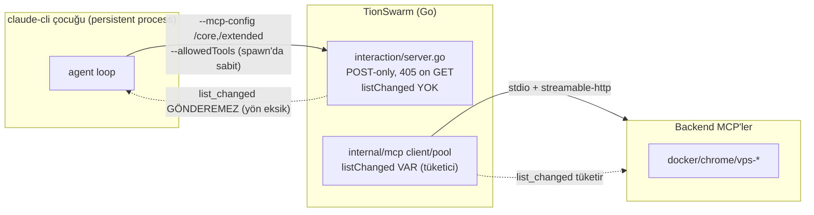

# 52 — Go-Native MCP Gateway Entegrasyonu (Planlama)

> **Durum: TASLAK / PLANLAMA.** Bu doküman kod değişikliği içermez. Önceki oturumun
> `gateway-integration-brief.md`'i + bu oturumda `codebase-memory-mcp` ile TionSwarm
> kaynak doğrulaması + `mcp-server` (TS `gateway-manager v3`) incelemesine dayanır.
> Amaç: gateway desenini TionSwarm'a katmanın **faz-faz uygulama planı** + Bilal'in
> onaylayacağı **açık kararlar**. İlgili: `11-INTERACTION-MCP.md`, `19-LAZY-TOOL-LOADING.md`.

---

## 0. Yönetici özeti (TL;DR)

Brief'in tezi — *"TionSwarm zaten %70 gateway, eksik olan tek şey `tools/list_changed`"* —
**yarı doğru**. Doğrulama şunu gösterdi:

- ✅ **Backend'e bakan yön** (TionSwarm = MCP **client**) `tools/list_changed`'i tam
  destekliyor: `internal/mcp/client.go` + `http.go` `listChanged:true` ilan ediyor,
  bildirim gelince `pool.go` cache'i geçersiz kılıyor. Test kapsamı var.
- ❌ **Gateway için gereken yön** (TionSwarm = MCP **server**, claude-cli'ye doğru)
  **hiç yok**. `internal/interaction/server.go` **stateless, yalnız-POST** bir endpoint:
  GET (server→client SSE akışı) **405** dönüyor, `initialize` `capabilities.tools:{}`
  ilan ediyor (**`listChanged` yok**), oturum durumu tutmuyor, bildirim gönderecek
  açık bir bağlantı **yok**.

Yani "gateway'i Go'da yeniden yaz" gerçekte **Interaction MCP server'ını stateful,
akışlı (SSE-tutan), list_changed gönderebilen bir MCP sunucusuna dönüştürmek**tir —
bu %20 tweak değil, **yeni bir bileşen**. Backend-client makinesi yeniden kullanılabilir,
ama server-push tarafı sıfırdan.

Dahası, planlanmamış bir **ön koşul bulgusu** çıktı (§3-D): bugün **persistent session +
MCP birlikte açıkken her tur cold-restart oluyor** (config temp yolu her tur değişiyor +
`defer cleanup` onu siliyor → fingerprint churn). Gateway deseninin cache faydası bu
düzeltilmeden **imkânsız**. Bu, Faz 0'ın list_changed'den bile önce çözmesi gereken
gerçek bloklayıcı.

**Öneri:** **Seçenek 2** (gateway desenini TionSwarm içine kat), **Faz 3 (harici sunum)
opsiyonel**. Ama önce **Faz 0 spike'ı 3 bağımsız bilinmeyeni ölçmeli** (aşağıda). Faz 0
kırmızı dönerse iş buraya kadar — mevcut "sonraki-tur re-allowlist" (hidden tier) zaten
gateway'in tur-ötesi faydasını sağlıyor; tur-içi fayda spike'a bağlı.

---

## 1. Doğrulanan mevcut mimari (kaynak okundu)

### 1.1 İki-tel gerçeği

**Kritik asimetri:** gateway deseni `IS -.-> A` okunu gerektirir; o ok bugün yok.

### 1.2 Interaction MCP server (`internal/interaction/server.go`)

- Sadece 4 metod: `initialize`, `notifications/initialized`, `tools/list`, `tools/call`.
- `initialize` → `capabilities: {tools: {}}` (**`listChanged:true` YOK**).
- **GET → 405** (kod yorumu: *"MVP returns tool results inline on the POST response, so
  we don't open one"*). Server→client akışı **yok** → bildirim gönderilecek kanal yok.
- Her istek bağımsız request/response; **oturum durumu yok** (`Mcp-Session-Id = Bearer
  token`, ama sadece round-trip için, state tutulmuyor).
- İki tier tek endpoint'e path son-ekiyle bağlanır: `tierFromPath` (`/core`,`/extended`).

### 1.3 CLI köprü config'i (`internal/agent/climcp.go`)

- `tionswarm_interaction` (**core, `alwaysLoad:true`**) → CLI ToolSearch'ten muaf, eager.
- `tionswarm_extended` (**extended**) → `ENABLE_TOOL_SEARCH=auto` ile deferral CLI'a bırakılır.
- Allowlist:
  - Dış MCP'ler için **sunucu-seviyesi wildcard**: `allowed += "mcp__"+key` (satır 102).
  - Interaction extended için **per-tool**: `allowed += "mcp__tionswarm_extended__"+t`
    (satır 133-134). → **Buradaki fark linchpin** (bkz. §4).
- `--strict-mcp-config` set ediliyor → yalnız config'teki sunucular kullanılır.

### 1.4 Persistent session (`internal/providers/claudecli_session.go`)

- `startPersistent`: `--mcp-config`, `--allowedTools`, `--disallowedTools`, appended
  system prompt **process spawn'ında sabitlenir**.
- `persistentFingerprint` = hash(model, permissionMode, **mcpConfigPath**, settingsPath,
  permissionPromptTool, **allowedTools**, **disallowedTools**, sys). Herhangi biri
  değişirse → **cold restart** (process kill + tam transcript yeniden gönderilir → cache soğur).
- Anahtar: `sid + "|" + agent.ID` (session+agent başına bir warm process).

### 1.5 Native activate_tools/tool_search (`internal/tools/builtin_activate.go`)

- **MCP teli yok.** `tool_search` registry entry'lerini grep'leyip metin döner;
  `activate_tools` registry görünürlüğünü mutate eder → sonraki `ActiveDefs` snapshot'ı
  aracı içerir. Yani native "activation" = **in-process registry mutasyonu**, gateway
  "activation" = **MCP `registerTool` + tel bildirimi**. İki farklı mekanik (bkz. §4, madde 3).

---

## 2. Brief §6 envanter doğrulaması (madde-madde)

| Parça | Brief iddiası | Doğrulama |
|---|---|---|
| `pool.go` ref-counted kalıcı havuz | var | ✅ Doğru. `mcpPool` workspace-ömürlü; ama bu **backend** havuzu, claude-cli oturumları değil. |
| `internal/mcp` client `list_changed` → re-list | "var mı? DOĞRULA" | ✅ **Var, ama yalnız backend yönünde** (client tüketir). Server yönü yok. |
| `registry.go` AttachMCP / activate_tools / tool_search | var | ✅ Var (`builtin_activate.go`). Native-only, tel bildirimi yok. |
| `mcp_interaction.go` iki-tier core/extended | var | ✅ Var (`cliTier`, `splitInteractionTiers`, `Tools(token,tier)`). |
| `climcp.go` writeCLIMCPConfig (allowlist, alwaysLoad) | var | ✅ Var. Extended per-tool allowlist (linchpin). |
| `ClaudePersistentSession` tek canlı process | var | ✅ Var, ama **allowlist spawn'da sabit + config churn** (§3-D). |
| Self-management audit muadili (debug.jsonl) | var | ✅ Var; gateway-audit.jsonl paritesi için uygun. |

---

## 3. Faz 0 spike — ÖLÇÜLECEK bilinmeyenler (make-or-break)

Gateway deseni CLI-yolunda **gerçekten token kazandırır** demeden önce, **üç bağımsız
bilinmeyen** doğrulanmalı. Hepsi doğruysa desen inşa edilir; Q1 yanlışsa tur-içi fayda
yok (mevcut hidden-tier zaten tur-ötesini sağlıyor).

### Q1 — claude-cli mid-session `tools/list_changed`'i onurlandırıp aracı AYNI turda çağırabiliyor mu?
- MCP spec "SHOULD re-list" der; claude-cli'nın agent-loop ORTASINDA re-list edip yeni
  aracı **aynı asistan turunda** çağırıp çağıramadığı **doğrulanmadı**.
- **Test:** Küçük stateful stdio/streamable-http MCP; başta 1 araç ilan et; `grow` çağrılınca
  `registerTool`+`list_changed` gönder; modelden `grow` sonrası yeni aracı **aynı turda**
  çağırmasını iste. Aynı-tur çağrı çalışıyor mu, yoksa sonraki tur mu?

### Q2 — Sunucu-seviyesi wildcard allowlist, sonradan gelen aracı kapsıyor mu (restart'sız)?
- `--allowedTools mcp__tionswarm_extended` (spawn'da sabit), list_changed ile **sonradan**
  eklenen `mcp__tionswarm_extended__foo`'yu izinli sayıyor mu? `--strict-mcp-config` +
  permission katmanı kabul ediyor mu?
- Doğruysa: allowlist değişmez → fingerprint değişmez → **restart yok** → cache korunur.
  (Dış MCP'lerde wildcard zaten kullanılıyor; extended'e taşımak yeterli olabilir.)

### Q3 — Mid-session list_changed prompt-cache prefix'ini geçersiz kılıyor mu?
- Araç şemaları cached system prefix'in parçası. Tur-içi araç eklemek **cache
  invalidation** yaparsa gateway tasarrufu kısmen geri ödenir. Maliyet/fayda ölç.

### Q0 (YENİ — §3-D bloklayıcısı) — persistent + MCP config kararlılığı
- Aşağıdaki bulgu doğrulanmalı ve düzeltme prototiplenmeli (stable config path +
  stable token + wildcard allowlist), yoksa Q1-Q3 anlamsız (session zaten her tur soğuk).

### 3-D. YENİ BULGU — persistent+MCP bugün her tur cold-restart oluyor

`toolloop.go:253` her tur `writeCLIMCPConfig` çağırır → `os.CreateTemp(... "tionswarm-mcp-*.json")`
**her tur YENİ yol** üretir, `defer cleanup()` **tur sonunda siler**. Sonra
`ConfigureMCP(path,...)` → `c.mcpConfigPath = <yeni yol>`. `persistentFingerprint` bu yolu
içerdiğinden → **her tur fingerprint değişir → cold restart**. Ek olarak persistent process
hâlâ o dosyaya referans verirken dosya siliniyor (Windows'ta açık handle sorunu).

> **Sonuç:** Bugün `ClaudePersistentSession` + `MCPEnabled` birlikteyken warm-reuse
> pratikte hiç gerçekleşmiyor — her tur tam prefix yeniden gönderiliyor. Bu **mevcut,
> muhtemelen fark edilmemiş bir regresyon** ve gateway işinin ilk düzeltmesi olmalı:
> config dosyasını **session-ömürlü, kararlı bir yola** yaz (temp churn yok), token'ı
> session-ömürlü yap, allowlist'i wildcard'a çevir. Ancak o zaman list_changed ile
> tur-içi büyütme cache'i bozmadan çalışabilir.

**Faz 0 çıktısı:** Q0/Q1/Q2/Q3 için evet/hayır + token sayıları tablosu; `52`'ye işlenir.

### 3-E. Faz 0 spike SONUÇLARI (2026-07-06, gerçek claude-cli 2.1.201 + claude-fable-5)

Harness: `_spikes/52-gateway/` — stateful streamable-HTTP Go MCP server (`server/main.go`)
GET SSE akışını açık tutuyor, `spike_grow` çağrılınca `spike_secret`'i `registerTool` edip
**`notifications/tools/list_changed`** push ediyor. claude tek `-p` turunda, allowlist
**yalnız `mcp__spike`** wildcard'ı ile sürüldü.

| Soru | Sonuç | Kanıt |
|---|---|---|
| **Q1** — mid-turn list_changed + AYNI turda çağrı | ✅ **EVET** | Tek turda: `spike_grow` → server push (`pushed list_changed`, `flushed`) → claude `spike_secret`'i çağırıp **`SECRET=GATEWAY_OK_42`** aldı. |
| **Q2** — wildcard allowlist sonradan gelen aracı kapsıyor | ✅ **EVET** | Allowlist spawn'da `mcp__spike` sabit; `spike_secret` yalnız grow'dan SONRA belirdi, yine de restart'sız çağrılabildi. |
| **Q3** — mid-turn list_changed cache prefix'i siliyor mu | ✅ **HAYIR (marjinal)** | list_changed sonrası model çağrıları `cacheRead≈29360–29570`, yalnız `cacheCreate 56–210` delta. Tam prefix rebuild YOK. Final: cacheRead 79456 > cacheCreate 63778. |
| **Q0** — persistent+MCP config kararsızlığı (§3-D) | ⚠️ **KOD-DOĞRULANDI, ampirik bekliyor** | `writeCLIMCPConfig` temp yol churn'ü + `defer cleanup` + fingerprint(mcpConfigPath) kesin. Ampirik teyit TionSwarm'ı çalıştırmayı gerektirir; düzeltme unit-testlenebilir (içerik-hash fingerprint). |

**Beklenmedik + kritik gözlem — ToolSearch aracılığı.** claude, spike araçlarını **inline
ETMEDİ**; her birini çağırmadan önce `ToolSearch select:mcp__spike__<tool>` ile şemasını
**on-demand yükledi**. Yani #40314 (HTTP-transport defer edilmez) claude 2.1.201'de artık
geçerli değil gibi görünüyor — HTTP MCP araçları da deferral'a giriyor. Bu, gateway
modelini claude-cli'nın kendi ToolSearch'iyle **uyumlu** kılar: extended yüzeyi başta
BOŞ/az ilan et → şemalar bağlama hiç girmez → list_changed ile büyüt → ToolSearch select
ile yüklenir → wildcard izin verir → aynı turda çağrılır. **name-only'nin yapamadığı
gerçek tasarruf budur.**

**Karar:** Faz 0 **YEŞİL** (Q1/Q2/Q3 olumlu, Q0 kod-net). Uygulamaya geçilir.

---

## 4. Mimari kritiği + karar

### Seçenek karşılaştırması

| | S1: Ayrı Go binary | **S2: TionSwarm içine kat (ÖNERİLEN)** | S3: Hibrit (S2 + sonra harici) |
|---|---|---|---|
| Backend pool | 2. havuzu kopyalar | mevcut `mcpPool` yeniden kullanılır | mevcut |
| CLI köprü fix'i | çözmez (ayrı servis) | **doğrudan çözer** | çözer |
| Harici Claude Code sunumu | evet | Faz 3'e ertelenir | evet (Faz 3) |
| Emek | yüksek (TS'i Go'ya port) | orta (server-push + config kararlılığı) | orta+ |

**Karar önerisi: S2, Faz 3'ü opsiyonel bırak.** Gerekçe: asıl ölçülen sorun CLI köprüsü;
ikinci pool israf; harici sunum ayrı ROI kararı (§7-madde17).

### Brief'in 4 numaralı içgörüsünün düzeltmesi
Brief "activate server → o server'ın tüm araçları; per-tool granülariteyi KORU" diyor.
Doğru — ama TionSwarm'ın gerçek gateway'i **backend MCP sunucuları** değil, **Interaction
MCP extended tier'ıdır**. Yani "server" burada `tionswarm_extended` (tek sunucu); "araçlar"
onun built-in + bridged self-management + NameOnly araçları. Gateway aktivasyonu =
"extended sunucusunun tools/list'ini boştan → istenen alt kümeye büyüt". Dış backend MCP'ler
(docker vb.) **ayrı** ve zaten `mcp__<key>` wildcard'la per-server ilan ediliyor.

---

## 5. Faz planı (uygulama)

### Faz 0 — Spike + kararlılık ön koşulu (önce bu)
1. `52`'ye Q0-Q3 harness'i + sonuç tablosu.
2. **Config kararlılığı düzeltmesi (prototip):** session-ömürlü mcp-config yolu (temp
   churn yok, tur sonunda silme yok), session-ömürlü interaction token, extended tier
   allowlist'i **wildcard `mcp__tionswarm_extended`**'e çevir. Fingerprint'ten `mcpConfigPath`
   yerine **config içeriği hash'i** kullan (yol değişse de içerik aynıysa warm kalsın).
3. Küçük stateful list_changed MCP ile Q1/Q2/Q3 ölç. **Kırmızıysa dur, S2'yi yeniden değerlendir.**

### Faz 1 — Dinamik extended yüzeyi (stateful Interaction server)
- `interaction/server.go`'yu **stateful streamable-HTTP** yap: GET SSE akışını **session
  başına açık tut**, `initialize` → `capabilities.tools.listChanged:true`.
- Extended `tools/list` başta **boş/az** ilan etsin (schema göndermeme = gerçek tasarruf).
- Native `activate_tools` extended bir aracı görünür yaptığında → server o session'ın SSE
  akışına `notifications/tools/list_changed` **push** etsin → CLI re-list eder.
- Server içi **pub/sub**: tool-call handler (activate) → stream-writer sinyali. Tek
  `activate` semantiği (§madde 3): native mutasyon **+** köprü list_changed'i birlikte tetikler.

### Faz 2 — Meta-araç konsolidasyonu
- `list_servers`/`enable_server`/`disable_server` (self-management) ↔ gateway meta seti
  eşlensin; model tek arayüz görsün. İki `activate_tools`'u tek semantiğe indir (Faz 1'de başlar).

### Faz 3 — Harici gateway endpoint'i (OPSİYONEL, ayrı ROI)
- `/mcp/gateway`: dış client (harici Claude Code) sunumu → TS `gateway-manager`'ı emekliye ayır.
- Göç yükü: `config.json` formatı, VPS streamable-http zincirleme, Tailscale portu, auth token.
- **Güvenlik ŞART** (§7-madde9): loopback default + `GATEWAY_AUTH_TOKEN` muadili.

### Faz 4 — Ölçüm + doküman
- Aynı harness (izole backend + gerçek claude-cli turu + `claude.exe` cmdline + debug.jsonl
  token) ile öncesi/sonrası. Beklenti: name-only'nin yapamadığı gerçek tasarruf. `52` + `11`/`19` güncelle.

---

## 6. Dosya-dokunuş envanteri (tahmin)

| Dosya | Değişiklik |
|---|---|
| `internal/interaction/server.go` | **Ana iş.** Stateful session, GET SSE akışı, `listChanged:true`, list_changed push, pub/sub. |
| `internal/interaction/*_test.go` | list_changed push + stateful session testleri. |
| `internal/agent/climcp.go` | extended tier allowlist → wildcard `mcp__tionswarm_extended`; config yolu kararlılığı. |
| `internal/providers/claudecli_session.go` | `persistentFingerprint` → yol yerine içerik-hash; config dosyası ömrü. |
| `internal/providers/claudecli.go` | `ConfigureMCP` çağrı ömrü / token kararlılığı. |
| `internal/agent/toolloop.go` | `writeCLIMCPConfig` çağrı yeri: session-ömürlü config, `defer cleanup` kaldır/koşullandır. |
| `internal/api/mcp_interaction.go` | extended `Tools()` başta boş; activate ile büyüme; visOf ile list_changed tetikleme. |
| `internal/tools/builtin_activate.go` | native `activate_tools` → extended köprü list_changed tetikleyicisiyle lockstep. |
| `internal/mcp/*` | (yeniden kullan) backend list_changed makinesi referans; yeni kod az. |
| `_Docs/11`, `_Docs/19` | tier↔gateway modeli güncelle; §7-madde15 birleştirme. |

---

## 7. Beyin fırtınası — kapatma + genişletme

| # | Konu | Bu oturumun sonucu |
|---|---|---|
| 1 | Kalıcı-session ↔ list_changed sinerjisi | **Ön koşul doğru + daha derin:** kalıcı-session şart AMA bugün MCP'yle her tur soğuk (§3-D). Önce config kararlılığı, sonra list_changed. Fresh-process modunda desen çalışmaz → fallback "sonraki tur re-allowlist" (zaten var). |
| 2 | Persistent'te allowlist dinamik mi | **Hayır (spawn'da sabit).** Çözüm netleşti: **wildcard `mcp__tionswarm_extended`** (dış MCP'lerde zaten kullanılan desen) → sonradan gelen araç otomatik izinli, restart yok. Q2'de doğrula. |
| 3 | İki activate_tools çakışması | **Tek semantik:** native activate = kaynak-of-truth; extended sunucusu list_changed'i onunla lockstep push eder. Model tek `activate_tools` görür. |
| 4 | Per-tool vs per-server granülerlik | TionSwarm per-tool granülerliği KORUNUR; "activate server" = şeker sözdizimi. Gerçek "gateway server" = `tionswarm_extended` (tek), dış MCP'ler `mcp__<key>` wildcard ile ayrı. |
| 5 | Reactive/otonom auto-activate | tool_search bulamayınca otomatik activate+list_changed → ara-bul-kullan. **Q1'e bağlı** (aynı-tur çağrı). Q1 hayırsa "bul → sonraki tur kullan". |
| 6 | Built-in'ler de deferse girsin mi | Davranışsal-core (`coreInteractionTools`: permission_prompt, shell, ask_user, todo/artifact/skill) **daima eager**. Gerisi extended'e girebilir. Sınır korunur. |
| 7 | Harici sunum = TS gateway emekli | Faz 3. Göç yükü: config format + VPS zincir + Tailscale + auth. ROI ayrı karar. |
| 8 | Uzak gateway zincirleme | TionSwarm zaten streamable-http backend destekliyor → vps-* URL'li kaynak. Gateway-of-gateways ucuz. |
| 9 | Güvenlik | Harici sunumda: loopback default + `GATEWAY_AUTH_TOKEN` muadili ŞART. Interaction endpoint'in Bearer auth'u yeniden kullanılabilir (bkz. YENİ-F). |
| 10 | Audit/observability | Proxied çağrılar zaten debug.jsonl + logbuf'a gidiyor. Harici sunumda gateway-audit.jsonl paritesi kur. |
| 11 | Ref-count & yaşam döngüsü | Backend pool workspace-ömürlü; dış+iç paylaşımda kapatma politikası Faz 3'te (ref-count). |
| 12 | list_changed client desteği | claude-cli MCP client'ı spec gereği desteklemeli; **Q1 doğrular**. Native (non-CLI) API yolu list_changed görmez → orada mevcut native activate_tools zaten çalışıyor; desen **CLI-yolu düzeltmesi**. |
| 13 | Cache etkisi | **Q3.** Mid-session araç ekleme cache prefix invalidation yapabilir → ölç, maliyet/fayda. |
| 14 | Failure/timeout | Backend pool'da `withTimeout`/health-check muadili var mı? Interaction server push'unda activate asılırsa modele temiz hata, tur kilitlenmesin. |
| 15 | Migration & geriye uyum | **Birleştirme:** gateway gelince CLI-yolunda `hidden` = "tools/list'te yok ama list_changed ile çağrılabilir" = gerçek deferred-usable. summary/name-only CLI'da anlamsız kalır (yalnız native). Temiz son model: CLI projeksiyonu **2-durum** (core=alwaysLoad · extended=gateway-managed, gerçekten token-free), native 4-tier kalır. |
| 16 | Test/doğrulama | Önceki harness yeniden kullanılır (izole backend + gerçek tur + cmdline + debug token). |
| 17 | Neden Go | Tek binary, aynı process/pool, çapraz-derleme, TS runtime bağımlılığı gider. Ama TS gateway çalışıyor → **harici sunum göçü** ayrı ROI; iç CLI-fix göçten bağımsız değerli. |

### YENİ açılar (brief'te yoktu)

- **YENİ-A — permission_prompt ↔ dinamik araç:** "ask"/"read-only" modda CLI, aracı
  çalıştırmadan önce `permission_prompt` çağırır. Mid-turn list_changed ile eklenen araç
  çağrılınca permission round-trip'i çalışıyor mu? (permission_prompt core/alwaysLoad'da →
  kanal hazır, ama yeni aracın adının handler'ca tanınması gerekir.) Faz 1'de doğrula.
- **YENİ-B — `--strict-mcp-config` uyumu:** list_changed **sunucu eklemez, mevcut sunucuya
  araç ekler** → strict-mcp-config ile uyumlu (yeni server yok). Faz 0 Q2'de teyit et.
- **YENİ-C — token yaşam döngüsü (persistent'te):** Interaction backend her şeyi per-run
  Bearer token'a bağlar (`chatRuns.byToken`), ama persistent process'in config'indeki token
  **spawn'da sabit**. Persistent process BİRDEN ÇOK turu (farklı run) kapsar → sabit token
  değişen run'lara nasıl map'lenmeli? Token'ı **per-(session,agent)** yapıp turn'de aktif
  run'a çözmek gerekir. Bu, §3-D config kararlılığının parçası ve gateway'in düzgün
  çalışması için şart. **Faz 0'da netleştir.**
- **YENİ-D — sıralama yarışı (activate vs call):** activate sonucu POST yanıtında, list_changed
  GET akışında döner. Model aynı asistan mesajında activate + yeni-araç-çağrısını arka arkaya
  yazarsa re-list henüz olmamış olabilir. Native'de sorun yok (in-process). Çözüm: activate
  **yalnız notification flush edildikten sonra** dönsün, ya da "çağrı bir sonraki adımda" belgelensin.
- **YENİ-E — wildcard vs güvenlik:** `mcp__tionswarm_extended` wildcard'ı, o sunucudaki
  **her** aracı (self-management dahil) allowlist'e sokar. Görünürlük hâlâ tools/list'i
  kontrol eder (araç ilan edilmezse çağrılamaz), ama allowlist artık "ilan edilirse izinli"
  demek. Permission katmanı (ask modu) gerçek kapı olarak kalmalı. Sınırı belgele.
- **YENİ-F — auth yeniden kullanımı:** Harici `/mcp/gateway`, Interaction endpoint'in mevcut
  Bearer-token + loopback desenini yeniden kullanabilir → Faz 3'te ayrı auth yazma yükü az.

---

## 8. Riskler

- **R1 (yüksek):** Q1 hayır → tur-içi reactive-activate çalışmaz; kazanç yalnız tur-ötesi
  (mevcut hidden-tier'a eşdeğer). Gateway'in ana vaadi zayıflar.
- **R2 (yüksek):** Q3 evet (cache invalidation) → warm-session tasarrufu list_changed
  churn'üyle kısmen geri ödenir; net kazanç ölçülmeli.
- **R3 (orta):** Stateful SSE akışı + pub/sub yeni karmaşıklık (bağlantı ömrü, sızıntı,
  Windows handle). Backend-client makinesi yardımcı olsa da server-push farklı.
- **R4 (orta):** §3-D düzeltmesi persistent+MCP davranışını değiştirir → mevcut turlarda
  regresyon riski; kapsamlı test + feature-flag.
- **R5 (düşük):** Faz 3 göçü (VPS/Tailscale/auth) TS gateway'le paritesizlik bırakabilir.

---

## 9. Ölçüm planı

1. Harness: izole backend (`TIONSWARM_DATA_DIR` ayrı, ayrı port) + gerçek `claude-fable-5`
   turları + `claude.exe` cmdline yakalama (CIM) + debug.jsonl token.
2. Senaryolar: (a) bugün extended-full, (b) bugün name-only/summary (brief: kazanç yok),
   (c) gateway boş-extended + on-demand list_changed. Taze input / cacheWrite / cacheRead karşılaştır.
3. Ek: warm-reuse oranı (config kararlılığı öncesi/sonrası) — §3-D düzeltmesinin cache etkisi.
4. Başarı ölçütü: (c) < (a) ve (c) < (b) taze input token; warm-reuse oranı ↑; tur-içi
   reactive-activate çalışıyor (Q1) veya net tur-ötesi kazanç pozitif.

---

## 10. Bilal'in onaylayacağı AÇIK KARARLAR

1. **Mimari:** S2 (TionSwarm içine kat) — onay? Faz 3 (harici `/mcp/gateway`, TS gateway
   emekli) **opsiyonel/sonraki** kalsın mı, yoksa baştan kapsama mı?
2. **Faz 0 önce:** Kod yazımından önce Q0-Q3 spike'ı çalıştırılsın mı (öneri: EVET, çünkü
   Q1 kırmızıysa kapsam küçülür)?
3. **§3-D düzeltmesi:** persistent+MCP cold-restart bulgusu — bunu **gateway'den bağımsız
   bir bugfix** olarak hemen ayrı ele alalım mı, yoksa Faz 0'ın parçası mı? (Öneri: Faz 0
   içinde, çünkü gateway ön koşulu.)
4. **Wildcard allowlist:** extended tier `mcp__tionswarm_extended` wildcard'ına geçsin mi
   (YENİ-E güvenlik notuyla)? Onay?
5. **Tier modeli birleştirme (§7-15):** Gateway gelince CLI'da summary/name-only'yi
   emekliye ayırıp CLI projeksiyonunu **2-durum** (core / gateway-managed) yapalım mı;
   native 4-tier kalsın? (name-only/summary kaldırma kararıyla birleştirme.)
6. **Token yaşam döngüsü (YENİ-C):** interaction token'ı per-run yerine per-(session,agent)
   yapmayı onaylıyor musun (persistent uyumu için)?
7. **Harici sunum kapsamı:** Faz 3 yapılırsa auth (loopback + token) ve VPS zincir göçü
   kapsama dahil mi?

> Onaydan sonra: Faz 0 spike harness'i + §3-D düzeltme prototipi ile başlanır; sonuçlar
> bu dosyaya (§3) işlenir ve gerçek uygulama fazları planlanır.

---

## 11. ONAYLANAN KARARLAR (Bilal, 2026-07-06)

1. ✅ **Mimari: S2** (gateway desenini TionSwarm içine kat). Faz 3 opsiyonel/sonraki.
2. ✅ **Kod yazımından önce Q0-Q3 spike** çalıştırıldı → §3-E: **YEŞİL**.
3. ✅ **§3-D düzeltmesi öneri gibi uygulanacak:** session-ömürlü kararlı config yolu,
   içerik-hash fingerprint, session-ömürlü token, wildcard allowlist.
4. ✅ **Extended tier → `mcp__tionswarm_extended` wildcard** allowlist'ine geçecek.
5. ✅ **summary/name-only emekliye ayrılacak** — CLI projeksiyonu 2-durum (core /
   gateway-managed), native 4-tier korunur (bkz. §7-15).
6. ✅ **Interaction token → per-(session,agent)** (aşağıda detaylı sonuçlar).
7. ✅ **Faz 3 kapsamı: auth (loopback+token) + VPS zincir göçü dahil** (aşağıda detay).

### 11-A. Token'ı per-run → per-(session,agent) yapmanın DETAYLI SONUÇLARI

**Bugünkü durum.** Interaction MCP her şeyi **per-run Bearer token**'a bağlar
(`chatRuns.byToken(token)` → o anki canlı turn). Token bir turn (chatRun) yaşam süresine
eşit. One-shot `-p` yolunda sorun yok: her turn yeni process, yeni config, yeni token.

**Persistent'te çelişki.** Persistent process config'i (dolayısıyla token'ı Authorization
header'ında) **spawn'da sabitlenir** ve process **birçok turn'ü** kapsar. Sabit token ↔
değişen run → `byToken` sonraki turn'lerde **eski/ölü run'a** çözer (veya `Valid=false` →
401). Yani bugün persistent+interaction düzgün çalışmaz (config churn bunu maskeliyordu).

**Değişiklik.** Token'ı `(session,agent)` kimliğine bağla; backend `byToken`'ı **o
anahtarın AKTİF run'ına** çözsün (turn başında set edilen `activeRun[key]`).

**Sonuçlar (olumlu):**
- Persistent process ömrü boyunca **tek kararlı token** → config değişmez → fingerprint
  değişmez → **warm-reuse korunur** (§3-D'nin diğer yarısı). Gateway list_changed'i canlı
  SSE'ye push edebilir çünkü bağlantı/oturum turn'ler arası **yaşıyor**.
- Token artık kararlı bir sırrın parçası → mcp-config dosyası turn'ler arası **aynı kalır**.

**Sonuçlar (dikkat/risk):**
- **Güvenlik ömrü uzar:** token artık turn değil, session+agent ömürlü. Sızarsa pencere
  daha geniş. Azaltma: yüksek-entropi token, **loopback-only** endpoint (zaten öyle),
  process ölünce token'ı geçersiz kıl (pool Drop/evict ile bağla).
- **Yetki kapsamı:** `byToken` "aktif run" çözümü, iki turn arası boşlukta (run yokken)
  gelen çağrıyı **temiz reddetmeli** (sessiz kabul yok) — CLI process turn dışında tool
  çağırmaz ama defansif ol.
- **Çoklu-agent izolasyonu:** anahtar `session|agent` olduğundan her agent'ın kendi warm
  process'i + kendi token'ı; çapraz-agent token karışması yok (mevcut `cliSessions` anahtarıyla hizalı).
- **Migration:** `interactionBackend.Valid/Tools/Call` imzaları token→key çözümüyle
  güncellenir; `chatRuns` bir `activeRun map[key]*chatRun` taşır. Token üretimi
  run-başından **session-başına** taşınır. Testler: token round-trip + turn-arası reddi.

### 11-B. Faz 3 — harici sunum: auth (loopback+token) + VPS zincir göçü DETAY

**Kapsam onaylandı** ama **opsiyonel/sonraki faz** (S2 iç-fix'ten bağımsız değer).

**Auth (loopback + token).**
- TionSwarm API'sinde bugün **auth YOK + CORS wildcard** (§7-9). `/mcp/gateway` dış
  client'a açılırsa bu kabul edilemez.
- Model: gateway'in `SISTEM.md` kuralı — **default `127.0.0.1` (loopback)**; ağa/Tailscale'e
  açmak için explicit `0.0.0.0` + **`GATEWAY_AUTH_TOKEN` muadili ŞART**. Token setliyse
  `/health` hariç her istek `Authorization: Bearer <token>` ister.
- Interaction endpoint'in mevcut Bearer middleware'i (`bearer()`/`Valid`) **yeniden
  kullanılır** (YENİ-F) → ayrı auth yazma yükü düşük.

**VPS zincir göçü (gateway-of-gateways).**
- TS gateway bugün `vps-*` sunucuları streamable-http URL'li backend olarak zincirliyor
  (Tailscale `<vps-host>:9090/servers/{name}/mcp`). TionSwarm `internal/mcp` **zaten
  streamable-http backend destekliyor** → `vps-*` sadece URL'li MCP kaynağı olarak eklenir
  (§7-8). Zincirleme neredeyse bedava.
- Göç adımları: (a) TS `config.json`'daki 18 server + 7 vps girişini TionSwarm MCP-server
  kayıtlarına aktar (transport/headers/env korunarak), (b) `autoActivate`/preset ↔ TionSwarm
  tier/görünürlük eşle, (c) auth token + loopback default, (d) audit paritesi (gateway-audit.jsonl
  ↔ debug.jsonl), (e) uçtan uca doğrula (Craft/harici Claude Code → TionSwarm `/mcp/gateway`
  → vps zincir → backend).
- **ROI notu:** TS gateway çalışıyor; göç faydası = tek Go binary + tek pool + TS runtime
  (Bun) bağımlılığının kalkması. İç CLI-fix (Faz 0-2) bundan **bağımsız** değerli; Faz 3
  ayrı tetiklenir.

---

## 12. Uygulama durumu

### ✅ Faz 0-b — config kararlılığı (UYGULANDI, 2026-07-06)

§3-D'nin üç kaynağı da kapatıldı; `go test ./...` **693 passed**. Değişiklikler:

1. **Extended tier wildcard allowlist** — `internal/agent/climcp.go`: extended tier artık
   per-tool (`mcp__tionswarm_extended__<tool>` × N) yerine **tek sunucu-seviyesi wildcard
   `mcp__tionswarm_extended`** (dış MCP'lerin `mcp__<key>` deseniyle aynı). Sonradan
   list_changed ile gelen araç zaten izinli + allowlist turn-arası sabit. Core tier
   per-tool kaldı (küçük/stabil). Test: `climcp_test.go` güncellendi.
2. **İçerik-hash fingerprint** — `internal/providers/claudecli_session.go`:
   `persistentFingerprint` artık `mcpConfigPath`/`settingsPath` **yollarını** değil dosya
   **içeriğini** hash'liyor (`hashFileContent`). Aynı içerik farklı temp yolda → aynı
   fingerprint → warm reuse. Test: `claudecli_fingerprint_test.go`.
3. **Stable per-(session,agent) token** — `internal/api/chat_control.go` +
   `chat_stream.go` + `autonomous_interaction.go`: Bearer token artık per-run uuid değil,
   **(session,agent) başına kararlı sır** (`interactionToken`); `byToken` bunu `active`
   map ile in-flight run'a çözer (per-run fallback korundu). Token turn-arası sabit →
   mcp-config byte-identical → fingerprint churn yok. Test: `interaction_token_test.go`.

**Birlikte etki:** wildcard (allowlist sabit) + stable token (config içeriği sabit) +
içerik-hash (yol churn'ü önemsiz) → persistent+MCP artık turn-arası **warm** kalır.
Ampirik warm-reuse oranı ölçümü Faz 4'e bırakıldı (çalışan TionSwarm gerektirir).

> **Kalan minör:** `writeCLIMCPConfig` hâlâ her tur temp dosya yazıp `defer cleanup` ile
> siliyor (israf, correctness değil — claude config'i yalnız spawn'da okur). Faz 1'de
> session-ömürlü config dosyasına geçilebilir.

### ✅ Faz 1-a — stateful streaming server (UYGULANDI, 2026-07-06)

`interaction/server.go` POST-only stateless'ten **stateful + streaming**'e yükseltildi
(`go test ./...` **694 passed**). Spike server (`_spikes/52-gateway/server`) referans alındı.

- `initialize` → `capabilities.tools.listChanged:true` (eskiden `{}`).
- `GET` → gerçek server→client **SSE stream** açar + tutar (eskiden 405). Tool sonuçları
  hâlâ POST'ta inline; SSE yalnız bildirim (`notifications/tools/list_changed`) taşır.
- `Server.PushToolsChanged(token)` + `HasStream(token)` — push kanalı (non-blocking,
  stream yoksa güvenli no-op). `api.Server.interactionSrv` concrete alanı push'u erişilebilir kılar.
- `interaction.Handler` compat shim korundu. Test: `TestInteraction_GetStreamReceivesPush`,
  `TestInteraction_PushNoStreamIsNoop`. Doc 11 güncellendi.
- **Davranış:** araç yüzeyi DEĞİŞMEDİ (extended hâlâ tam set); yalnız push altyapısı kuruldu
  → güvenli/inert increment. Dinamik büyütme Faz 1-b'de.

### ✅ Faz 1-b — dinamik extended yüzeyi + tek activate semantiği (UYGULANDI, 2026-07-06)

extended `Tools(token,"extended")` artık (flag ON) **boş başlar**; model `activate_tools`
çağırınca backend aracı aktif sete ekler + `PushToolsChanged(token)` ile list_changed push
eder → claude re-list → ToolSearch select ile yükler → wildcard allowlist izin verir → aynı
turda çağırır (spike Q1/Q2 mekaniği). `go test ./...` **701 passed**, flag **default OFF**.

**Uygulanan parçalar:**
1. **Feature-flag `GatewayDynamicExtended`** (`gateway_tunable.go`, `tunables.go` alanı,
   default OFF) + boot env seed `TIONSWARM_GATEWAY_DYNAMIC_EXTENDED` (`app.go`).
2. **Per-token aktif-extended durumu** — `interactionBackend.activated map[token]map[string]bool`
   + mutex; `Tools(token,"extended")` flag ON iken bunu filtreler (`isActivated`).
3. **Core meta-tools `activate_tools`/`deactivate_tools`** — yalnız flag ON iken ilan edilir
   (`interactionToolSpecs`), core (alwaysLoad) tier. `Call` → `callActivate` → aktif seti
   mutate + `srv.PushToolsChanged(token)`. Bilinmeyen ad → temiz hata (`extendedCandidates`
   ile doğrulama). Namespaced ad da kabul (`bareToolName` ile normalize).
4. **Pusher referansı** — `interactionBackend.setServer(srv)` (server construct sonrası,
   `api/server.go`); nil-safe (stream yoksa sonraki tools/list'te converge).
5. **Keşif nudge'ı** — `renderLazyToolCatalog` artık `gateway` parametresi alır; CLI+gateway
   modunda "yüklemek için `activate_tools` çağır (ToolSearch değil)" der. Harici MCP araçları
   hâlâ ToolSearch ile.
6. **YENİ-D sıralama** — activate push'u sonuç dönmeden ÖNCE queue'lanır (SSE flush arası).

**Testler:** `gateway_dynamic_test.go` (boş başlama, activate→görünür, deactivate,
bilinmeyen ad, namespaced ad, flag-OFF tam yüzey), `tooltier_test.go`
(`TestLazyCatalogGatewayFormUsesActivateTools`), `interaction/server_test.go` (push).

### ✅ Faz 1-b canlı validation (2026-07-06, gerçek claude-cli 2.1.201 + claude-fable-5)

Harness: `internal/interaction/live_gateway_test.go` (`TestLiveGatewayActivate`, gate
`TIONSWARM_LIVE_CLI=1`). **GERÇEK `interaction.Server`** (fake dinamik backend) +
`writeCLIMCPConfig` birebir yapısı (core=alwaysLoad `/core`, extended `/extended`, extended
**wildcard `mcp__gwext`** allowlist) + gerçek `claude -p` turu.

**Sonuç: ✅ tek turda uçtan uca çalıştı.** claude-fable-5:
1. `activate_tools(tools=["gizmo_secret"])` → "activated: … now callable"
2. Server `tools/list_changed` push etti → `gizmo_secret` **extended (`gwext`)** bağlantısında belirdi
3. `mcp__gwext__gizmo_secret` çağrıldı → **`SECRET=GATEWAY_LIVE_OK_77`** alındı (num_turns=4, tek `-p`)
4. Cache: `cache_read=176137`, `cache_creation=9685` — büyük ölçüde warm.

**Validation'ın yakaladığı GERÇEK bug (düzeltildi):** core ve extended **iki ayrı MCP
bağlantısı** ama **tek token** paylaşıyor. `streams` map'i token'la anahtarlanınca bir GET
stream diğerini eziyordu → push yanlış bağlantıya gidip claude **extended'i hiç re-list
etmeyebilirdi**. Fix: `streams` artık **token+tier** ile anahtarlanır; `PushToolsChanged`
token'ın **tüm** stream'lerine broadcast eder (doğru tier re-list olur, diğeri ucuz no-op).
Model bunu doğruladı: "aktive edilen araç `activate_tools`'un olduğu `gwcore`'da değil
`gwext`'te yayınlandı" — **beklenen/doğru davranış** (activate_tools=core, aktive edilen=extended).

**KALAN (default-on ÖNCESİ):**
- **Tam-yol validation:** gerçek `api.interactionBackend` + canlı chatRun ile (fake backend
  yerine) — mekanik unit+live ile kanıtlandı; tam-yol Faz 4 ölçümüyle birlikte.
- permission_prompt yeni-aktive aracı ask modunda gate'liyor mu (YENİ-A).
- Öncesi/sonrası token ölçümü: boş-extended gerçekten name-only'den fazla kazandırıyor mu (Faz 4).

### ✅ Faz 2 — meta-araç konsolidasyonu + CLI 2-durum projeksiyonu (UYGULANDI, 2026-07-06)

**Birleşik meta-araç seti (gateway ↔ TionSwarm eşlemesi):**

| Gateway (TS) | TionSwarm karşılığı | Seviye | Nerede |
|---|---|---|---|
| `activate_tools` | `activate_tools` | session | core interaction (Faz 1-b, flag) |
| `deactivate_tools` | `deactivate_tools` | session | core interaction (Faz 1-b, flag) |
| `active_tools` | **`active_tools`** (YENİ, Faz 2) | session | core interaction (flag) |
| `list_servers` | `list_mcp_servers` | config | self-management (bridged extended) |
| `enable_server`/`disable_server` | `toggle_mcp_server` | config | self-management (bridged extended) |
| — | `create_mcp_server` | config | self-management (gateway'de yok, ekstra) |

Model tek tutarlı yüzey görür: **session-seviyesi** activate/deactivate/active (core, eager,
flag ON iken), **config-seviyesi** list/toggle/create MCP server (self-management). İki
`activate_tools` çakışması yok — CLI'da tek semantik (interaction meta-tool → aktif set +
`PushToolsChanged`); native path kendi registry `activate_tools`'unu kullanır (ayrı yol).

- **`active_tools`** — `callActiveTools`: session'ın aktive edilmiş extended araçlarını
  listeler (`activeExtended` sıralı snapshot). Test: `gateway_dynamic_test.go`.

**CLI 2-durum projeksiyonu (summary/name-only "emekliliği"):** `cliTier` **zaten**
summary ve name-only'yi tek `extended` durumuna indiriyordu (`full→core`,
`summary|name-only→extended`, `hidden→absent`) — yani CLI teli **zaten 2+1 durum**. Faz 1-b
katalog nudge'ı (activate_tools) bunu UX'te tamamladı: CLI'da model için tek anlamlı ayrım
**core (eager) vs extended (activate ile gelir)**. Native yol 4-tier'ı korur (token farkı
gerçek). **Kod değişikliği gerekmedi** — projeksiyon mevcut; Faz 2 bunu belgeliyor.

**Bilinçli DEFER (ayrı iş):** `hidden→deferred-usable` (native `tool_search`+activate
muadili CLI'da). Bugün `hidden→absent` (katalogda yok, `cliBridgeSkipHidden` ile köprülenmez).
Gateway'de hidden'ı da aktive edilebilir yapmak, CLI için **hidden araçları arayan bir
`tool_search` meta-tool** + hidden'ı köprüleme gerektirir → görünürlük postürünü değiştirir,
gateway default-on kararıyla (Faz 4) birlikte ele alınmalı.

### ✅ Faz 4 — token ölçümü (2026-07-06, gerçek claude-cli 2.1.201 + claude-fable-5)

Harness: `internal/interaction/measure_gateway_test.go` (`TestMeasureGatewaySavings`,
gate `TIONSWARM_LIVE_CLI=1`). Gerçek `interaction.Server` + fake backend, extended tier
**30 gerçekçi self-management-tarzı araç** (ad+özet+küçük şema). Trivial, araç-gerektirmeyen
prompt (`"reply DONE"`) → tek fark: extended kaç araç ilan ediyor. Her senaryo benzersiz
marker ile (cache paylaşımı yok, `cacheRead=0` → temiz soğuk ölçüm).

| Extended tier | Soğuk prefix (input + cacheCreate) | input | cacheCreate |
|---|---|---|---|
| **FULL (30 araç)** | **52.269** | 3.977 | 48.292 |
| **EMPTY (gateway)** | **46.373** | 3.509 | 42.864 |
| **TASARRUF** | **5.896 token** | — | — |

**Sonuç — gateway'in ana tezi DOĞRULANDI.** 30 "deferred" extended araç ilan etmek CLI'da
**yine de ~5.9K token** yiyor (≈197 token/araç) — çünkü claude bunları %10 eşiği altında
**inline ediyor** (brief §1'in tam bulgusu: name-only/deferral CLI'da kazandırmıyor).
Gateway'in **boş-başlaması** bu maliyeti araç gerçekten aktive edilene kadar **tamamen
ortadan kaldırıyor**. Gerçek extended yüzeyi (self-management + name-only, ~30-50 araç,
daha zengin şemalar) için tasarruf muhtemelen **daha yüksek** (~6-12K token/tur, soğuk prefix).

**Model/pay-for-use:** gateway "kullandığın kadar öde" — çoğu turda extended kullanılmaz →
büyük tasarruf; bir araç aktive edilince maliyeti o an yayılır. Persistent+warm (Faz 0-b) ile
prefix bir kez yazılır, sonra `cacheRead` ile okunur → küçük prefix warm turda da ucuz.

**DEFAULT-ON KARARI (Bilal onayına):** Sinyal güçlü ve tek yönlü pozitif; mekanizma
unit+canlı+ölçüm ile kanıtlı; risk flag'le izole. Ön koşullar:
- ✅ **permission_prompt (YENİ-A):** namespaced araç bare risk'iyle gate'lenir (`callPermission`
  namespace'i soyar; `TestPermissionPromptStripsNamespace`). Kapatıldı.
- ⏳ **Tam-yol canlı tur** (gerçek `api.interactionBackend` + canlı chatRun): mekanizma
  `TestLiveGatewayActivate` (gerçek `interaction.Server` + fake backend) ile kanıtlı; tam
  runtime turu hâlâ manuel/QA adımı.

**✅ KARAR (Bilal, 2026-07-06): flag KALDIRILDI — dinamik extended TEK davranış.** "Geri
dönük uyum yok, temiz kurulum" onayıyla `GatewayDynamicExtended` tunable + env seed + OFF-yolu
**tamamen silindi** (`gateway_tunable.go` silindi, `tunables.go`/`app.go` temizlendi,
`mcp_interaction.go` koşulsuzlaştı, `toolsetup.go` CLI katalogu daima activate_tools formu).
Extended tier artık her CLI turunda boş başlar ve activate_tools ile büyür. Obsolete testler
(`...OffIsFullSurface`, `...GatewayFormUsesActivateTools`) kaldırıldı; `TestInteractionTierSplit`
sınıflandırma-partisyonuna güncellendi. `go test ./...` **705 passed**.

### ✅ Faz 3 — harici `/mcp/gateway` endpoint (UYGULANDI, 2026-07-06)

TionSwarm artık MCP havuzunu **dış client'lara** (harici Claude Code / External Agent) tek
endpoint arkasında sunabiliyor — TS `gateway-manager`'ın Go-native muadili. **Opt-in**
(`TIONSWARM_GATEWAY_EXTERNAL=1`), `go test ./...` **706 passed**.

**Yeni paket `internal/gateway`** (interaction'dan AYRI — auth ve session modeli farklı):
- `server.go` — streaming MCP-over-HTTP: `initialize`'da **session id MİNTLER** (bearer'dan
  türetmez), `listChanged:true`, GET SSE per-session, `PushToolsChanged`. Auth **ayrı**
  bearer kontrolü (dış client'lar tek paylaşılan token, her bağlantı izole session).
- `backend.go` — `mcp.Pool` üzerinde meta-araçlar: **`list_servers` / `activate_tools` /
  `deactivate_tools` / `active_tools`**. `activate_tools(["docker"])` → `pool.Catalog` ile
  bağlan + araçları namespaced (`server__tool`) kaydet + `list_changed` push. Proxied çağrı
  → `pool.Call`. Servers **canlı** okunur (`ServersFunc`, config değişince restart yok).

**API entegrasyonu** (`api/server.go`): opt-in iken dedicated `mcp.Pool` + default
workspace'in enabled MCP server'ları (`workspaces.Default().DB.ListEnabledMCPServers` →
`agent.ToServerConfig`) + mount `/mcp/gateway` (+subtree).

**Güvenlik (§7-9, §11-B):**
- **Token yoksa → loopback-only** (`loopbackGuard`: non-loopback RemoteAddr → 403). Ağa
  açmak için **`TIONSWARM_GATEWAY_AUTH_TOKEN` ŞART** (set edilince bearer zorunlu, guard pass-through).
- Default **KAPALI** — harici sunum explicit tercih.
- Test: `TestLoopbackGuard`, `TestIsLoopbackAddr` (IPv4+IPv6 loopback), `TestGatewayAuth`
  (401 token yok/yanlış, 200+session-id doğru).

**VPS zincir göçü (§11-B):** TionSwarm `internal/mcp` zaten streamable-http backend
destekliyor → `vps-*` sunucular yalnız **URL'li MCP server satırları** (transport `http`,
`headers` ile auth). Göç = TS `config.json`'daki 18+7 server'ı default workspace'e MCP
server olarak ekle (`create_mcp_server`/UI/API) → dış client'ı `/mcp/gateway` + token'a
yönelt. `ServersFunc` canlı okuduğu için server ekleme **restart gerektirmez**. Böylece
gateway-of-gateways (yerel → VPS zincir) neredeyse bedava.

**Testler:** `internal/gateway/gateway_test.go` — `TestGatewayActivateAndProxy` (gerçek
`mcp.Pool` + fake backend MCP: meta-only → activate → namespaced araç görünür → proxied
`echo` round-trip → deactivate), `TestGatewayAuth`.

**✅ Canlı dış-client validation (2026-07-06):** `internal/gateway/live_gateway_test.go`
(`TestLiveExternalGateway`, gate `TIONSWARM_LIVE_CLI=1`). Gerçek claude-cli, token'lı
`/mcp/gateway`'e (gerçek `gateway.Server` + gerçek `mcp.Pool` + fake backend MCP) bağlandı;
**tek turda** `activate_tools(servers=["fake"])` → gateway pool ile backend'e bağlandı +
`list_changed` push → claude re-list → proxied `get_secret` → **`SECRET=GW_EXT_OK_88`**.
Tam zincir **claude → gateway → pool → backend MCP** doğrulandı (num_turns=3, tek `-p`).

**KALAN (Faz 3 tamamlama):**
- ✅ **Pool yaşam döngüsü:** `api.Server.Close()` eklendi (dedicated gateway pool'u kapatır,
  stdio child'ları orphan bırakmaz); `App.Shutdown` çağırır. Ref-count paylaşımı (iç ajan +
  dış client aynı backend, #11) — hâlâ follow-up.
- **Workspace seçimi:** MVP default workspace'e bağlı; header/token→workspace eşlemesi follow-up.

### Sıradaki

- **Default-on ön koşulu:** tam-yol canlı tur (gerçek `api.interactionBackend`) + token
  ölçümü + permission_prompt (YENİ-A) doğrulaması.
- **Faz 3 tamamlama:** canlı dış-client validation + pool cleanup + VPS göç uygulaması.
- **Follow-up:** hidden→deferred-usable + gateway `tool_search` (default-on sonrası).
