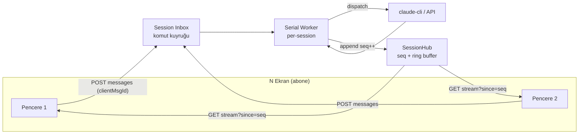

# TionSwarm — Sohbet Kuyruğu + Çoklu-Ekran Senkronizasyonu (Event-Sourcing Refactor)

> Durum: **Faz 1–4 TAMAMEN UYGULANDI ✅** (2026-07-10). Tam otoriter cutover +
> interaction CAS + durable send-queue + presence. Backend uçtan uca yeşil
> (`go build`/`go vet`, **815 test / 35 paket geçti**), frontend `tsc --noEmit` +
> `vite build` temiz. Canlı çok-pencere runtime testi kullanıcıda. Uygulama özeti
> dosya sonunda "Uygulama durumu".
>
> Amaç: Sohbet akışını "owner window kendi SSE'sini stream'ler + non-owner
> window'lar inflight snapshot + polling ile kurtarır" ikiliğinden çıkarıp,
> **sunucu-otoriter, tek total-order'lı, cursor tabanlı event akışı** modeline
> taşımak. Her pencere sadece bir **abonedir**; "sahip pencere" kavramı ölür.

## Sorun

Bugünkü model (bkz. `07-CHAT-UX.md`, `30-COKLU-PENCERE.md`):

- **Owner/non-owner ikiliği:** turu başlatan pencere `POST /api/chat/stream`
  üzerinden kendi SSE'sini render eder; diğer pencereler global `/events`
  bus'ından `session_step` alır **+ saniyede bir** `GET /sessions/{id}/inflight`
  polling ile metni ilerletir. İki farklı kod yolu, `syncLive`/`reseedLive`/
  `liveBubblesRef` jimnastiği.
- **İnteraktif kartlar yayılmıyor:** `busForwardable` (`agent/sessionstep.go`)
  `ask`/`permission`/`plan` adımlarını bus'tan düşürür → bir `todo_list` veya
  `ask_user` kartı yalnız owner pencerede görünür, diğerlerinde görünmez.
- **Race:** aynı session iki ekranda açıksa ve `ask_user` iki ekrandan
  cevaplanırsa; `run.answer` kanalı (buffered-1) kanal düzeyinde ilk-yazanı
  alır ama diğer ekranın kartı **kapanmaz** (ona resolved sinyali gitmez).
- **Kuyruk yok:** tur çalışırken gelen yeni mesajın net bir politikası yok;
  `steer` var ama "kuyruğa al, sıra gelince gönder" + iptal yok.

## Mevcut yapı taşları (sıfırdan başlamıyoruz)

| İhtiyaç | Bugünkü karşılık | Dosya |
|---|---|---|
| Append-only event log | `session.jsonl` (O(1) append), `d.messages[sid]` in-memory slice (implicit sıra) | `db/store.go` |
| Pub/sub | `events.Bus` (global, non-blocking, slow-drop) | `events/events.go` |
| Uçuşan tur | `inflight.json` sidecar + `ReadInflight`/`recoverInflight` | `db/inflight.go` |
| Tur kontrol | `chatRun{answer,steer,cancel,done}` + `chatRuns` (runID-keyed) | `api/chat_control.go` |
| Tek sunucu N pencere | Çoklu-pencere = ayrı süreç, **aynı sunucu** | `30-COKLU-PENCERE.md` |

**Eksik olan tek çekirdek primitive:** per-session **monoton sequence** ile
etiketlenmiş, replay-edilebilir bir **session event log** + cursor'lı SSE.

## Hedef mimari



### İki akış — kesin ayrım (her şeyin anahtarı)

1. **Dayanıklı domain event'leri** → per-session **monoton `seq`** alır, ring
   buffer'da tutulur, replay edilebilir. Kinds: `user_message`, `agent_start`,
   `step` (thinking/tool/todo/diff/recovery/error/context_change), `reply`,
   `interaction_open`, `interaction_resolved`, `session_update`, `turn_done`,
   `turn_error`, `queue_update`.
2. **Efemer event'ler** → `seq` almaz (0), ring'e girmez, best-effort canlı:
   `delta` (token), `tool_delta`, `typing`. Reload'da snapshot'tan tazelenir.
   (`busForwardable`'ın mevcut ayrımının resmileşmiş hâli.)

### SessionHub (yeni: `internal/sessionhub`)

Per-session:
- `seq int64` (atomik monoton sayaç; process ömrü boyunca — kalıcı değil, boot'ta
  mevcut mesaj sayısından ≥ değere seed edilir).
- `ring []Event` (son N dayanıklı event; gap replay için, örn. 512).
- `subs map[int]chan Event` (aboneler).

API: `Publish(sessionID, ev)` (seq atar, ring'e ekler, fan-out) ·
`Subscribe(sessionID) (id, ch, cursor)` · `Replay(sessionID, since) []Event` ·
`Drop(sessionID)`.

Efemer event'lerde `Publish` seq atamaz ve ring'e koymaz.

**`Drop` — oturum durumunu serbest bırakır.** `states` haritası yalnızca
büyüyordu: publish edilen ya da izlenen her oturum, silindikten sonra bile ring
buffer'ını process ömrü boyunca tutuyordu — otonom bir workspace'in sürekli
üretip attığı schedule/spawn/worker oturumları dahil. `Drop`, oturum silinirken
`teardownSessionRuntime`'ın son fazında çağrılır ve açık abone kanallarını
kapatır (stream handler iki-değerli okumayla temiz çıkar). Drop'tan **sonra**
gelen bir `Publish`/`Subscribe` durumu sıfırdan yeniden yaratır; bu yüzden
yalnız oturum gerçekten giderken çağrılmalıdır.

> **Not (istemci kablolaması):** efemer `tool_delta`, hub'a geçiş sırasında
> istemci `switch`'inde karşılıksız kalmıştı — sunucu yayınlıyor, `applyStep`'in
> chunk birleştirme mantığı ve `ToolDeltaStep` render'ı hazır, ama `case` yoktu;
> yani uzun süren araçların canlı çıktısı sessizce düşüyordu. `case
> HubKind.ToolDelta` eklendi.

### Endpoint: cursor'lı resumable SSE

`GET /api/sessions/{id}/stream?since=<seq>`:
1. Abone ol.
2. Ring'ten `seq > since` olanları replay et (gap doldurma).
3. Canlıya geç; her SSE frame `id: <seq>` taşır → tarayıcı `EventSource`
   reconnect'te `Last-Event-ID`'yi otomatik yollar (`since` fallback).
4. Ring taşmışsa (`since` çok eski) → `event: reset` yolla, client tam
   `listMessages` ile resync eder.

`POST /api/chat/stream` (mevcut) turu çalıştırmaya devam eder ama frontend artık
UI render için onun frame'lerine bağlı değildir — tüm pencereler (gönderen dahil)
`GET .../stream`'den render eder. Faz 3'te submit `POST .../messages` (enqueue)
olur.

## Faz 2 — Generic interaction CAS (resolve-once)

Tüm tek-cevaplı etkileşimler (`ask_user`, `permission`, `plan` onayı) tek
primitive'e:

```
type PendingInteraction struct {
    ID        string  // idempotency + CAS hedefi
    SessionID string
    Kind      string  // ask | permission | plan
    Payload   ...      // question/options/tool/reason
    state     int32    // 0=open, 1=resolved (atomic CAS)
    answer    chan string
}
```

- Açılış → `interaction_open` **dayanıklı** event (seq'li) yayınla → **tüm**
  pencereler kartı gösterir.
- Cevap → `POST /api/sessions/{id}/interactions/{iid}/answer` → `CompareAndSwap
  (open→resolved)`. Kazanan `answer`'a yazar; kaybeden `409 already_resolved`.
- Resolve → `interaction_resolved` (seq'li, kazanan cevabı + kim) yayınla → tüm
  pencereler kartı kapatır, cevabı transkripte yazar.
- `interaction_open`/`interaction_resolved` artık bus'tan **düşmez** (mevcut
  `busForwardable` StepAsk/Permission/Plan drop'unun yerini alır) — çünkü artık
  runID değil, session+interactionID ile herkes cevaplayabilir.

## Faz 3 — Inbound send-queue + cancel + steer/queue politikası

- `POST /api/sessions/{id}/messages {text, clientMsgId, attachments}` → mesajı
  **inbox**'a ekler, `queue_update` (seq'li) yayınlar, hemen döner. Serial
  per-session worker sıradakini provider'a dispatch eder.
- **Idempotency:** `clientMsgId` (client ULID) ile dedupe — çoklu-ekran çift
  gönderim / retry / reconnect tekrarını yutar.
- **Kalıcılık:** inbox diske yazılır → crash recovery = "işlenmemiş inbox
  girdilerini replay et"; `inflight.json` rolü yalnız **efemer streaming metni**
  kurtarmaya daralır.
- **Uçuşan head dayanıklılığı (2026-07-12):** `inbox.json` artık `{inflight, items}`
  obje şekli (eski bare-array `decodeInbox` ile geriye-uyumlu okunur). Worker head'i
  pop edince onu ayrı `inflight` slotuna yazar ve tur bitene kadar orada tutar →
  tur kendi `inflight.json` sidecar'ını yazamadan süreç ölse bile (hung subprocess
  hard-kill) boot'ta `recoverInboxes` head'i öne alıp yeniden dispatch eder. Eski
  bug: head, tur çalışmadan **önce** kuyruktan silinip persist ediliyordu → sidecar
  da yoksa mesaj **tümden kayboluyordu** (SES10 "ajan hiç başlamıyor" semptomu).
- **Worker watchdog + poison guard (2026-07-12):** her kuyruk turu `runQueuedTurn`
  ile panik-bariyeri **+ 20 dk watchdog** altında koşar; asılan tur süreyi aşınca
  worker live-run'ı `cancel()` eder → goroutine çözülür, kuyruk kilitlenmez. Her
  dispatch `inboxItem.Attempts++` sayar; `maxInboxAttempts` (3) aşılırsa mesaj
  "poison" olarak düşürülür (görünür `turn_error`) → her boot'ta çöken tur kuyruğu
  sonsuza dek bloklayamaz.
- **Kuyruk-hatası kalıcılaştırma (2026-07-13):** üç bariyer de (panic/watchdog/
  poison) artık `recordQueueTurnFailure` ile hatayı **kalıcı** yazar: `session.jsonl`'e
  `kind=error` asistan mesajı (hub `KindReply` → yenilemeye dayanıklı kırmızı kart,
  `analyze-session` bulur) **+** `debug.jsonl`'e `DebugError` olayı (Debug paneli /
  `read_session_debug` görür). Önceden yalnız ephemeral hub `turn_error` + server-log
  vardı → tur setup'ında ölen panic "sessiz asılma" gibi görünüyordu.
- **Cancel/dequeue:** `DELETE .../messages/{clientMsgId}` provider'a gitmemiş
  girdiyi çeker.
- **Steer vs queue politikası (UI'da görünür):** tur çalışırken gelen mesaj →
  varsayılan **kuyruğa al** ("mevcut tur bitince gönderilecek" rozeti);
  kullanıcı isterse **steer** (tur ortasına enjekte). Koordinatör tur kuyruğu +
  coalesce mantığı (`coordination.go`) buraya taşınır.

## Faz 4 — Presence + bildirim

- **Presence:** hub abonelerinden session başına bağlı ekran sayısı →
  "başka ekran cevaplıyor…" göstergesi + odaktaki pencereye bildirim gönderme
  (`29-BILDIRIM-SINYALLERI.md` ile birleşir).

## 8 madde → faz eşlemesi

| # | Madde | Faz |
|---|---|---|
| 1 | Cursor/sequence number (asıl primitive) | 1 |
| 2 | Race = interaction CAS (mesajda değil) | 2 |
| 3 | Steer vs queue politikası, UI'da görünür | 3 |
| 4 | Idempotency = client-generated msg ID | 3 (interaction ID: 2) |
| 5 | Kuyruk = dayanıklılık → inflight hack daralır | 3 |
| 6 | Cancel/dequeue | 3 |
| 7 | Presence | 4 |
| 8 | Total order — herkes tek inbox (user+auto+peer+worker) | 1 (log) + 3 (inbox) |

## Ağ dayanıklılığı (doc 48 — VPS remote client)

Client'lar ağ üzerinden bağlanabildiğinden cursor'lı SSE **reconnect + resume +
gap-fill** dayanıklı olmalı: `Last-Event-ID`, ring taşınca `reset`, ping/keepalive
(mevcut 25sn).

## Dokunulacak dosyalar (canlı liste)

- **Yeni:** `internal/sessionhub/hub.go` (Hub + Event + ring + seq).
- `internal/api/session_stream.go` (yeni): `GET /sessions/{id}/stream?since=`.
- `internal/api/chat_stream.go`: her dayanıklı adımı hub'a `Publish` (seq'li);
  efemer delta'yı `Ephemeral` işaretle.
- `internal/api/chat_control.go`: interaction CAS (Faz 2); inbox worker (Faz 3).
- `internal/db/`: inbox kalıcılığı (Faz 3, yeni `inbox.go`).
- **Frontend:** `features/chat/useSessionStream.ts` (yeni, cursor'lı); `ChatView`
  + `chatStream*` ailesini buna geçir; inflight polling + owner/non-owner kaldır;
  interaction kartlarını `interaction_open/resolved` ile sür.

## Uygulama durumu (2026-07-10)

**Backend (tamam):**
- `internal/sessionhub/hub.go` — per-session monoton `seq` + ring buffer (512) +
  epoch + gap-aware `Replay`; `Publish`/`Subscribe`/`Head`/`SubscriberCount`
  (presence temeli). Testler: `hub_test.go` (4/4).
- `internal/api/session_stream.go` — `GET /sessions/{id}/stream?since=&epoch=`
  (hello/reset/hub frame'leri, `id:<seq>` ile `Last-Event-ID` uyumlu) +
  `bridgeBusToHub` (autonomous turları bus→hub aynala; interaktif zaten doğrudan).
  `hello` = `{epoch, head, now}`; `now` sunucunun unix saniyesidir — istemci ilk hub
  frame'ini beklemeden geçen-süre sayaçlarını sunucu saatine kalibre eder
  (`shared/lib/serverClock.ts`; her hub frame'inin `time` alanı da beslenir). Detay `07`.
- `internal/api/interactions.go` — `pendingInteraction` + CAS (`resolveInteraction`
  / `cancelInteraction`), `POST /sessions/{id}/interactions/{iid}/answer`
  (kazanan 200, kaybeden 409), `waitInteraction` (native) + `waitInteractionCLI`.
- `internal/api/chat_stream.go` — interaktif tur her dayanıklı olayı **eş-sıralı**
  hub'a yayınlıyor (user_message/agent_start/step/reply/turn_done/error); delta
  efemer; native ask/permission → `openInteraction`.
- `internal/api/mcp_interaction_tools.go` — CLI ask/confirm/permission/plan →
  `openInteraction` + `waitInteractionCLI` (run.emit+run.answer yerine).

**Frontend (tamam — tam cutover):**
- `api/sessionStream.ts` — cursor + epoch + gap-detect + auto-reconnect SSE.
- `features/chat/chatStreamHub.ts` — hub olaylarını uygular (ghost bubble, delta,
  reply map-in-place, interaction_open/resolved → kart). AKTİF session'ın tek
  otoriter render kaynağı.
- `useChatStream.ts` — aktif session için hub aboneliği; `applyAutoStep` artık
  yalnız off-screen pending işaretler; `answerAsk` → CAS endpoint; inflight
  polling + bus-ghost + recoverInflight kaldırıldı (no-op).
- `chatStreamSend.ts` — `performSend` yalnız turu ÇALIŞTIRIR + runId tutar (stop/
  steer); render tamamen hub'a devredildi. Optimistic user balonu id-dedupe'lu.

**Faz 3 — Send-queue (tamam):**
- `internal/api/chat_stream.go` — `handleChatStream` ince HTTP wrapper'a bölündü;
  tur mantığı `runChatTurn(clientGone, wsp, req, write)`'a çıkarıldı (write=nil →
  worker; hub UI'ı taşır). Pre-flight hataları hub `turn_error`'a gider.
- `internal/db/inbox.go` — per-session `inbox.json` (opaque JSON, atomik).
- `internal/api/inbox.go` — `inboxStore` + per-session **serial worker**;
  `POST /sessions/{id}/messages` (enqueue, `clientMsgId` idempotency),
  `DELETE /sessions/{id}/queue/{msgId}` (cancel), `POST /sessions/{id}/control`
  (session-scoped stop/steer — worker runId tutmadığından), `queue_update`
  broadcast, boot `recoverInboxes`.
- Frontend: `performSend` artık **enqueue** (optimistic yok — kuyruktaysa tray,
  çalışınca chat balonu); `queueMessage`=send, `stopTurn`/`steerTurn`/
  `interruptTurn`→`sessionControl`, `removePending`→`cancelQueued`; client-side
  flush döngüsü kaldırıldı (backend serialize ediyor).

**Faz 4 — Presence (tamam):**
- `hub.SubscriberCount` + `publishPresence` (efemer) her abone giriş/çıkışında;
  frontend `activePresence` → ChatView'de "Bu oturum N pencerede açık" rozeti.

**Sağlamlaştırma + genişletme (2. tur, 2026-07-11):**
- **Replay optimizasyonu:** hub'a per-session `committed` boundary + `Commit()`;
  fresh abonelik (`since<=0`) yalnız `committed`'dan sonraki in-flight tail'i
  replay eder. Ring: **uncommitted (in-flight) event'ler asla eviction'a
  uğramaz** — sadece committed olanlar cap'lenir. Testler: `TestReplayCommitBoundary`,
  `TestRingKeepsUncommitted`.
- **Autonomous simetri (F):** `bridgeBusToHub` tamamlanma event'inde son assistant
  mesajını `KindReply` olarak hub'a yayınlar (+turn_done+Commit) → autonomous tur
  da canlı reply gösterir (`publishAutonomousReply`). Simetrik olarak enjekte
  **user** mesajları da `session_user_message` bus tipiyle köprülenir (aşağıdaki
  2026-08-03 bug fix); yani autonomous akışın hem soru hem cevap tarafı canlıdır.
- **Bug fix — otonom canlı adım köprüsü (2026-07-11):** `session_step` guard'ı
  `live && !info.Autonomous` olmalı. `autonomousInteraction` otonom CLI turları için
  Interaction MCP token'ını eşleyen **token-only bir chatRun** kaydeder; eski guard
  (`live`) bunu "interaktif" sanıp adımları atlıyordu → koordinatör/scheduler/spawn
  turlarında düşünce/tool adımları tur bitene kadar görünmüyordu. Interaktif run
  (kendi yayınlar) atlanır, otonom run (yayınlamaz) köprülenir. Test:
  `bridge_autonomous_test.go`.
- **Bug fix — interaktif adım köprüsü `origin` tabanlı (2026-07-23):** Yukarıdaki
  `live && !info.Autonomous` guard'ı **canlılığa** dayandığı için yeni bir yarışa
  yol açıyordu: `runChatTurn` `turn_done`'u **doğrudan** hub'a yayınlar, ardından
  `defer s.runs.unregister(runID)` çalışır. Bus'ta bekleyen **geç (straggler)** bir
  interaktif `session_step`, run kaydı silindikten sonra işlenirse `!live` görünür
  ve hub'a yeniden yayınlanırdı → istemci `turn_done` ile temizlediği
  `streamingSessions`'ı bu geç `KindStep` ile **yeniden** doldurup "hâlâ konuşuyor"
  takılı kalırdı (sayfa yenileyince düzelir, çünkü tur gerçekten bitmiştir). Çözüm:
  interaktif adımlar bus olayında `Target["origin"]="interactive"` ile etiketlenir
  (`EmitSessionStep`); köprü bunları **run canlılığından bağımsız koşulsuz atlar**.
  Otonom adımlar (`origin=""`) eskisi gibi köprülenir. `emitSessionStep` artık
  `origin` parametresi alır. Testler: `TestBridgeSkipsInteractiveSteps` (run
  kaydı YOK → straggler senaryosu), `TestBridgeForwardsAutonomousSteps`.
- **Otonom "çalışıyor" göstergesi + gerçek Durdur (2026-07-12):** Otonom turlar
  `KindUserMessage` yayınlamadığından frontend busy-state işaretlenmiyordu. Çözüm:
  `chatStreamHub.ts` ilk `KindAgentStart`/`KindStep`'te oturumu `streamingSessions`'a
  ekler (interaktifle simetri). `autonomousInteraction` artık gerçek bir `cancel`
  kaydeder (`context.WithCancel`) → izleyicinin Durdur/Kes'i otonom CLI turunu
  gerçekten durdurur; `runCoordinatorTurn`/`runWorker` `context.Canceled`'ı temiz
  "durduruldu" mesajına çevirir.
- **Bug fix — enjekte USER mesajı köprüsü (2026-08-03):** Autonomous simetri (F)
  yalnız assistant reply'ı köprülüyordu; runtime'ın koordinasyon akışında enjekte
  ettiği **user-rol mesajları** (worker `<task-notification>`, `send_to_worker`
  promptu, coordination status/guard notları) `db.AddMessage` ile sessizce diske
  yazılıp hub'a hiç yayınlanmıyordu. Sonuç: açık koordinatör/worker sohbetinde
  worker'ın cevabı canlı görünmüyor, ardından köprülenen koordinatör reply'ı
  "görülmeyen bir mesaja yanıt" gibi (worker "2. kez cevap veriyor" izlenimi)
  belirip ancak reload'da düzeliyordu. Çözüm: yeni bus tipi
  `session_user_message` (`Event.Msg` = marshalled `db.Message`) + tek helper
  `recordInjectedUserNote` (AddMessage + `emitInjectedUserNote`) tüm enjeksiyon
  noktalarını sarar; `bridgeBusToHub` bunu **durable** `KindUserMessage` olarak
  hub'a basar (interaktifle simetri, sırayı korur; run-canlılığından bağımsız —
  enjekte mesajı hiçbir interaktif run yayınlamaz, çift-yayın yok; id ile idempotent).
  `chatStreamHub` **not-tipi** enjekte origin'lerde (`worker-note`/`coordination-guard`/
  `auto-continue`/`wake`/`schedule`) busy-state'i **kurmaz** (turun kendi AgentStart/Step'i
  yakar → turn-cap/mid-run edge'inde takılı "çalışıyor" yok); gerçek tur-başı mesajlar
  (spawn/inbox açılış turu, origin boş) eskisi gibi anında işaretler. Test:
  `TestBridgeForwardsInjectedUserMessage`.
  **Kapsam (tüm enjekte user turları):** koordinasyon (worker-note/send_to_worker/
  status/guard/stall) + `spawn` açılış promptu + peer `inbox` teslimi (AuthorKind=agent
  korunur) + `scheduler` (zamanlı prompt + wake) + `auto-continue` nudge + `flow` transkript
  girdisi + `flow-coordinator` node promptu. Hepsi `recordInjectedUserNote`/
  `recordInjectedUserMessage` funnel'ından geçer; her birinin ardından o oturuma
  `sessionId` taşıyan bir completion event'i (`chat`/`spawned`/`schedule`/`flow`) gelir →
  bridge turn_done'ı basıp busy-state'i temizler.
- **Worker sağlamlığı:** `runTurnGuarded` panic-barrier — tek turun panic'i
  worker'ı öldürüp session kuyruğunu kilitlemez (log + hub turn_error + devam).
  `inbox.seen` dedupe seti kuyruk boşalınca sıfırlanır (sınırsız büyüme yok).
- **Interaction CAS testi:** `TestResolveInteractionCAS` — 16 eşzamanlı cevap →
  tam olarak 1 kazanan.
- **Kuyruk yönetimi:** `DELETE /sessions/{id}/queue` (tümünü temizle),
  `POST /sessions/{id}/queue/{msgId}/front` (öne al); frontend PendingTray'de
  "Sırada #N" + "öne al" + "Kuyruğu temizle"; **optimistic çip** (enqueue anında
  tray'de, queue_update ile reconcile).
- **Presence ipucu:** açık interaction + >1 pencere → "N pencerede açık — ilk
  cevaplayan geçerli".
- **Ölü kod temizliği:** `chatStreamInterventions.ts` silindi;
  `chatStreamAutoLive.ts` sadeleşti; backend `run.answer` kanalı + chat-control
  `"answer"` aksiyonu kaldırıldı (interaction endpoint devraldı).

**Typing göstergesi (2026-07-11):** `POST /sessions/{id}/typing {active,clientId}`
→ efemer `typing` hub yayını; composer keystroke'ta throttle'lı gönderilir (ilk
tuş `active`, 2.5sn boşlukta `inactive`); diğer pencereler "Başka bir pencere
yazıyor…" gösterir (kendi echo'su `windowClientId` ile yok sayılır). `sessionStream`
`windowClientId` üretir.

**Canlı tarayıcı testi (Playwright, 2026-07-11):** İki sekmede aynı session açıldı.
- **Presence** ✅ canlı "N pencerede açık", sekme kapanınca decrement doğru.
  (Dev'de `<StrictMode>` effect'i çiftlediğinden sayı sekme başına ~+1 şişer —
  **prod build'de doğru**; gerçek leak değil.)
- **Typing** ✅ üç halka da doğrulandı: composer `onChange`→`POST /typing` (fetch
  spy), backend SSE frame teslimi, karşı pencerede render.

**Composer buton modeli (queue-entegre):** Tur çalışırken metin yazılınca üç buton
çıkar — **Sıraya** (tur bitince çalış = enqueue-after), **Kes** (mevcut turu durdur,
benimki sıradaki = `sessionControl stop` + enqueue), **Yönlendir** (çalışan tura
canlı rehberlik enjekte et). Üçü de kuyruk-entegre. **Yönlendir artık her iki
provider'da da çalışır:** NATIVE tool loop `drainSteer` ile iterasyonlar arası
enjekte eder; **claude-cli** için mesaj `chatRun.pendingSteer`'a saklanıp bir
sonraki **tool sınırında** Interaction MCP permission tool'unun `additionalContext`
alanıyla teslim edilir (`{"result":"steered"}`). Tur hiç tool çağırmadan (yalnız
metin) biterse `runChatTurn` bekleyen mesajı **sonraki tur olarak kuyruğa düşürür**
(steer_undelivered fallback). Ayrıntı: [59-CLI-STEER-PLANI.md](59-CLI-STEER-PLANI.md)
(2026-07-11 uygulandı; önceki `unsupported`→kuyruk davranışının yerini aldı).

**Bug fix — off-screen "Durdur" sızıntısı (2026-07-11):** Tur, kullanıcı başka
session'a geçtikten sonra biterse, o session'ın hub aboneliği kapandığı için
`turn_done` ulaşmıyor ve `streamingSessions` temizlenmiyordu → geri dönünce takılı
"Durdur" + artan sayaç (tur aslında bitmiş; diskte tam yanıt, inflight/inbox yok).
Düzeltme: global tamamlanma feed'i (`useAppEvents` → `clearPending`) artık
`streamingSessions`'ı da temizler (bu sinyal aktif-session'dan bağımsız gelir).
Mevcut takılı session sayfa yenilemeyle de temizlenir (streaming boş başlar).

**Kalan sınır:** stream/queue/typing endpoint'lerine auth yok (VPS'e açılırsa
gerekir); dev StrictMode presence şişmesi (prod'da yok); kuyruk öğesi düzenleme.
Ekstra dayanıklılık için `activeSessions` ile periyodik streaming reconcile
düşünülebilir (şimdilik event-driven clear + reload yeterli).

## Birleşik per-session tur kilidi (2026-07-25)

Send-queue (bu doc) kullanıcı `/messages`'larını **birbirine** karşı serileştirir;
ama tur açan diğer yollar — legacy `/chat/stream`·`/chat`, scheduler wake, peer
inbox teslimi, scheduled prompt — kuyruğu atlayıp doğrudan tur koşuyordu. Bunlar
eskiden yalnız `Role=="coordinator"` oturumlarda `coordSlot` ile serileşiyor, düz
oturumda ise **eşzamanlı ikinci bir tur** açabiliyordu (wake↔kullanıcı,
direct-chat↔inbox-worker yarışı). Artık `coordSlot` **her oturumun** tek tur
kilidi: `runChatTurn`/`handleChat` `BeginSessionUserTurn` ile, otonom yollar
`claimSessionTurnSlot` ile **koşulsuz** claim eder → aynı oturumda asla iki tur
paralel koşmaz. Detay + testler: `_Docs/47` §13.

## Legacy `/chat/stream` + `/chat` kuyruğa taşındı (dayanıklı cutover, 2026-07-25)

Bu iki legacy endpoint (frontend artık **hiçbirini** çağırmıyor — yalnız dış
otomasyon/eski istemci; Doc 33) turu **inline** koşuyor, mesajı `inbox.json`'a
yazmıyordu → süreç tur ortasında çökerse mesaj kurtarılamıyor + kuyruğu atlıyordu.
Artık ikisi de `POST /sessions/{id}/messages` gibi **serial send-queue**'ya enqueue
eder (kalıcı, crash-recoverable, tek-tur garantili) ve per-session **hub**'ı gözler:
- `handleChatStream` → hub olaylarını **legacy SSE frame** şekline (meta/agent/step/
  reply/done/error) çevirip relay eder; senkron streaming sözleşmesi korunur.
- `handleChat` → terminal olayı bekler, kalıcı yanıtı DB'den JSON döndürür.

**Korelasyon:** her handler taze bir `clientMsgId` üretir (dedupe'a takılmaz);
`runChatTurn` + kuyruk dayanıklılık bariyerleri (panic/watchdog/poison) bu id'yi
terminal hub olaylarına (`turn_done`/`turn_error`) damgalar → gözlemci **kendi**
turunun bitişini başka bir kuyruk turununkinden ayırır (öndeki turun terminal'i
DÜŞÜRÜLÜR, erken kapatmaz). Slow-consumer drop'una karşı `Replay` ile gap-fill.
Ayrıca `failTurn` artık hub'a da `turn_error` yayınlar (önceden yalnız legacy SSE
sink'e yazıyordu → hub istemcileri hatayı ancak reload'da görüyordu; gözlemci
asılıyordu). Kod: `internal/api/chat_queue.go`; testler: `chat_queue_test.go`
(`TestPayloadClientMsgID`, `TestRelayLegacyFrameOwnTerminalOnly`). Kaybolan tek şey
non-stream yanıtındaki `contextTokens`/`compacted` alanları (tur artık band-dışı
koştuğundan yeniden üretilmiyor); `reply`/`replyMessage`/`usage`/`model` korunur.

### Nadir-senaryo sağlamlaştırması (2026-07-25)

Cutover sonrası adversarial gözden geçirmede 3 nadir boşluk bulunup kapatıldı:
- **Düşen terminal frame → asılma:** hub'ın non-blocking fan-out'u terminal
  `turn_done`/`turn_error`'ı slow-consumer'a düşürürse ardından başka olay gelmediği
  için gap-tespiti tetiklenmez → gözlemci sonsuza dek bekler. Çözüm: her ping tick'te
  `drainReplay` ile ring'ten görülmemiş dayanıklı olaylar reconcile edilir (stream +
  non-stream). Test: `TestDrainReplayRecoversDroppedTerminal`.
- **`handleChat` yanlış/boş yanıt:** ardışık kuyruk turlarında "son assistant mesajı"
  yarışı. Çözüm: gözlemci turu boyunca gördüğü **hub `KindReply` payload'ını** kullanır
  (serial worker → turn_done'dan hemen önceki reply bizimkidir); DB fallback'i de artık
  sondan geriye son assistant rolünü tarar.
- **Asılan wake/scheduled tur → kuyruk head-of-line bloğu:** `deliverWake`/`deliverPrompt`
  artık per-session slotu alıyor ama `withActivityTimeout` (spawn/worker'da var) yoktu →
  sonsuz asılan bir wake, slotun Cond-wait'i ctx'i dinlemediğinden tüm oturum kuyruğunu
  bloke ederdi. Çözüm: her ikisi de `withActivityTimeout(SpawnTimeout, SpawnIdleTimeout)`
  ile sarıldı (spawn/worker paritesi).
- **Kuyruktaki mesaj başka pencereden iptal edilirse → gözlemci asılması:** `/chat` +
  `/chat/stream` kendi terminal olayını bekler; mesaj çalışmadan `DELETE .../queue/{id}`
  veya `.../queue` ile silinirse terminal hiç gelmez → gözlemci sonsuza beklerdi. Çözüm:
  `queue_update` payload'ına **`inflightClientMsgId`** eklendi (dispatched↔cancelled ayrımı);
  gözlemci mesajını kuyrukta **canlı gördükten sonra** (`queueHasMsg`) kaybolursa iptal
  sayar → stream `error{reason:"cancelled"}` frame'i, non-stream **409** döner. Enqueue-öncesi
  yarışa karşı "önce canlı görülmeli" guard'ı (false-cancel yok). Test: `TestQueueHasMsg`.

## Refactor (2026-07-13) — tek-snapshot flush + mutator helper

Kuyruk mutator'ları eskiden `persistInbox` + `publishQueueUpdate` çiftini ayrı ayrı
çağırıyordu; her ikisi de inbox kilidini **bağımsız** alıyordu, yani iki kritik bölüm
arasında başka bir goroutine kuyruğu değiştirebilir → diske yazılan snapshot ile her
pencereye yayınlanan kuyruk **birbirinden sapabilirdi**. İkisi tek locked-snapshot'tan
türeten `flushInbox` ile birleştirildi (tutarsızlık penceresi kapandı, kilit alımı
yarıya indi). Ortak kilitle-mutasyon-flush iskeleti `withInbox(sessionID, fn)`
helper'ına toplandı (`cancel/clear/move`). `runTurnGuarded` panic bariyeri, kavramsal
eşi `runQueuedTurn` watchdog'unun yanına (`inbox_durability.go`) taşındı. Davranış
birebir korundu; `go build`/`go vet` temiz, inbox testleri 4/4 geçiyor.

## Session silme — fail-closed runtime teardown (2026-07-13)

Session silmek (`handleDeleteSession`) eskiden yalnız DB + disk + worktree temizliyordu;
**çalışan runtime durumuna hiç dokunmuyordu** → geride artıklar kalıyordu: (1) warm
claude-cli havuz süreçleri (`DropSession` silmede çağrılmıyordu), (2) uçuştaki tur +
subprocess'i (`run.cancel` yok), (3) bellekteki inbox worker'ı kuyruğu dispatch etmeye
devam ediyordu, (4) autonomous worker/coordinator (`StopWorker` yok).

Çözüm: DB silmesinden **önce** `teardownSessionRuntime` (`session_teardown.go`), **fail
closed** — canlı bir tur/subprocess durdurulamazsa delete 409 ile iptal edilir ve session
tam olarak korunur (kuyruk geri yüklenir, worker devam eder). Sıra: kuyruğu `closing`
bayrağıyla **dondur** (yeni dispatch durur ama mesajlar korunur) → uçuştaki turu iptal
edip `run.done`'u bekle (`sessionTeardownGrace`=15sn, bitmezse abort) → warm süreçleri
**doğrulanmış kill** ile düşür (`DropSessionChecked`/`closeChecked`: öldürülemeyen süreç
havuzda kalır, orphan olmaz, delete'i bloke eder) → autonomous worker'ı durdur → inbox
girdisini kaldır. `CLISession.closeChecked` `os.ErrProcessDone`'u başarı sayar, kill
hatasında `closed=false` bırakıp retry'a izin verir. Testler: `session_teardown_test.go`
(stop/timeout/freeze/resume). `go build`/`go vet` temiz, 403 test geçiyor.

## Doğrulama

Her fazda `go build ./...` + `go vet`. Canlı: aynı session'ı iki pencerede aç →
(1) bir turun adımları + `todo_list` her iki pencerede senkron; (2) `ask_user`
bir ekrandan cevaplanınca diğerinde kart kapanır; (3) aynı anda iki cevap →
biri kazanır, diğeri `already_resolved`; (4) reload → gap cursor'dan doldurulur,
mesaj kaybı yok.
