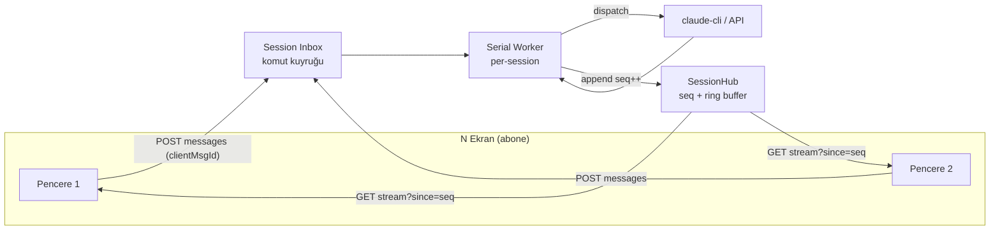

# TionSwarm — Sohbet Kuyruğu + Çoklu-Ekran Senkronizasyonu (Event-Sourcing Refactor)

> Durum: **Faz 1–4 TAMAMEN UYGULANDI ✅** (2026-07-10). Tam otoriter cutover +
> interaction CAS + durable send-queue + presence. Backend uçtan uca yeşil
> (`go build`/`go vet`, **815 test / 35 paket geçti**), frontend `tsc --noEmit` +
> `vite build` temiz. Canlı çok-pencere runtime testi kullanıcıda. Uygulama özeti
> dosya sonunda "Uygulama durumu".
>
> Amaç: Sohbet akışını "owner window kendi SSE'sini stream'ler + non-owner
> window'lar inflight snapshot + polling ile kurtarır" ikiliğinden çıkarıp,
> **sunucu-otoriter, tek total-order'lı, cursor tabanlı event akışı** modeline
> taşımak. Her pencere sadece bir **abonedir**; "sahip pencere" kavramı ölür.

## Sorun

Bugünkü model (bkz. `07-CHAT-UX.md`, `30-COKLU-PENCERE.md`):

- **Owner/non-owner ikiliği:** turu başlatan pencere `POST /api/chat/stream`
  üzerinden kendi SSE'sini render eder; diğer pencereler global `/events`
  bus'ından `session_step` alır **+ saniyede bir** `GET /sessions/{id}/inflight`
  polling ile metni ilerletir. İki farklı kod yolu, `syncLive`/`reseedLive`/
  `liveBubblesRef` jimnastiği.
- **İnteraktif kartlar yayılmıyor:** `busForwardable` (`agent/sessionstep.go`)
  `ask`/`permission`/`plan` adımlarını bus'tan düşürür → bir `todo_list` veya
  `ask_user` kartı yalnız owner pencerede görünür, diğerlerinde görünmez.
- **Race:** aynı session iki ekranda açıksa ve `ask_user` iki ekrandan
  cevaplanırsa; `run.answer` kanalı (buffered-1) kanal düzeyinde ilk-yazanı
  alır ama diğer ekranın kartı **kapanmaz** (ona resolved sinyali gitmez).
- **Kuyruk yok:** tur çalışırken gelen yeni mesajın net bir politikası yok;
  `steer` var ama "kuyruğa al, sıra gelince gönder" + iptal yok.

## Mevcut yapı taşları (sıfırdan başlamıyoruz)

| İhtiyaç | Bugünkü karşılık | Dosya |
|---|---|---|
| Append-only event log | `session.jsonl` (O(1) append), `d.messages[sid]` in-memory slice (implicit sıra) | `db/store.go` |
| Pub/sub | `events.Bus` (global, non-blocking, slow-drop) | `events/events.go` |
| Uçuşan tur | `inflight.json` sidecar + `ReadInflight`/`recoverInflight` | `db/inflight.go` |
| Tur kontrol | `chatRun{answer,steer,cancel,done}` + `chatRuns` (runID-keyed) | `api/chat_control.go` |
| Tek sunucu N pencere | Çoklu-pencere = ayrı süreç, **aynı sunucu** | `30-COKLU-PENCERE.md` |

**Eksik olan tek çekirdek primitive:** per-session **monoton sequence** ile
etiketlenmiş, replay-edilebilir bir **session event log** + cursor'lı SSE.

## Hedef mimari



### İki akış — kesin ayrım (her şeyin anahtarı)

1. **Dayanıklı domain event'leri** → per-session **monoton `seq`** alır, ring
   buffer'da tutulur, replay edilebilir. Kinds: `user_message`, `agent_start`,
   `step` (thinking/tool/todo/diff/recovery/error/context_change), `reply`,
   `interaction_open`, `interaction_resolved`, `session_update`, `turn_done`,
   `turn_error`, `queue_update`.
2. **Efemer event'ler** → `seq` almaz (0), ring'e girmez, best-effort canlı:
   `delta` (token), `tool_delta`, `typing`. Reload'da snapshot'tan tazelenir.
   (`busForwardable`'ın mevcut ayrımının resmileşmiş hâli.)

### SessionHub (yeni: `internal/sessionhub`)

Per-session:
- `seq int64` (atomik monoton sayaç; process ömrü boyunca — kalıcı değil, boot'ta
  mevcut mesaj sayısından ≥ değere seed edilir).
- `ring []Event` (son N dayanıklı event; gap replay için, örn. 512).
- `subs map[int]chan Event` (aboneler).

API: `Publish(sessionID, ev)` (seq atar, ring'e ekler, fan-out) ·
`Subscribe(sessionID) (id, ch, cursor)` · `Replay(sessionID, since) []Event`.

Efemer event'lerde `Publish` seq atamaz ve ring'e koymaz.

### Endpoint: cursor'lı resumable SSE

`GET /api/sessions/{id}/stream?since=<seq>`:
1. Abone ol.
2. Ring'ten `seq > since` olanları replay et (gap doldurma).
3. Canlıya geç; her SSE frame `id: <seq>` taşır → tarayıcı `EventSource`
   reconnect'te `Last-Event-ID`'yi otomatik yollar (`since` fallback).
4. Ring taşmışsa (`since` çok eski) → `event: reset` yolla, client tam
   `listMessages` ile resync eder.

`POST /api/chat/stream` (mevcut) turu çalıştırmaya devam eder ama frontend artık
UI render için onun frame'lerine bağlı değildir — tüm pencereler (gönderen dahil)
`GET .../stream`'den render eder. Faz 3'te submit `POST .../messages` (enqueue)
olur.

## Faz 2 — Generic interaction CAS (resolve-once)

Tüm tek-cevaplı etkileşimler (`ask_user`, `permission`, `plan` onayı) tek
primitive'e:

```
type PendingInteraction struct {
    ID        string  // idempotency + CAS hedefi
    SessionID string
    Kind      string  // ask | permission | plan
    Payload   ...      // question/options/tool/reason
    state     int32    // 0=open, 1=resolved (atomic CAS)
    answer    chan string
}
```

- Açılış → `interaction_open` **dayanıklı** event (seq'li) yayınla → **tüm**
  pencereler kartı gösterir.
- Cevap → `POST /api/sessions/{id}/interactions/{iid}/answer` → `CompareAndSwap
  (open→resolved)`. Kazanan `answer`'a yazar; kaybeden `409 already_resolved`.
- Resolve → `interaction_resolved` (seq'li, kazanan cevabı + kim) yayınla → tüm
  pencereler kartı kapatır, cevabı transkripte yazar.
- `interaction_open`/`interaction_resolved` artık bus'tan **düşmez** (mevcut
  `busForwardable` StepAsk/Permission/Plan drop'unun yerini alır) — çünkü artık
  runID değil, session+interactionID ile herkes cevaplayabilir.

## Faz 3 — Inbound send-queue + cancel + steer/queue politikası

- `POST /api/sessions/{id}/messages {text, clientMsgId, attachments}` → mesajı
  **inbox**'a ekler, `queue_update` (seq'li) yayınlar, hemen döner. Serial
  per-session worker sıradakini provider'a dispatch eder.
- **Idempotency:** `clientMsgId` (client ULID) ile dedupe — çoklu-ekran çift
  gönderim / retry / reconnect tekrarını yutar.
- **Kalıcılık:** inbox diske yazılır → crash recovery = "işlenmemiş inbox
  girdilerini replay et"; `inflight.json` rolü yalnız **efemer streaming metni**
  kurtarmaya daralır.
- **Cancel/dequeue:** `DELETE .../messages/{clientMsgId}` provider'a gitmemiş
  girdiyi çeker.
- **Steer vs queue politikası (UI'da görünür):** tur çalışırken gelen mesaj →
  varsayılan **kuyruğa al** ("mevcut tur bitince gönderilecek" rozeti);
  kullanıcı isterse **steer** (tur ortasına enjekte). Koordinatör tur kuyruğu +
  coalesce mantığı (`coordination.go`) buraya taşınır.

## Faz 4 — Presence + bildirim

- **Presence:** hub abonelerinden session başına bağlı ekran sayısı →
  "başka ekran cevaplıyor…" göstergesi + odaktaki pencereye bildirim gönderme
  (`29-BILDIRIM-SINYALLERI.md` ile birleşir).

## 8 madde → faz eşlemesi

| # | Madde | Faz |
|---|---|---|
| 1 | Cursor/sequence number (asıl primitive) | 1 |
| 2 | Race = interaction CAS (mesajda değil) | 2 |
| 3 | Steer vs queue politikası, UI'da görünür | 3 |
| 4 | Idempotency = client-generated msg ID | 3 (interaction ID: 2) |
| 5 | Kuyruk = dayanıklılık → inflight hack daralır | 3 |
| 6 | Cancel/dequeue | 3 |
| 7 | Presence | 4 |
| 8 | Total order — herkes tek inbox (user+auto+peer+worker) | 1 (log) + 3 (inbox) |

## Ağ dayanıklılığı (doc 48 — VPS remote client)

Client'lar ağ üzerinden bağlanabildiğinden cursor'lı SSE **reconnect + resume +
gap-fill** dayanıklı olmalı: `Last-Event-ID`, ring taşınca `reset`, ping/keepalive
(mevcut 25sn).

## Dokunulacak dosyalar (canlı liste)

- **Yeni:** `internal/sessionhub/hub.go` (Hub + Event + ring + seq).
- `internal/api/session_stream.go` (yeni): `GET /sessions/{id}/stream?since=`.
- `internal/api/chat_stream.go`: her dayanıklı adımı hub'a `Publish` (seq'li);
  efemer delta'yı `Ephemeral` işaretle.
- `internal/api/chat_control.go`: interaction CAS (Faz 2); inbox worker (Faz 3).
- `internal/db/`: inbox kalıcılığı (Faz 3, yeni `inbox.go`).
- **Frontend:** `features/chat/useSessionStream.ts` (yeni, cursor'lı); `ChatView`
  + `chatStream*` ailesini buna geçir; inflight polling + owner/non-owner kaldır;
  interaction kartlarını `interaction_open/resolved` ile sür.

## Uygulama durumu (2026-07-10)

**Backend (tamam):**
- `internal/sessionhub/hub.go` — per-session monoton `seq` + ring buffer (512) +
  epoch + gap-aware `Replay`; `Publish`/`Subscribe`/`Head`/`SubscriberCount`
  (presence temeli). Testler: `hub_test.go` (4/4).
- `internal/api/session_stream.go` — `GET /sessions/{id}/stream?since=&epoch=`
  (hello/reset/hub frame'leri, `id:<seq>` ile `Last-Event-ID` uyumlu) +
  `bridgeBusToHub` (autonomous turları bus→hub aynala; interaktif zaten doğrudan).
- `internal/api/interactions.go` — `pendingInteraction` + CAS (`resolveInteraction`
  / `cancelInteraction`), `POST /sessions/{id}/interactions/{iid}/answer`
  (kazanan 200, kaybeden 409), `waitInteraction` (native) + `waitInteractionCLI`.
- `internal/api/chat_stream.go` — interaktif tur her dayanıklı olayı **eş-sıralı**
  hub'a yayınlıyor (user_message/agent_start/step/reply/turn_done/error); delta
  efemer; native ask/permission → `openInteraction`.
- `internal/api/mcp_interaction_tools.go` — CLI ask/confirm/permission/plan →
  `openInteraction` + `waitInteractionCLI` (run.emit+run.answer yerine).

**Frontend (tamam — tam cutover):**
- `api/sessionStream.ts` — cursor + epoch + gap-detect + auto-reconnect SSE.
- `features/chat/chatStreamHub.ts` — hub olaylarını uygular (ghost bubble, delta,
  reply map-in-place, interaction_open/resolved → kart). AKTİF session'ın tek
  otoriter render kaynağı.
- `useChatStream.ts` — aktif session için hub aboneliği; `applyAutoStep` artık
  yalnız off-screen pending işaretler; `answerAsk` → CAS endpoint; inflight
  polling + bus-ghost + recoverInflight kaldırıldı (no-op).
- `chatStreamSend.ts` — `performSend` yalnız turu ÇALIŞTIRIR + runId tutar (stop/
  steer); render tamamen hub'a devredildi. Optimistic user balonu id-dedupe'lu.

**Faz 3 — Send-queue (tamam):**
- `internal/api/chat_stream.go` — `handleChatStream` ince HTTP wrapper'a bölündü;
  tur mantığı `runChatTurn(clientGone, wsp, req, write)`'a çıkarıldı (write=nil →
  worker; hub UI'ı taşır). Pre-flight hataları hub `turn_error`'a gider.
- `internal/db/inbox.go` — per-session `inbox.json` (opaque JSON, atomik).
- `internal/api/inbox.go` — `inboxStore` + per-session **serial worker**;
  `POST /sessions/{id}/messages` (enqueue, `clientMsgId` idempotency),
  `DELETE /sessions/{id}/queue/{msgId}` (cancel), `POST /sessions/{id}/control`
  (session-scoped stop/steer — worker runId tutmadığından), `queue_update`
  broadcast, boot `recoverInboxes`.
- Frontend: `performSend` artık **enqueue** (optimistic yok — kuyruktaysa tray,
  çalışınca chat balonu); `queueMessage`=send, `stopTurn`/`steerTurn`/
  `interruptTurn`→`sessionControl`, `removePending`→`cancelQueued`; client-side
  flush döngüsü kaldırıldı (backend serialize ediyor).

**Faz 4 — Presence (tamam):**
- `hub.SubscriberCount` + `publishPresence` (efemer) her abone giriş/çıkışında;
  frontend `activePresence` → ChatView'de "Bu oturum N pencerede açık" rozeti.

**Sağlamlaştırma + genişletme (2. tur, 2026-07-11):**
- **Replay optimizasyonu:** hub'a per-session `committed` boundary + `Commit()`;
  fresh abonelik (`since<=0`) yalnız `committed`'dan sonraki in-flight tail'i
  replay eder. Ring: **uncommitted (in-flight) event'ler asla eviction'a
  uğramaz** — sadece committed olanlar cap'lenir. Testler: `TestReplayCommitBoundary`,
  `TestRingKeepsUncommitted`.
- **Autonomous simetri (F):** `bridgeBusToHub` tamamlanma event'inde son assistant
  mesajını `KindReply` olarak hub'a yayınlar (+turn_done+Commit) → autonomous tur
  da canlı reply gösterir (`publishAutonomousReply`).
- **Worker sağlamlığı:** `runTurnGuarded` panic-barrier — tek turun panic'i
  worker'ı öldürüp session kuyruğunu kilitlemez (log + hub turn_error + devam).
  `inbox.seen` dedupe seti kuyruk boşalınca sıfırlanır (sınırsız büyüme yok).
- **Interaction CAS testi:** `TestResolveInteractionCAS` — 16 eşzamanlı cevap →
  tam olarak 1 kazanan.
- **Kuyruk yönetimi:** `DELETE /sessions/{id}/queue` (tümünü temizle),
  `POST /sessions/{id}/queue/{msgId}/front` (öne al); frontend PendingTray'de
  "Sırada #N" + "öne al" + "Kuyruğu temizle"; **optimistic çip** (enqueue anında
  tray'de, queue_update ile reconcile).
- **Presence ipucu:** açık interaction + >1 pencere → "N pencerede açık — ilk
  cevaplayan geçerli".
- **Ölü kod temizliği:** `chatStreamInterventions.ts` silindi;
  `chatStreamAutoLive.ts` sadeleşti; backend `run.answer` kanalı + chat-control
  `"answer"` aksiyonu kaldırıldı (interaction endpoint devraldı).

**Typing göstergesi (2026-07-11):** `POST /sessions/{id}/typing {active,clientId}`
→ efemer `typing` hub yayını; composer keystroke'ta throttle'lı gönderilir (ilk
tuş `active`, 2.5sn boşlukta `inactive`); diğer pencereler "Başka bir pencere
yazıyor…" gösterir (kendi echo'su `windowClientId` ile yok sayılır). `sessionStream`
`windowClientId` üretir.

**Canlı tarayıcı testi (Playwright, 2026-07-11):** İki sekmede aynı session açıldı.
- **Presence** ✅ canlı "N pencerede açık", sekme kapanınca decrement doğru.
  (Dev'de `<StrictMode>` effect'i çiftlediğinden sayı sekme başına ~+1 şişer —
  **prod build'de doğru**; gerçek leak değil.)
- **Typing** ✅ üç halka da doğrulandı: composer `onChange`→`POST /typing` (fetch
  spy), backend SSE frame teslimi, karşı pencerede render.

**Composer buton modeli (queue-entegre):** Tur çalışırken metin yazılınca üç buton
çıkar — **Sıraya** (tur bitince çalış = enqueue-after), **Kes** (mevcut turu durdur,
benimki sıradaki = `sessionControl stop` + enqueue), **Yönlendir** (çalışan tura
canlı rehberlik enjekte et). Üçü de kuyruk-entegre. **Yönlendir yalnız NATIVE
provider'da çalışır** (tool loop `drainSteer` ile iterasyonlar arası enjekte eder);
**claude-cli** kendi alt-süreç döngüsünü çalıştırdığından mid-turn enjeksiyon alamaz
→ backend `{"result":"unsupported"}` döner, frontend rehberliği **kuyruğa düşürür +
bildirir** (2026-07-11 fix; önceden claude-cli'da sessizce hiçbir şey yapmıyordu).

**Bug fix — off-screen "Durdur" sızıntısı (2026-07-11):** Tur, kullanıcı başka
session'a geçtikten sonra biterse, o session'ın hub aboneliği kapandığı için
`turn_done` ulaşmıyor ve `streamingSessions` temizlenmiyordu → geri dönünce takılı
"Durdur" + artan sayaç (tur aslında bitmiş; diskte tam yanıt, inflight/inbox yok).
Düzeltme: global tamamlanma feed'i (`useAppEvents` → `clearPending`) artık
`streamingSessions`'ı da temizler (bu sinyal aktif-session'dan bağımsız gelir).
Mevcut takılı session sayfa yenilemeyle de temizlenir (streaming boş başlar).

**Kalan sınır:** stream/queue/typing endpoint'lerine auth yok (VPS'e açılırsa
gerekir); dev StrictMode presence şişmesi (prod'da yok); kuyruk öğesi düzenleme.
Ekstra dayanıklılık için `activeSessions` ile periyodik streaming reconcile
düşünülebilir (şimdilik event-driven clear + reload yeterli).

## Doğrulama

Her fazda `go build ./...` + `go vet`. Canlı: aynı session'ı iki pencerede aç →
(1) bir turun adımları + `todo_list` her iki pencerede senkron; (2) `ask_user`
bir ekrandan cevaplanınca diğerinde kart kapanır; (3) aynı anda iki cevap →
biri kazanır, diğeri `already_resolved`; (4) reload → gap cursor'dan doldurulur,
mesaj kaybı yok.
