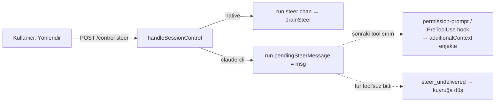

# TionHarness — claude-cli Canlı Steer (Yönlendirme) Planı

> **Özet (2026-09-06):** Bu doküman claude-cli sağlayıcısında turu durdurmadan yönlendirme (mid-turn steer) yapabilmenin tasarımını ve durumunu anlatır. Uygulandı ama sınırlıyla: steer yalnız "ask" izin modunda çalışır, "read-only" ve "auto" modlarda yapısal olarak desteklenmediği için backend `"unsupported"` döner ve mesaj tur bitince kuyruğa alınır. Ana mekanizma external-agent'tan esinlenerek permission-prompt (`callPermission`) yanıtına `additionalContext` enjekte etmektir; ilgili kod `chat_control.go`, `inbox.go`, `mcp_interaction_tools.go` ve `steer_cli_test.go` dosyalarındadır. TSK762 araştırması (2026-09-06) taşıyıcı × izin modu destek matrisini kod kanıtıyla doğruladı: aşağıdaki **"Doğrulanmış durum"** bölümü gerçek davranıştır, onun dışındaki bölümler plan/tasarım metnidir. TSK899 (2026-09-06) native yoldaki iki sessiz kayıp yolunu kapattı: araçsız tur da `foldSteer()` ile steer'i drain ediyor, tur sonu fallback `run.steer` kanalını kurtarıyor ve dolu steer buffer'ı artık sessizce düşürülmek yerine `503` döndürüyor. TSK900 (2026-09-06) `read-only` yanlış raporlamasını kapattı: canlı steer artık yalnız claude-cli + **`ask`** modunda destekli; `read-only` ve `auto` dürüstçe `"unsupported"` döner. TSK901 (2026-09-06) kuyrukta bekleyen bir mesajı çalışan tura canlı yönlendirme olarak taşıyan `POST /api/sessions/{id}/queue/{msgId}/steer` ucunu ekledi: dönüşüm tek `withInbox` kilidi altında atomiktir, red hâlinde mesaj kuyrukta kalır.

> ## ⚠️ Güncelleme (2026-07-13): "auto" modda steer YAPISAL OLARAK ÇALIŞMAZ
> claude-cli steer teslimi **tamamen** `callPermission` (permission-prompt tool)
> sınırına bağlı. Ama bu araç yalnız **"ask"/"read-only"** modunda bağlanıyor
> (`climcp.go` `promptToolForMode`). (**TSK900 ile kapatıldı:** araç read-only'de de
> bağlı olmasına rağmen o modda teslim yolu yok — aşağıdaki matris satırına bakın;
> canlı steer yalnız **"ask"** modunda destekli.) **"auto"** modda CLI
> `--dangerously-skip-permissions` ile çalışır → permission-prompt tool'u **HİÇ**
> çağrılmaz → `callPermission` hiç tetiklenmez → `pendingSteer` tur ortasında **hiç**
> teslim edilmez. Aşağıdaki "Enjeksiyon kanalı — kritik incelik" bölümü yalnız
> RiskRead boşluğunu anıyordu; asıl boşluk **auto modun tümü**. Yani en yaygın
> kurulumda (claude-cli + auto) "Yönlendir" bir no-op'tu: backend `"steered"` dönüp
> mesajı yalnız tur bitince `steer_undelivered` ile yeni mesaj olarak kuyruğa
> alıyordu → kullanıcı ne UI'da ne davranışta değişiklik görüyordu.
>
> **Karar — Seçenek (C) (mekanizmaya dokunma, dürüst UX):** steer teslim
> edilemeyecekse backend `"unsupported"` döner, frontend mesajı kuyruğa alıp
> "Auto izin modunda canlı yönlendirme desteklenmiyor" bildirir. (A)/(B)
> uygulanmadı — auto modda her araca +1 MCP round-trip / hook wiring maliyeti
> istenmedi. Canlı steer isteyen kullanıcı ajanı **"ask"** moduna alır.
>
> **Kod:** `steerableForTurn(provider, mode)` (`chat_control.go`) kuralı;
> `chatRun.steerable` alanı, tur kurulumunda `chat_stream.go`'da set edilir;
> `handleSessionControl` (`inbox.go`) claude-cli + `!steerable` → `"unsupported"`.
> Test: `steer_cli_test.go` `TestSteerableForTurn`.

> Durum: **UYGULANDI — SINIRLAMAYLA** (2026-07-11, Faz 1 + 3; 2026-07-13 revizyonu).
> Canlı steer yalnız **"ask"** izin modunda çalışır; **"read-only" ve "auto"
> modlarda yapısal olarak desteklenmez** (yukarıdaki uyarıya ve matrise bakın) →
> backend `"unsupported"` döner ve mesaj kuyruğa alınır. Amaç: claude-cli ajanlarında da
> **gerçek mid-turn steer** (turu durdurmadan, çalışan tura rehberlik enjekte
> etme) desteği — önceden yalnız native (anthropic/minimax) provider'larda çalışıyordu.
>
> **Uygulanan:** `chatRun.pendingSteer` + `setSteer`/`takeSteer`
> (`chat_control.go`); `handleSessionControl` claude-cli → stash + `"steered"`
> (`inbox.go`); `callPermission` her allow (auto-allow RiskRead + prompt sonrası)
> sınırında `additionalContext` enjeksiyonu + `permDecisionCtx`/`steerContext`
> (`mcp_interaction_tools.go`); `runChatTurn` sonunda `steer_undelivered`→enqueue
> fallback (`chat_stream.go`); frontend `steerTurn` "unsupported" fallback korunur
> (eski backend uyumu). Testler: `steer_cli_test.go` (stash/enjeksiyon/plain).
>
> **Açık doğrulama (canlı):** `additionalContext`'in claude-cli permission-prompt
> cevabında modele gerçekten bağlam olarak girip girmediği CLI sürümüne bağlı
> (aşağıdaki "Enjeksiyon kanalı" ve "Riskler"). Girmezse **Faz 2 seçenek (B)**
> PreToolUse hook kanalına geçilir. Kod-yolu ve fallback her hâlükârda güvenli:
> teslim olmazsa mesaj kuyruğa düşer, kaybolmaz.

## Doğrulanmış durum — TSK762 araştırması (2026-09-06)

> Bu bölüm **doğrulanmış** gerçek davranıştır (kod okuması, `74399ffb`; yol/satır
> referansları o commit'e göredir). Dokümanın geri kalanı **plan/tasarım**
> metnidir ve uygulanmamış seçenekler içerir — ikisini karıştırma.

| Taşıyıcı × izin modu | Mid-turn steer | Kanıt |
|---|---|---|
| native (doğrudan API), **araçlı** tur | **DESTEKLİ** — çalışıyor | `drainSteer`, `internal/agent/toolloop_phases.go:609` |
| native, **araçsız** tur | **DESTEKLİ** (TSK899 ile düzeltildi) | `runPlain` da `foldSteer()` çağırıyor: `internal/agent/steer.go:44`, `internal/agent/toolloop_phases.go:294`; sağlayıcı çağrısından sonra gelen mesajı tur sonunda `recoverUndeliveredSteer` kanaldan kurtarıp kuyruğun **başına** koyuyor (`internal/api/steer_recovery.go`) |
| claude-cli + `ask` | **SINIRLI DESTEK** — kod yolu var, etkisi uçtan uca doğrulanmadı | permission-prompt aracı yalnız gated (write/exec) araç sınırında fire eder: `internal/climcp/climcp.go:97-102`, `internal/api/mcp_interaction_tools.go` `callPermission` |
| claude-cli + `read-only` | **DESTEKLENMİYOR** — `steerableForTurn` artık `false` (TSK900) | Permission-prompt aracı bağlı (`climcp.go:97-102`) ama `read-only` ayrıca `--permission-mode plan` koşuyor (`claudecli.go:203-216`): CLI mutasyonları kendi bloklar, köprülenmiş/harici MCP araçları `--allowedTools`'ta (`climcp.go:178,215-229`), dolayısıyla prompt'a ulaşan tek çağrı `ExitPlanMode`. `callPermission` onu `steerContext()`'e uğramadan `callExitPlan`'a sapıtıyor (`mcp_interaction_tools.go:99-101`), steer ise yalnız `callPermission`'ın allow yollarında enjekte ediliyor (`:118,131,133`). Boundary yok ⇒ `inbox.go` `"unsupported"` döndürür, mesaj kuyruğa alınır. |
| claude-cli + `auto` (**VARSAYILAN**) | **YAPISAL OLARAK DESTEKLENMİYOR** — enjeksiyon noktası yok; backend `"unsupported"` dönüp mesajı kuyruğa alıyor | auto modda permission-prompt aracı hiç bağlanmıyor: `internal/climcp/climcp.go:97-102`; varsayılan mod `internal/db/store.go:84`, `internal/settings/settings.go:400` |
| codex-cli (her mod) | **YAPISAL OLARAK DESTEKLENMİYOR** | `exec --json` + `cmd.Stdin = strings.NewReader(prompt)` prompt bitince EOF verir, ikinci mesaj için kanal yok — `internal/providers/codexcli.go:153`, `:512`; gerçek steer için app-server (JSON-RPC) moduna geçiş gerekir |

### Claude CLI kalıcı stdin — mevcut, ama kazanç yok

`--input-format stream-json` entegrasyonda **mevcut ve varsayılan açık**
(`internal/providers/claudecli_session.go:340`,
`internal/settings/settings.go:489`). Tur sürerken stdin'e ikinci bir
`{"type":"user"}` satırı yazmak protokolce kabul ediliyor, ama CLI onu **tur
sonuna erteliyor** ([claude-code#41665](https://github.com/anthropics/claude-code/issues/41665))
— yani bugünkü kuyruk davranışına göre davranışsal bir kazanç yok.

**DOĞRULANMADI:** CLI'nin `system/init` olayındaki `capabilities` alanı bir
`control_request` / `interrupt` kanalını **ima ediyor**, ancak wire formatı ne
resmî dokümanda ne de üçüncü parti protokol dokümanında verilmiş; koştuğumuz CLI
sürümünde deneysel olarak teyit edilmedi. Bu satır kesinmiş gibi bir plan
dayanağı olarak kullanılmamalı.

### Bilinen sınırlar / açık kartlar

- **TSK899 — KAPATILDI (2026-09-06).** İki sessiz kayıp yolu da kapandı;
  ayrıntı aşağıdaki "TSK899 düzeltmesi" notunda.
- **TSK900 — KAPATILDI (2026-09-06).** `read-only` modda `steerableForTurn` artık
  `false` dönüyor; teslim yolu olmayan mod için backend dürüstçe `"unsupported"`
  veriyor. Ayrıntı aşağıdaki "TSK900 düzeltmesi" notunda.
- **TSK901 — KAPATILDI (2026-09-06).** Kuyruktaki mesajı steer'e çevirme ucu
  (`POST /api/sessions/{id}/queue/{msgId}/steer`) ve `PendingTray` düğmesi
  uygulandı; ayrıntı aşağıdaki "TSK901 — kuyruktan steer'e çevirme" notunda.
- **TSK906 (açık)** — frontend turun gerçek steerability'sini bilmiyor: backend
  `chatRun.steerable` alanını hiçbir uçta/hub olayında yayınlamıyor. "Şimdi
  yönlendir" düğmesi bu yüzden yalnız `activeStreaming` ile geçitli; gerçek
  karar backend'de kalıyor ve `"unsupported"` yanıtıyla bildiriliyor.

### TSK899 düzeltmesi — steer artık sessizce kaybolmuyor (2026-09-06)

Yukarıdaki matriste "native araçsız → HAYIR (bug)" olarak kayıtlı davranış
düzeltildi. Üç değişiklik:

1. **Araçsız tur da drain ediyor.** Drain + enjeksiyon mantığı tek bir
   `foldSteer()` metoduna taşındı (`internal/agent/steer.go`); native araç
   döngüsü her sağlayıcı çağrısından önce (`toolloop_phases.go:614`), araçsız
   yol da tek çağrısından önce (`toolloop_phases.go:294`) onu çağırıyor. Steer
   rolü (`steerRoleFor`) artık `prepare()` içinde çözülüyor, çünkü araçsız yol
   native döngünün kurulumuna hiç uğramıyor.
2. **Tur sonu fallback kanalı da kurtarıyor.** `recoverUndeliveredSteer`
   (`internal/api/steer_recovery.go`) yalnız claude-cli `pendingSteer`
   alanını değil, `run.steer` **kanalını** da boşaltıyor; kurtarılan mesajlar
   kuyruğun **başına** (sonuna değil) konuyor — kullanıcı onları bu turu
   yönlendirmek için yazmıştı, sonradan kuyruğa aldıklarından önce gelmeliler.
3. **Buffer dolu = `503`, sessiz düşürme değil.** `handleSessionControl`
   (`internal/api/inbox.go`) ve chat-control steer ucu (`chat_control.go`)
   artık `run.trySteer` başarısız olduğunda `503` + `steerBufferFullMsg`
   dönüyor. Gerekçe: dolu buffer "tur rehberliği tüketmiyor" demektir; mesajı
   sessizce kuyruğa almak steer'i yeni mesajla karıştırırdı.

Testler: `internal/agent/steer_plain_test.go`
(`TestPlainTurnFoldsPendingSteer`, `TestPlainTurnLeavesLateSteerOnChannel`),
`internal/api/steer_recovery_test.go`
(`TestRecoverUndeliveredSteerRequeuesChannelMessages`,
`TestSessionSteerReportsFullQueue`, `TestSessionSteerAcceptedWhenQueueHasRoom`,
`TestChatControlSteerReportsFullQueue`).

TSK900 ve TSK901 bu düzeltmenin kapsamı dışındaydı; ikisi de aynı gün ayrıca
kapatıldı (aşağıya bakın).

### TSK900 düzeltmesi — `read-only` artık dürüst rapor veriyor (2026-09-06)

Matriste "`steerableForTurn` `true` dönüyor, pratikte DESTEKLENMİYOR" olarak
kayıtlı tutarsızlık kapatıldı. `steerableForTurn` (`internal/api/chat_control.go`)
claude-cli için artık yalnız `mode == "ask"` durumunda `true` dönüyor; `read-only`
ve `auto` için `handleSessionControl` (`internal/api/inbox.go`) `"unsupported"`
verip mesajı kuyruğa alıyor — kullanıcı "steered" yanıtı alıp hiçbir şey olmadığını
görmüyor.

Kartın öncülü kısmen yanlıştı: permission-prompt aracı `read-only` modda da
**bağlı** (`internal/climcp/climcp.go:97-102`). Gerçek sebep `read-only`'nin
ayrıca `--permission-mode plan` koşması: mutasyonları CLI kendi blokluyor,
köprülenmiş MCP araçları `--allowedTools` üzerinden geçiyor, prompt'a ulaşan tek
çağrı `ExitPlanMode` kalıyor ve `callPermission` onu `steerContext()`'e uğramadan
`callExitPlan`'a sapıtıyor (`internal/api/mcp_interaction_tools.go:99-101`).

**Bilinen sınır:** plan onaylanıp CLI plan modundan çıkarsa steer teknik olarak
teslim edilebilir hale gelir, ama `steerable` tur kurulumunda bir kez hesaplanıyor
(`chat_turn_phases.go:196`) ve o an bu bilinemez — yaygın durumda dürüst cevap
`false`.

Testler: `internal/api/steer_cli_test.go` (`TestSteerableForTurn` read-only vakası
`false`'a çevrildi; yeni `TestSteerableForTurnReadOnlyCLI` hem `read-only=false`
hem `ask=true` yönünü pinliyor).

### TSK901 — kuyruktan steer'e çevirme (2026-09-06)

Kuyrukta bekleyen bir mesaj eskiden yalnız tur bitince teslim edilebiliyordu.
Yeni uç `POST /api/sessions/{id}/queue/{msgId}/steer`
(`internal/api/inbox_steer.go` `handleSteerQueued`) o mesajı, ayrı bir steer
metni yazdırmadan, **çalışan tura** canlı yönlendirme olarak taşır.

**Neden ayrı uç.** İstemci bunu "steer + kuyruktan sil" ikilisiyle yapamaz: iki
çağrı arasında seri worker mesajı dispatch edebilir → metin hem yönlendirme hem
kendi turu olarak koşar; ters sırada ise steer reddedilince mesaj kuyruktan
silinmiş olur. İkisi de istemci tarafında telafi edilemez.

**Atomiklik.** Arama ve silme tek bir `withInbox` geri çağrısı içinde yapılır
(`steerQueuedMessage`). Seri worker kuyruk başını aynı kilit altında poplar
(`popInboxHead`), dolayısıyla biz kilidi tutarken mesajı dispatch edemez. Silme
yalnız run metni **kabul ettikten sonra** yapılır; kabul edilmezse kuyruk hiç
değişmez. Geri çağrı bilinçli olarak inbox dışına da uzanır (metni run'a verir),
bu güvenli çünkü `deliverSteer`'in iki yolu da bloklamaz ve yalnız run'ın kendi
mutex'ini alır (kilit sırası inbox.mu → run.mu). Aynı anda biten bir tur da
güvenli: tüketilmemiş yönlendirmeyi tur sonunda `recoverUndeliveredSteer`
kuyruğun **başına** geri koyar.

Ortak teslim yardımcıları `internal/api/steer_delivery.go`'ya alındı
(`steerTargetRun` — yalnız uçuştaki turun sahibi run hedeflenir, superseded run
fenced'dır; `deliverSteer` — native kanal vs. CLI stash ayrımı).
`handleSessionControl` (`inbox.go`) aynı yardımcılara indirgendi, davranışı
birebir korundu.

| Durum | Yanıt | Kuyruk |
|---|---|---|
| Uçuşta tur yok / run bitmiş | `404` | değişmez |
| `msgId` WAITING kuyrukta yok | `404` | değişmez |
| Mesajda ek dosya var (steer metin-only) | `400` | değişmez |
| Mesajın steer edilecek metni yok | `400` | değişmez |
| Tur steerable değil (claude-cli `auto`/`read-only`, codex-cli) | `200 {"result":"unsupported"}` | değişmez |
| Steer buffer dolu | `503 steerBufferFullMsg` | değişmez |
| Başarılı | `200 {"result":"steered"}` | mesaj düşer |

**Frontend.** `PendingTray` kuyruk çipine "şimdi yönlendir" eylemi eklendi
(`onSteerNow` + `canSteer`); `ChatView` onu `chat.steerQueued` /
`chat.activeStreaming` ile bağlar. İstemci **optimistik silme yapmaz** — çip
ancak sunucunun kuyruk güncellemesi mesajın gerçekten düştüğünü söyleyince
kaybolur, yani bir red mesajı UI'dan yok edemez. `"unsupported"` yanıtında
kullanıcıya "mesaj sırada kaldı, canlı yönlendirme için ajanı `ask` moduna al"
ipucu gösterilir.

**Bilinen sınır:** düğme turun gerçek steerability'siyle değil `activeStreaming`
ile geçitli — backend `steerable` alanını UI'a yayınlamıyor (yukarıdaki TSK906).
Yani `auto` modda düğme etkin görünür ve red ancak tıklamadan sonra bildirilir.

Testler: `internal/api/inbox_steer_test.go` (6 vaka: dönüşüm, unsupported,
buffer dolu, ek dosya, bilinmeyen id, tur yok), `PendingTray.test.tsx` (3 vaka).

## Arka plan

Steer (Yönlendir) = tur çalışırken kullanıcı yeni bir mesaj yazınca, turu
**durdurmadan** ajanın gidişatını değiştirme. Bugün TionHarness'te:

- **Native yol** (anthropic/minimax): ÇALIŞIR — ama yalnız **araçlı** turda.
  `drainSteer` her iterasyon başında `run.steer` kanalını boşaltıp mesajı
  `req.Messages`'a (operator/system rolü) enjekte eder. Araçsız turda enjeksiyon
  noktası yok ve mesaj kayboluyor → yukarıdaki "Doğrulanmış durum" bölümü, TSK899.
  **(2026-09-06 itibarıyla geçersiz:** araçsız yol da `foldSteer()` ile drain
  ediyor — "TSK899 düzeltmesi" notuna bakın.)
- **claude-cli yolu**: ÇALIŞMAZ. CLI kendi alt-süreç döngüsünü çalıştırır;
  `drainSteer` çağrılmaz. Geçici çözüm (2026-07-11): `handleSessionControl`
  claude-cli için `{"result":"unsupported"}` döner → frontend mesajı **kuyruğa**
  düşürür.

### external-agent nasıl yapıyor (kanıtlı referans)

`external-agent-oss/packages/shared/src/agent/claude-agent.ts` (Claude Agent SDK):

1. **`redirect(message)`** (satır ~2488): tur aktifse `pendingSteerMessage = message`
   (durdurmaz); değilse `forceAbort(Redirect)` + kuyruk.
2. **Teslim = `canUseTool` (PreToolUse) hook'unun `additionalContext` dönüşü**
   (satır ~1136-1163): SDK her tool çağrısından önce `canUseTool`'u çağırır; o anda
   `pendingSteerMessage` tüketilip enjekte edilir:
   ```
   hookSpecificOutput: { hookEventName: 'PreToolUse',
     additionalContext: "The user just sent a new message while you were working.
       Stop what you are currently doing and address their message instead:\n\n<msg>" }
   ```
   → rehberlik bir sonraki **tool sınırında** turu yeniden başlatmadan bağlama girer.
3. **Fallback `steer_undelivered`** (satır ~2136): tur hiç tool çağrısı olmadan
   biterse enjekte edilecek hook yok → mesaj normal follow-up olarak kuyruğa alınır.

**Ana fikir:** claude-cli'ın bir "steer primitive"i yok; external-agent
**permission/PreToolUse kanalının `additionalContext`'ini** steer teslim kanalı
olarak kullanıyor. Bu kanal TionHarness'te da var (Interaction MCP permission-prompt
+ 9-olay PreToolUse hook paritesi).

## Hedef mimari (TionHarness)



## Enjeksiyon kanalı — kritik incelik

external-agent'in `canUseTool`'u **HER** tool'da fire eder. TionHarness'in CLI
permission-prompt'u (`callPermission`) ise **yalnız gated (write/exec) tool'larda**
fire eder — **RiskRead auto-allow** olduğu için okuma tool'larında enjeksiyon
noktası YOK. İki seçenek:

- **(A) Steer beklerken permission-prompt'u tüm tool'lar için zorla:** bir steer
  pending iken `callPermission` RiskRead'i de prompt'a soksun (yalnız
  `additionalContext` enjekte edip hemen `allow` dönerek) → her tool sınırı
  enjeksiyon noktası olur. En yakın external-agent muadili.
- **(B) CLI PreToolUse hook kanalı:** claude-cli PreToolUse hook çıktısı
  `hookSpecificOutput.additionalContext` destekler ve her tool'da fire eder.
  TionHarness'in CLI hook runner'ı bu alanı dinamik doldurabilecek şekilde
  genişletilir. (Doğrulama gerektirir: mevcut CLI sürümü permission-prompt
  cevabında `additionalContext` kabul ediyor mu, yoksa yalnız hook çıktısında mı.)

**Öneri:** Önce (A) — `callPermission`'a küçük dokunuş, mevcut Interaction MCP
akışına oturur. Doğrulama: bir steer pending iken CLI `additionalContext`'i
gerçekten bağlama alıyor mu (canlı test).

## Değişiklikler (dosya bazında)

1. **`internal/api/chat_control.go`** — `chatRun`'a `pendingSteerMessage` alanı +
   `setSteer(msg)` / `takeSteer() string` (atomik, mutex altında). Tur bitişinde
   temizle.
2. **`internal/api/inbox.go` `handleSessionControl` "steer":**
   - native provider → bugünkü gibi `run.steer <- text` (değişmez).
   - claude-cli → `run.setSteer(text)`; `{"result":"steered"}` dön (artık
     "unsupported" değil).
3. **`internal/api/mcp_interaction_tools.go` `callPermission`** (ve gerekiyorsa
   read-allow yolu): dispatch sırasında `msg := run.takeSteer()` varsa dönen
   permission JSON'una `additionalContext` (veya hookSpecificOutput) ekle:
   `"The user just sent a new message while you were working. Stop … :\n\n<msg>"`.
   Seçenek (A) için: steer pending iken RiskRead'i de kısa devre etmeyip
   `additionalContext` + `allow` dönerek enjekte et.
4. **`steer_undelivered` fallback:** tur bitişinde (`runChatTurn` sonu) hâlâ
   `takeSteer()` doluysa → mesajı **inbox'a enqueue** et (kullanıcının niyeti
   kaybolmasın) + kullanıcıya "yönlendirme kuyruğa alındı" bildir.
5. **Frontend `useChatStream.steerTurn`:** `unsupported` fallback'ini kaldır/güncelle
   → artık `steered` dönebilir; `undelivered` durumunda backend zaten kuyruğa
   aldığından ekstra iş yok (opsiyonel bilgi mesajı).

## Fazlar

1. **Faz 1 — İskelet + kanal doğrulama:** `pendingSteerMessage` alanı +
   `callPermission` enjeksiyonu (seçenek A, yalnız gated tool'larda). Canlı test:
   write/exec tool içeren bir claude-cli turunda steer gerçekten bağlama giriyor mu.
2. **Faz 2 — Her-tool kapsama:** steer pending iken RiskRead tool'larda da enjeksiyon
   (A) veya PreToolUse hook kanalı (B) — Faz 1 doğrulamasına göre seçilir.
3. **Faz 3 — `steer_undelivered` fallback + UI:** tool'suz turda kuyruğa düşür,
   "Yönlendir" butonuna native/CLI tutarlı davranış.

## Doğrulama

- `go build ./...` + `go vet`; steer birim/entegrasyon testi (native: `drainSteer`
  hâlâ çalışıyor; CLI: `takeSteer` + permission enjeksiyonu).
- Canlı (Playwright/manuel): claude-cli ajanıyla tur başlat → yaz → **Yönlendir** →
  ajan bir sonraki tool sınırında yönü değiştiriyor; tool'suz turda mesaj kuyruğa
  düşüyor.

## Riskler / notlar

- **Sürüm bağımlılığı:** `additionalContext`'in claude-cli permission-prompt
  cevabında mı yoksa yalnız PreToolUse hook çıktısında mı kabul edildiği CLI
  sürümüne bağlı → Faz 1 doğrulaması şart (batching/thinking gibi olasılıksal
  değil, kesin test edilmeli).
- **Read-only turlar:** hiç tool çağırmayan (yalnız metin üreten) tur steer'i
  enjekte edemez → `steer_undelivered` → kuyruk (external-agent ile aynı davranış).
- **Native yola dokunma:** anthropic/minimax `drainSteer` yolu çalışıyor, korunur.
- **Prompt-cache:** `additionalContext` dinamik → cache breakpoint'inden SONRA
  gelmeli (statik prefix bozulmasın). Interaction MCP cevabı zaten dinamik alan,
  risk düşük.
