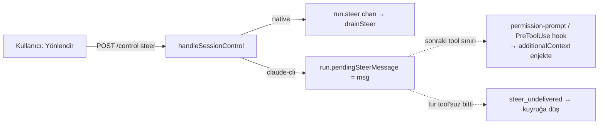

# TionSwarm — claude-cli Canlı Steer (Yönlendirme) Planı

> Durum: **PLAN** (2026-07-11). Uygulanmadı. Amaç: claude-cli ajanlarında da
> **gerçek mid-turn steer** (turu durdurmadan, çalışan tura rehberlik enjekte
> etme) desteği — bugün yalnız native (anthropic/minimax) provider'larda çalışıyor.

## Arka plan

Steer (Yönlendir) = tur çalışırken kullanıcı yeni bir mesaj yazınca, turu
**durdurmadan** ajanın gidişatını değiştirme. Bugün TionSwarm'da:

- **Native yol** (anthropic/minimax): ÇALIŞIR. `agent/toolloop.go` `drainSteer` ile
  her iterasyon başında `run.steer` kanalını boşaltıp mesajı `req.Messages`'a
  (operator/system rolü) enjekte eder.
- **claude-cli yolu**: ÇALIŞMAZ. CLI kendi alt-süreç döngüsünü çalıştırır;
  `drainSteer` çağrılmaz. Geçici çözüm (2026-07-11): `handleSessionControl`
  claude-cli için `{"result":"unsupported"}` döner → frontend mesajı **kuyruğa**
  düşürür.

### external-agent nasıl yapıyor (kanıtlı referans)

`external-agent-oss/packages/shared/src/agent/claude-agent.ts` (Claude Agent SDK):

1. **`redirect(message)`** (satır ~2488): tur aktifse `pendingSteerMessage = message`
   (durdurmaz); değilse `forceAbort(Redirect)` + kuyruk.
2. **Teslim = `canUseTool` (PreToolUse) hook'unun `additionalContext` dönüşü**
   (satır ~1136-1163): SDK her tool çağrısından önce `canUseTool`'u çağırır; o anda
   `pendingSteerMessage` tüketilip enjekte edilir:
   ```
   hookSpecificOutput: { hookEventName: 'PreToolUse',
     additionalContext: "The user just sent a new message while you were working.
       Stop what you are currently doing and address their message instead:\n\n<msg>" }
   ```
   → rehberlik bir sonraki **tool sınırında** turu yeniden başlatmadan bağlama girer.
3. **Fallback `steer_undelivered`** (satır ~2136): tur hiç tool çağrısı olmadan
   biterse enjekte edilecek hook yok → mesaj normal follow-up olarak kuyruğa alınır.

**Ana fikir:** claude-cli'ın bir "steer primitive"i yok; external-agent
**permission/PreToolUse kanalının `additionalContext`'ini** steer teslim kanalı
olarak kullanıyor. Bu kanal TionSwarm'da da var (Interaction MCP permission-prompt
+ 9-olay PreToolUse hook paritesi).

## Hedef mimari (TionSwarm)



## Enjeksiyon kanalı — kritik incelik

external-agent'in `canUseTool`'u **HER** tool'da fire eder. TionSwarm'ın CLI
permission-prompt'u (`callPermission`) ise **yalnız gated (write/exec) tool'larda**
fire eder — **RiskRead auto-allow** olduğu için okuma tool'larında enjeksiyon
noktası YOK. İki seçenek:

- **(A) Steer beklerken permission-prompt'u tüm tool'lar için zorla:** bir steer
  pending iken `callPermission` RiskRead'i de prompt'a soksun (yalnız
  `additionalContext` enjekte edip hemen `allow` dönerek) → her tool sınırı
  enjeksiyon noktası olur. En yakın external-agent muadili.
- **(B) CLI PreToolUse hook kanalı:** claude-cli PreToolUse hook çıktısı
  `hookSpecificOutput.additionalContext` destekler ve her tool'da fire eder.
  TionSwarm'ın CLI hook runner'ı bu alanı dinamik doldurabilecek şekilde
  genişletilir. (Doğrulama gerektirir: mevcut CLI sürümü permission-prompt
  cevabında `additionalContext` kabul ediyor mu, yoksa yalnız hook çıktısında mı.)

**Öneri:** Önce (A) — `callPermission`'a küçük dokunuş, mevcut Interaction MCP
akışına oturur. Doğrulama: bir steer pending iken CLI `additionalContext`'i
gerçekten bağlama alıyor mu (canlı test).

## Değişiklikler (dosya bazında)

1. **`internal/api/chat_control.go`** — `chatRun`'a `pendingSteerMessage` alanı +
   `setSteer(msg)` / `takeSteer() string` (atomik, mutex altında). Tur bitişinde
   temizle.
2. **`internal/api/inbox.go` `handleSessionControl` "steer":**
   - native provider → bugünkü gibi `run.steer <- text` (değişmez).
   - claude-cli → `run.setSteer(text)`; `{"result":"steered"}` dön (artık
     "unsupported" değil).
3. **`internal/api/mcp_interaction_tools.go` `callPermission`** (ve gerekiyorsa
   read-allow yolu): dispatch sırasında `msg := run.takeSteer()` varsa dönen
   permission JSON'una `additionalContext` (veya hookSpecificOutput) ekle:
   `"The user just sent a new message while you were working. Stop … :\n\n<msg>"`.
   Seçenek (A) için: steer pending iken RiskRead'i de kısa devre etmeyip
   `additionalContext` + `allow` dönerek enjekte et.
4. **`steer_undelivered` fallback:** tur bitişinde (`runChatTurn` sonu) hâlâ
   `takeSteer()` doluysa → mesajı **inbox'a enqueue** et (kullanıcının niyeti
   kaybolmasın) + kullanıcıya "yönlendirme kuyruğa alındı" bildir.
5. **Frontend `useChatStream.steerTurn`:** `unsupported` fallback'ini kaldır/güncelle
   → artık `steered` dönebilir; `undelivered` durumunda backend zaten kuyruğa
   aldığından ekstra iş yok (opsiyonel bilgi mesajı).

## Fazlar

1. **Faz 1 — İskelet + kanal doğrulama:** `pendingSteerMessage` alanı +
   `callPermission` enjeksiyonu (seçenek A, yalnız gated tool'larda). Canlı test:
   write/exec tool içeren bir claude-cli turunda steer gerçekten bağlama giriyor mu.
2. **Faz 2 — Her-tool kapsama:** steer pending iken RiskRead tool'larda da enjeksiyon
   (A) veya PreToolUse hook kanalı (B) — Faz 1 doğrulamasına göre seçilir.
3. **Faz 3 — `steer_undelivered` fallback + UI:** tool'suz turda kuyruğa düşür,
   "Yönlendir" butonuna native/CLI tutarlı davranış.

## Doğrulama

- `go build ./...` + `go vet`; steer birim/entegrasyon testi (native: `drainSteer`
  hâlâ çalışıyor; CLI: `takeSteer` + permission enjeksiyonu).
- Canlı (Playwright/manuel): claude-cli ajanıyla tur başlat → yaz → **Yönlendir** →
  ajan bir sonraki tool sınırında yönü değiştiriyor; tool'suz turda mesaj kuyruğa
  düşüyor.

## Riskler / notlar

- **Sürüm bağımlılığı:** `additionalContext`'in claude-cli permission-prompt
  cevabında mı yoksa yalnız PreToolUse hook çıktısında mı kabul edildiği CLI
  sürümüne bağlı → Faz 1 doğrulaması şart (batching/thinking gibi olasılıksal
  değil, kesin test edilmeli).
- **Read-only turlar:** hiç tool çağırmayan (yalnız metin üreten) tur steer'i
  enjekte edemez → `steer_undelivered` → kuyruk (external-agent ile aynı davranış).
- **Native yola dokunma:** anthropic/minimax `drainSteer` yolu çalışıyor, korunur.
- **Prompt-cache:** `additionalContext` dinamik → cache breakpoint'inden SONRA
  gelmeli (statik prefix bozulmasın). Interaction MCP cevabı zaten dinamik alan,
  risk düşük.
