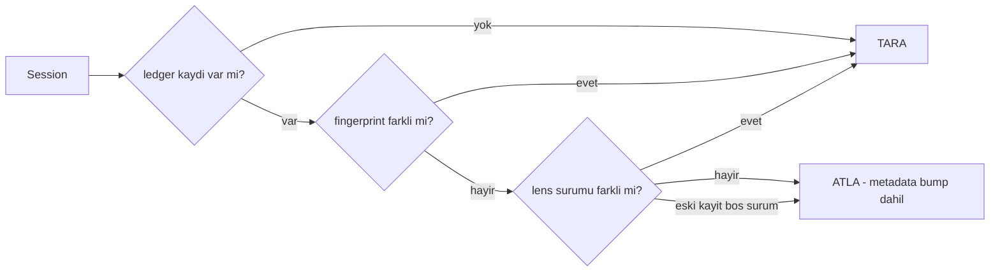
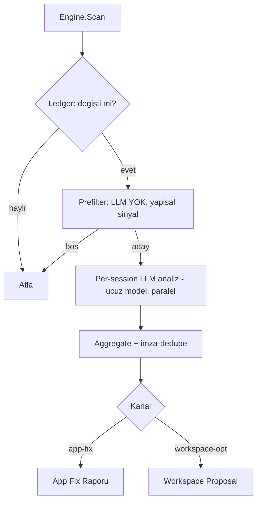
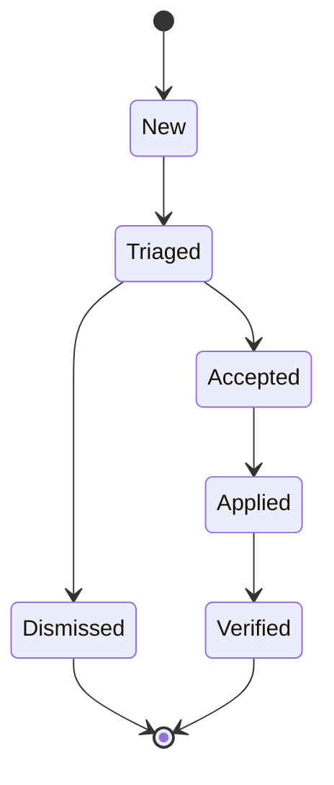
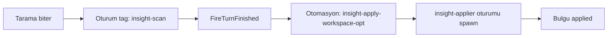

# 60 — Retrospektif Geçmiş Tarama (Insight Scan)

> **Durum:** Faz 1–4 TAMAM (build OK · 899 test · tsc temiz). Canlı ilerleme `05-ILERLEME.md`'ye işlenecek.
>
> **Amaç:** Geçmiş session'ları **farklı amaçlarla (lens)** tarayan; taradığını tekrar
> taramayan (session değiştiyse yeniden tarayan); bulguları **iki kanala** yönlendiren
> generic motor:
> - **Kanal A — App Fix:** kök nedeni TionHarness uygulamasında olan bulgular → düzeltme raporu.
> - **Kanal B — Workspace Opt:** workspace içinde koda dokunmadan çözülebilen optimizasyonlar.
>
> Hem **manuel (UI)** hem **otomatik (cron/automation)** tetiklenebilir. Paket `internal/insight`.

---

## 1. Kavramlar

| Kavram | Tanım |
|--------|-------|
| **Lens (Scan Intent)** | Tarama amacı. **Workspace'te editlenebilir dosya** (skill gibi). Prefilter + analiz promptu + kanal + kapsam taşır. |
| **Ledger** | `(lensId, sessionId)` başına inkremental durum. **fingerprint + lens sürümü** ile "değişti mi?" kararı. |
| **Finding (Bulgu)** | Tek kanonik şema; imza-dedupe ile tekrarlar `occurrences` biriktirir. |
| **Channel** | `app-fix` \| `workspace-opt`. Bulgunun yönlendirileceği kanal. |

---

## 2. Lens = Editlenebilir Dosya (skill deseni)

Skill sistemiyle **aynı tier + seed** yaklaşımı (`internal/skills` emsali):

- **Konum:** `<workspace>/insight/lenses/<lensId>.md`
- **Gömülü default'lar:** `internal/insight/defaults/*.md` (`//go:embed`) → workspace'e
  **seed** edilir; sürüm+frontmatter-farkındalı (kullanıcı fm'i korunur, gövde tazelenir) —
  `internal/skills` seed mantığının birebir kopyası.
- **Kullanıcı editler:** prompt gövdesini ve frontmatter'ı serbestçe değiştirir; yeni lens
  ekleyebilir. Registry açılışta workspace tier'ından yükler.

### Dosya formatı (frontmatter + gövde)

```markdown
---
id: tool-errors
name: "Tool Hataları"
description: "Tool hatalarını bulup kök nedeni uygulamaya fix olarak raporlar."
channel: app-fix           # app-fix | workspace-opt
enabled: true
model: claude-cli          # ucuz model; analiz per-session
scope: [steps, debug]      # okunacak yüzeyler: steps|debug|toolCalls|skills|context
prefilter:
  requiresAny: [error]     # bu step-kind / debug-event yoksa LLM'e gitme (bedava eleme)
---

# Analiz Talimatı (LLM prompt gövdesi)

Sana bir session'ın hata adımları ve debug olayları verildi. Her tool hatasının
kök nedenini belirle. Kök neden TionHarness uygulamasındaysa `app-fix` bulgusu üret:
başlık, kök neden, kanıt (satır/olay), önerilen düzeltme ve ilgili dosya işaretçisi.
Geçici/kullanıcı-kaynaklı hataları ELE.
```

> **Neden ortak Finding şeması, lens'te değil:** lens dosyaları basit/editlenebilir kalsın
> diye JSON şemayı her lens tanımlamaz; motor tek kanonik `Finding` şemasını structured
> output olarak dayatır. Lens yalnız prompt + kanal + prefilter + scope verir.

### Prefilter — yapısal predikat (parser YOK)

İfade dili (AND/OR/NOT parser'ı) **kullanılmaz** — editlenebilirlik + güvenlik için. Bunun
yerine motorun yorumladığı sabit alanlı **declarative struct**:

```yaml
prefilter:
  requiresAny: [error]           # OR — sinyallerden en az biri varsa aday
  requiresAll: [worker, idle]    # AND — hepsi varsa
  excludes: [handoff]            # NOT — varsa atla
  minCount: { cache_break: 3 }   # sinyal → min tekrar (eşik)
  minTokens: 50000               # session-düzeyi sayısal eşik
```

**Bileşik sinyal — olay türü + atıflı sebep (2026-08-11).** Bir `cache_break` olayının
**sebebi** hangi lensin bakması gerektiğini belirler: kararsız önek bir sıralama problemi,
TTL soğuması bir **tempo** problemidir ve zıt öneriler gerektirir. Çıplak tür sayısı bunları
ayıramadığı için `extractSignals` sebebi ayrı bir sinyal olarak da indeksler:
`cache_break:ttl-or-server-eviction`, `cache_break:model-changed`, … (+ ölçülmüş israf varsa
`cooling_waste`). Prefilter düz bir `ad→sayı` haritası olduğundan bileşik ad tek başına
yeterli mekanizmadır — yeni alan gerekmez. **`parseMinCount` bu yüzden çiftin SON iki
noktasından böler** (ilkinden bölmek anahtarı `"cache_break` yapıp eşiği sessizce düşürüyordu
→ lens her oturumu eşlerdi).

Sinyaller `debug.jsonl` olay türleri + step kind'larıdır. AND/OR/NOT/eşik ihtiyacını
Turing-complete dil olmadan karşılar; yeni ihtiyaç = yeni sabit anahtar.
**Faz 1:** yalnız `requiresAny` implement edilir (`tool-errors` bunu kullanır); struct diğer
alanları baştan taşır, motor Faz 2+ lensleri gelince doldurur.

### Başlangıç default lensleri
`tool-errors` (app-fix), `tool-usage-opt`, `skill-usage-opt`, `context-hygiene`,
`context-cache-opt`, `cache-cooling-waste`, `lessons-mining`, `workspace-tuning`
(hepsi workspace-opt).
Genişletme: `autonomy-safety`, `cost-hotspots`, `permission-friction`,
`coordination-stalls`, `handoff-quality`.

**İki cache lensi, aynı olay türü, zıt sebep (2026-08-11):**

| Lens | Prefilter | Soru | Öneri ekseni |
|---|---|---|---|
| `context-cache-opt` | `cache_break:prompt-or-tools-changed ≥ 2` | Önek neden değişiyor? | bağlam sıralaması / epoch |
| `cache-cooling-waste` | `cache_break:ttl-or-server-eviction ≥ 2` | Neden zamanında kullanılmıyor? | schedule aralığı / oturum ömrü / prefix boyu |

Her iki prompt da diğerinin sebebini **açıkça yok saymaya** talimatlıdır; aksi halde ikisi de
aynı oturumda çakışan bulgular üretirdi.

### Slice kapsamı — `scope: [cache]` (2026-08-11)

`Lens.Scope` frontmatter'da baştan vardı ama **hiçbir yerde kullanılmıyordu**; `buildSlice`
sabit biçimde yalnız `error/repair/guardrail/recovery` olaylarını yazıyordu. Sonuç:
`context-cache-opt` `cache_break ≥ 2` ile prefilter'dan geçiyor, sonra analize **içinde tek bir
cache kanıtı olmayan** bir dilim gidiyordu — lens tahmin etmekten başka bir şey yapamıyordu.

`ScopeCache` ("cache") ilk kullanılan scope değeridir: lens isterse dilime
"## Prompt-cache events" bölümü eklenir — `cache_break` satırları (`at=` zaman damgası,
`cause=`, `coldTokens=`, `wasteUsd=`) **ve araya serpiştirilmiş `epoch` olayları. Zaman
damgası şart: tempo lensi olaylar arası **boşluğu** ölçer. Epoch olayları da şart: bir kırılım
bilinçli bir adopt'un (`created`/`refreshed`/`compaction`/`ttl-cold`) yanında mı duruyor,
yoksa tek başına mı — `_Docs\57`'deki okuma kuralı ancak böyle uygulanabilir. Scope
istemeyen lensler bu olayların token'ını ödemez (opt-in).

### workspace-opt öneri hedefi — varlık önceliği (2026-08-27)

**Semptom:** WS19'un `insight/findings.jsonl` dosyasındaki 69 `workspace-opt` bulgusunun ezici
çoğunluğu `File: CLAUDE.md` ile geliyordu. Kök neden model değil, **lens promptuydu**:
`context-hygiene` gövdesi düzeltme hedefi olarak doğrudan "workspace CLAUDE.md, agent soul,
config prompt" diyordu, dolayısıyla her friction bir CLAUDE.md notuna dönüşüyordu.

**Yeni lens — `workspace-tuning`** (`defaults/workspace-tuning.md`, kanal `workspace-opt`,
`prefilter.requiresAny: [error, recovery, guardrail, lesson]`). Öneri hedefini **katı bir
öncelik sırasıyla** dayatır; liste yukarıdan aşağıya taranır ve düzeltmeyi gerçekten taşıyabilen
İLK hedefte durulur:

| # | Hedef | Ne zaman | `filePointer` biçimi |
|---|---|---|---|
| 1 | **Skill** | eksik/yetersiz prosedür, tekrar keşfedilen ritüel | `skill:<slug>` |
| 2 | **Agent** | soul/system prompt, model seçimi, izinli araç seti, subagent profili | `agent:<ad>` |
| 3 | **tools-config** | hiç işe yaramayan ya da sürekli hata veren aracı kapat / deferred'a al | `tools-config.json` |
| 4 | **Hook / automation** | tekrarlayan manuel adımın otomatikleştirilmesi | `hook:<olay>` · `automation:<ad>` |
| 5 | **Insight ayarı** | yanlış prefilter, `maxSessions`/`maxAnalyzed`, lens enable-disable | `insight:lens:<id>` |
| 6 | **CLAUDE.md** | **son çare** — yukarıdakilerin hiçbirinin taşıyamadığı, her zaman geçerli proje gerçeği | `CLAUDE.md` |

`proposedFix` somut olmak zorundadır: hangi skill slug'ı ve eklenecek kural, hangi ajan alanı ve
yeni değeri, hangi araç adı, hangi hook olayı ve komutu. "Rehberliği iyileştir" tarzı öneri
kabul edilmez. `signature` = hedef varlık + sorun türü (ör. `skill:tionharness-build:missing-test-cmd`).

**`context-hygiene` daraltıldı:** artık yalnızca gerçek BAĞLAM (eksik/bayat prompt metni)
problemine bakar ve gövdesinde bir **kapsam kilidi** taşır — düzeltme bir workspace varlığıyla
(skill/agent/tool/hook) yapılabiliyorsa bulgu üretmez, işi `workspace-tuning` lensine bırakır.
İki lens aynı oturumda çalışır; çakışmayı bu kilit engeller (iki cache lensinin birbirinin
sebebini yok sayması ile aynı desen).

**Mevcut workspace'lere yayılım kod tarafından olur** — elle dosya kopyalanmaz. `seed.Ensure`
(`internal/seed/seed.go`) diskte **olmayan** her gömülü lensi yazar, dolayısıyla
`workspace-tuning.md` her workspace'e ilk `EnsureDefaults` çağrısında düşer. Çağrı noktaları:
`RunInsightScan` (`internal/agent/insightscan.go:66`, her taramanın başında) ve lens listesi /
raw uçları (`internal/api/insight.go:21,120`). Gövdesi bozulmamış (`default`/`tuned`) lensler
gövde-hash defterinden tazelenir; kullanıcının **gövdesini** düzenlediği lens (`edited`)
dondurulur ve yeni prompt'u almaz — bilinçli davranış, çözümü tekil "varsayılana döndür"
(`POST /api/insight/lenses/{id}/restore`).

> **Manifest öncesi kurulum uyarısı:** `.shipped-versions.json` dosyası **olmayan** bir lens
> dizininde, önceki sürümle birebir aynı olan `context-hygiene.md` de "kullanıcı düzenlemesi"
> gibi görünür ve yeni gövdeyi almaz (bkz. `seed.Ensure` bootstrap notu). Yeni lens yine de
> düşer; `context-hygiene`'i tazelemek için o workspace'te bir kez "varsayılana döndür" gerekir.

---

## 3. İnkremental Ledger (fingerprint + lens sürümü)

**Konum:** `<store>/insight/ledger.jsonl` (dosya-tabanlı, DB-yok mimarisine uygun).

**Kayıt:**
```json
{ "lensId": "...", "sessionId": "...", "seenUpdatedAt": 0,
  "seenFingerprint": "...", "seenLensVersion": "...", "scannedAt": 0,
  "findingCount": 0, "status": "clean|error" }
```

**Fingerprint (içerik tetiği):** `Fingerprint(msgCount, summaryMsgCount)` =
`"msgCount:summaryMsgCount"` — header'dan hesaplanır (jsonl okumaz). **İçerik değişim
sinyali fingerprint'tir; `UpdatedAt` tetik DEĞİL** (saniye granülerliği → aynı-saniye içerik
değişimini kaçırır; ayrıca metadata-only bump'ta da artar → yanlış tetikler). Fingerprint
her ikisini de doğru çözer: tur append'inde/compaction'da değişir, metadata editinde değişmez.
`seenUpdatedAt` yalnız gözlem için saklanır. (İleride son-mesaj-id ile güçlendirilebilir.)

**Lens sürümü (ikinci tetik, TSK445):** `Lens.Version()`
(`internal/insight/lens_version.go`) — lensin *üretimi değiştirebilecek* alanlarının
sha256 özeti: analiz gövdesi (`Prompt`), `Prefilter`, `Scope` ve `Model`. Kimlik/ad/
açıklama/`Enabled`/`Path` **dahil değildir** (yeniden adlandırma veya aç-kapa anlamsal
değişiklik değildir; hash'lense ücretli tam yeniden tarama tetiklerdi). Küme alanları
(`Scope`, prefilter listeleri) sıralanarak hash'lenir, yani frontmatter'daki sıra
değişimi sürüm değiştirmez. Böylece bir lensin promptu iyileştirildiğinde, içeriği
değişmemiş eski oturumlar da yeniden taranır — daha önce bunun tek karşılığı
hepsi-ya-hiç `Reset(deep=true)` idi.

**Geriye dönük uyumluluk:** sürüm alanı olmadan yazılmış eski satırlar
(`seenLensVersion: ""`) **güncel kabul edilir** (grandfathering), yeniden taranmaz.
Aksi hâlde yükseltmeden sonraki ilk tarama tüm ledger'ı geçersiz kılar ve
`Reset(deep)`'in uyardığı "çoktan düzeltilmiş sorunların bulgularını geri getirme"
etkisini yaratırdı. Karar `ledger.go` `NeedsScan` yorumunda gerekçesiyle sabitlenmiştir.

**Karar:**


- **Per-lens** tutulur (farklı lens farklı yüzey okur).
- Yeni lens → o `(lens, session)` ledger boş → otomatik backfill.
- Archived: manuel taramada dahil, gece-oto taramada hariç (konfigüre).

---

## 4. Pipeline (3 aşama, maliyet kontrolü)



1. **Prefilter (LLM yok):** lens `prefilter.requiresAny` sinyalini `debug.jsonl`/steps'ten
   kontrol et. Yoksa atla → bedava eleme.
2. **Analiz (LLM):** eleyen session'ın **ilgili dilimini** (tüm transkript değil) ucuz
   modele ver → kanonik `Finding[]`. Session'lar paralel.
   Dilim `Scanner.buildSlice`'ta kurulur; bütçe **kayıt sınırında** uygulanır ve
   sığmayan kayıtlar **sayılarak** bildirilir (`view.CapLines`) — eskiden bayttan
   kesiliyordu, son kayıt eksik ama tam görünüyordu. Adım çözümü ortak
   `view.DecodeSteps` ile yapılır. Detay [66](66-VIEW-KATMANI.md).
3. **Aggregate + dedupe:** imzayla birleştir (lessons dedupe emsali); tekrar → `occurrences++`
   + kanıt `sessionIds`.

---

## 5. Finding Modeli + Yaşam Döngüsü

```json
{ "id": "...", "lensId": "...", "channel": "app-fix",
  "signature": "...", "title": "...", "rootCause": "...",
  "evidenceSessionIds": ["..."], "occurrences": 1, "severity": "low|med|high",
  "proposedFix": "...", "filePointer": "internal/...", "status": "new",
  "appliedAt": 0, "verifiedAt": 0 }
```



**Konum:** `<store>/insight/findings.jsonl`.

---

## 6. İki Kanal

- **Kanal A — App Fix:** kök neden uygulamada. Çıktı = App Fix Raporu (kök neden + kanıt
  session'lar + önerilen düzeltme + dosya işaretçisi). **Asla oto-apply / asla coder-spawn.**
  Kullanıcı bu raporları sonradan TionHarness'i geliştirmekte kullanır. **İki sink (varsayılan):**
  1. **In-app detaylı rapor** — `findings.jsonl` + render artifact, Insight panosunda görünür (her zaman).
  2. **Repo `_Docs` backlog** — hedef git reposu **UI'dan seçilir** (`InsightSettings.AppFixRepoPath`);
     seçilen reponun `_Docs/INSIGHT-BACKLOG.md`'sine append-only yazılır (kodu değil dokümanı
     ekler, versiyonlu, imza-dedupe ile tekrar eklemez). GitHub issue / coder-spawn kapsam dışı.
- **Kanal B — Workspace Opt:** self-management araçlarına maplenir (skill buda,
  `BlockedTools`/`DisabledTools`, config prompt, agent soul, `update_settings`, eksik
  CLAUDE.md). **Guarded auto-apply:** düşük-risk oto, yüksek-risk `needs-review`.

---

## 7. Kod Yerleşimi + Yeniden Kullanım

| Yeni | İçerik | Durum |
|------|--------|-------|
| `internal/insight/finding.go` | Finding modeli + imza-dedupe store | ✅ Faz 1 |
| `internal/insight/lens.go` | Lens tipi + Prefilter + parser + Registry + `SetFrontmatterScalar` | ✅ Faz 1 |
| `internal/seed/` | **Paylaşılan** shipped-defaults tazeleme (hash ledger + `Ensure`/`Restore`); tüketiciler: `insight`, `skills` | ✅ Faz 6.4 |
| `internal/insight/defaults.go` | Gömülü lens ağacı + lens merge politikası (`userLensKeys`) + `RestoreDefault`/`HasDefault` | ✅ Faz 6.4 |
| `internal/insight/prefilter.go` | Yapısal predikat `Match` (requiresAny/All/excludes/minCount/minTokens) | ✅ Faz 1 |
| `internal/insight/ledger.go` | İnkremental durum (fingerprint + lens sürümü) | ✅ Faz 1 |
| `internal/insight/lens_version.go` | `Lens.Version()` — lens gövdesi hash'i (yeniden tarama tetiği) | ✅ TSK445 |
| `internal/insight/defaults.go` + `defaults/*.md` | Gömülü default lensler (`//go:embed`) + seed | ✅ Faz 1 |
| `internal/insight/scanner.go` | Pipeline + `SessionSignals` extraction + prefilter + inkremental + dedupe (`Analyzer` seam) | ✅ Faz 1 (LLM impl hariç) |
| `internal/insight/router.go` | Kanal A: `RenderAppFixReport` + `AppendBacklog` (idempotent, insight-sig marker) | ✅ Faz 1 |
| `internal/insight/settings.go` | `Settings{AppFixRepoPath,MaxSessions}` load/save | ✅ Faz 1 |
| `internal/agent/insightanalyzer.go` | Gerçek `Analyzer`: `guardedComplete` + structured output + parse-with-fallback. Prompt, kullanıcı dilinde (`Settings.Language` → `Tunables.Language()`) title/rootCause/proposedFix üretir; signature/kod/dosya-yolları verbatim kalır. | ✅ Faz 1 |
| `internal/agent/insightscan.go` | `Runtime.RunInsightScan` orchestration (seed→scan→backlog route) | ✅ Faz 1 |
| `internal/api/insight.go` | REST uçları (lenses/scan/findings/settings) + server.go route kaydı | ✅ Faz 1 |
| `internal/insight/router.go` Kanal B | `AppendWorkspaceActions` → `insight/WORKSPACE-ACTIONS.md` (idempotent) | ✅ Faz 2.5 |
| `internal/agent/insightcron.go` | `InsightCron` — ayar-güdümlü otomatik tarama (`AutoScanCron`) | ✅ Faz 3 |
| `frontend/src/features/insight/` | UI (pano + triage + auto-scan cron alanı) | ✅ Faz 1–3 |
| `internal/tools/builtin_insight.go` | ajan araçları `insight_scan` + `insight_list_findings` (id+status çıktı/filtre) + `insight_apply_finding`; `insight_list_findings` varsayılanı **tek satırlık özet** (id görünür, `cause`/`fix`/`file` yalnız `verbose:true` ile), `insight_scan` hata özeti tekilleştirilip sayılır (`… (×53)`, fazlası `+N more`); `maxSessions` = workspace ayarını (varsayılan 20) **ezme** değeri, 0 sınırsız değil; **varsayılan görünürlük NAME-ONLY** (2026-08-15, `_Docs/19`) — katalogda yalnız adla, şema `tool_search`/`activate_tools` ile | ✅ Faz 1–2 |
| `internal/skills/defaults/tionharness-insight/` | Ajana tarama→sun→(kullanıcı kararı)→triage akışını öğreten skill | ✅ |

**Yeniden kullanım:** `db.ListSessions` (+`UpdatedAt`), debug journal reader
(`read_session_debug`), `call_llm`/`run_subagent`, `internal/skills` seed deseni,
lessons imza-dedupe, scheduler + `AutomationEngine`.

**Lessons ilişkisi:** Lessons = per-agent reaktif runtime hafızası; Insight = fleet-geneli
retrospektif offline analiz. **Ortak store** (`db.Lesson`): hem `lessons-mining` lensi hem reaktif
reflektör onu besler — iki üretici (hızlı/per-tur + yavaş/batch), tek store; üreticiyi taşımak
latency'yi bozar. **İçgörü panelinde "Dersler" sekmesi** reaktif tarafı gösterir: `lesson reflect`
toggle (Ayarlar ▸ Bağlam ile aynı `lessonReflect`) + kayıtlı dersler (`LessonsList` reuse).

---

## 8. API + Araçlar (hedef yüzey)

- `GET  /api/insight/lenses` — lens listesi (seed+load; id/name/channel/enabled/prefilter/hasDefault) ✅
- `POST /api/insight/lenses/{id}/restore` — lensi gönderilen varsayılana döndür (yerel
  düzenlemeler silinir; manifest'e pristine yazılır → otomatik tazeleme yeniden kurulur) ✅
- `POST /api/insight/scan` — `{ lensIds[], … }` → **arka planda başlatır**, `202 {started}` döner
  (senkron değil: tarama dakikalarca sürebilir + request-context iptali taramayı öldürürdü). Sonuç
  bulgu store'una + `🔍 İçgörü Taraması` session'ına düşer. Çakışma guard'ı: çalışırken ikinci tetik `409`. ✅
- `GET  /api/insight/status` — `{ scanning }` — arka plan taraması sürüyor mu (panel canlı takip + otomatik yenileme). ✅
- `GET  /api/insight/runs` — son tarama-run log'u (when/süre/sayılar) + her kaydın `id` ve
  `sessionId` alanı (bkz. §9.1 salt-okunur run oturumu). ✅
- `GET  /api/insight/fleet-findings` — tüm workspace'ler arası birleşik app-fix backlog'u (kanonik-imza dedup). ✅
- `GET  /api/insight/lenses/{id}/raw` · `PUT /api/insight/lenses/{id}` (parse-doğrulamalı) · `POST /api/insight/lenses/{id}/toggle` — lens düzenleme/enable-disable. ✅
- `GET  /api/insight/findings?lens=&channel=` — bulgu listesi ✅
- `GET|PUT /api/insight/settings` — `{ appFixRepoPath, maxSessions, maxAnalyzed, scanSinceDays, autoScanCron, autoScanAgentId, autoVerifyDays, pruneDays }` ✅
  (PUT sonrası otomatik tarama cron'u anında re-arm edilir)
  - `scanSinceDays` — sadece son N günde aktif oturumları tara (0 = tüm geçmiş); eski oturum gürültüsünü keser.
  - `autoVerifyDays` / `pruneDays` — bulgu bakımı eşikleri (0 = varsayılan 14 / 45 gün): applied bulgu N gün nüksetmezse auto-verify; dismissed/verified bulgu N gün dokunulmazsa silinir (`maintain.go`).
  - `autoScanAgentId` — analiz ajanı (manuel + cron): seçili ajan KENDİ provider+model'iyle çalışır. Soyut "varsayılan" seçeneği yoktur; UI açılışta boşsa mevcut **ilk ajanı** otomatik seçer (picker clearable değil). Kayıtlı değer boşsa backend yine ilk ajana (ucuz başlık modeliyle) düşer.
- `POST /api/insight/findings/{id}/status` — bulgu statü geçişi (triage) ✅
- `DELETE /api/insight/findings/{id}` — bulguyu kalıcı siler (`FindingStore.Delete`; dismiss'ten farklı) ✅
- `POST /api/insight/reset` — `{ deep }` — workspace insight verisini sıfırlar; tarama sürerken `409` ✅

---

## 9. Tetikleme

- **Manuel (✅):** UI → lens seç → "Tara" → `POST /scan` **arka planda** başlar; panel `/status`'u
  poll ederek bitişte bulguları yeniler. Tarama tek-uçuş (workspace başına bir tarama, çakışma `409`).
- **Otomatik (✅ Faz 3):** `insight/settings.json` `autoScanCron` → `InsightCron` doğrudan
  `RunInsightScan`'i çağırır (özel cron, prompt/flow Scheduler'dan ayrı, deterministik).
- **Ajan-güdümlü (✅):** Bir ajana talimatla ("içgörü taraması yap ve özetle") → ajan `insight_scan`
  ile tarar, `insight_list_findings` ile okur (satır başında **finding id**), kanala göre sunar ve
  **DURUR** — kullanıcı ne yapılacağını söyler, ajan `insight_apply_finding` ile triage eder (advisory,
  otomatik mutasyon yok). `tionharness-insight` skill'i bu akışı öğretir. Otomasyon: aynı talimatı bir
  schedule'a koy (Scheduler zaten ajan-prompt tetikler).

> **Not:** Tarama oturumları sohbet listesinin **varsayılan görünümünde gizlidir** (bilinçli —
> gürültü olmasın); bulgular ayrıca bulgu store'una + panele + sink dokümanlarına düşer, panel
> `GET /status`'u poll edip yeniler.

### 9.1 Salt-okunur run oturumu (`kind == "insight"`)

Her tarama, bittiğinde **iki** kayıt bırakır:

| Kayıt | Nerede | Ne için |
|---|---|---|
| Run oturumu | `Session{Kind:"insight", SourceID:<run id>}` | Okunabilir transkript: kapsam, sayaçlar, üretilen bulgular, hatalar (tek assistant mesajı, `insightsession.go`) |
| Run log satırı | `insight/runs.jsonl` (`RunRecord`) | Sorgulanabilir kompakt rollup (ne zaman / ne kadar sürdü / kaç bulgu) |

- İkisi **aynı run id**'yi taşır: `RunRecord.ID == Session.SourceID`, `RunRecord.SessionID ==
  Session.ID`. Yani hangi kaydı elinde tutuyorsan diğerine geçebilirsin.
- Transkript **LLM çağırmaz** — taramanın zaten ürettiği veriden render edilir.
- **Salt okunur, katı anlamda:** `kind == "insight"` bir oturuma kullanıcı mesajı yazmak veya ajan
  turu başlatmak API tarafında **`403 Forbidden`** ile reddedilir (sessizce yutulmaz).

  Bu kural artık **iki sınıfa** ayrılmıştır ve tek kaynağı `internal/db/models.go`'dur:

  | Sınıf | Kaynak (db) | Anlamı | HTTP guard (`internal/api/session_readonly.go`) | Kapsadığı giriş noktaları |
  |---|---|---|---|---|
  | **Yazılabilir değil** | `IsWritableSessionKind` (`""`/`chat`/`spawned` dışındaki her kind) | Yeni bir **kullanıcı turu** başlatılamaz; transkript orkestratöre aittir | `rejectNonWritableSession` | `POST /api/chat`, `POST /api/chat/stream`, `POST /api/sessions/{id}/messages` |
  | **Değişmez (immutable)** | `IsImmutableSessionKind` = makine-transkript kümesi (`machineTranscriptKindList`, şimdilik yalnız `insight`) | Hiç tur koşmaz; transkript hiçbir şekilde değişmez | `rejectImmutableSession` | `POST /api/sessions/{id}/control`, `.../interactions/{iid}/answer`, `.../rewind` |

  **Neden ayrık:** stop/steer, `ask_user` cevabı ve rewind **koşan bir turun** parçasıdır; bir
  task/flow oturumunda bunlar meşrudur, kilitlenirse gerçek orkestrasyon akışı kırılır. `insight`
  oturumu hiç tur koşturmadığı için zaten her iki guard'a da takılır.

  **Kapsam:** guard'lar yalnız HTTP giriş noktalarındadır. Süreç-içi üreticiler (`send_message`
  aracı — `internal/agent/agentmsg.go`, otomasyon teslimi, koordinatör→worker mesajı) doğrudan
  store/runtime üzerinden yazar ve bilerek guard dışındadır: orada sistem kendi oturumunu sürer.

  Frontend `isWritableSessionKind` (`frontend/src/shared/lib/sessionKind.ts`) 1. sınıfın **aynasıdır**;
  iki taraf birlikte güncellenmelidir.
- **Geriye uyumluluk:** oturum eşlemesinden önce yazılmış `runs.jsonl` satırlarında `id`/`sessionId`
  yoktur; bu satırlar aynen okunmaya devam eder (alanlar `omitempty`), yalnızca eşlenmemiş görünürler.
  Oturum açılamazsa tarama yine de run log satırını yazar (`sessionId` boş kalır) ve hata loglanır.

### 9.2 Otomatik uygulama zinciri (2026-08-27)

Tarama bulguyu **üretiyordu** ama kimse **uygulamıyordu**: `workspace-opt` bulguları panoda
`new` durumunda birikiyordu. Zincir artık uçtan uca kapalı:



1. **Tarama oturumu artık etiketli ve tur-bitişi sinyali veriyor.** `openInsightSession`
   oturumu `Tags: ["insight-scan"]` ile açar; `insightStepRecorder.finish` başarı yolunda
   `Runtime.FireTurnFinished` çağırır (`internal/agent/insightsteps.go`). Öncesinde tarama
   **hiçbir** tur-bitiş hook'unu ateşlemiyordu — tarama oturumlarında etiket-tetikleyicili
   otomasyonlar tamamen ölüydü. Etiket sabiti `insightScanSessionTag`
   (`internal/agent/automation_defaults.go`).
2. **Shipped tag-otomasyonu `insight-apply-workspace-opt`.** `TriggerKind: tag`, tetik etiketi
   `insight-scan`, hedef `insight-applier` sistem ajanı (seed anında `SystemKey` ile çözülür,
   "ilk ajan" değil), `SessionMode: spawn`, `MaxIterations: 20`, `CooldownSec: 300`.
   `SpawnTags: ["insight-applied"]` — **döngü kırıcı**: `nil` bırakılsa spawn edilen oturum
   tetik etiketini alır ve kural kendini yeniden ateşlerdi, boş dilim de bunu ifade edemez
   (`normalizeTags` `[]` değerini `nil`'e indirger). Detay: `_Docs/46-ETIKET-OTOMASYON.md`.
3. **Varsayılan KAPALI (`Enabled: false`) — opt-in.** Diğer shipped otomasyonlarla aynı
   sözleşme: düz bir workspace'te sürpriz maliyet/mutasyon olmasın. Açmak için **Otomasyon**
   ekranı ▸ 🏷 Etiket otomasyonları şeridi ▸ ilgili kartın aç-kapa düğmesi. Kullanıcı kuralı
   silerse `.seeded-automations.json` defteri sayesinde bir sonraki açılışta **dirilmez**.
4. **`insight-applier`'ın izin sınırı bir güvenlik sözleşmesidir.** Yalnız `channel:workspace-opt`
   + `status:new` bulguları uygular, `app-fix` kanalına dokunmaz, uyguladığını
   `insight_apply_finding` ile `applied` işaretler. `AllowedTools` yedi giriş taşır
   (`group:automation`, `group:agents`, `group:skills-mcp`, `group:artifacts`,
   `insight_list_findings`, `insight_apply_finding`, `todo_write`); **`group:files` ve
   `group:config` bilinçli olarak YOKTUR** → Read/Write/Edit/Bash ve ayar/secret araçlarına
   erişemez. Yani düzeltmeyi yalnız workspace store varlıklarında (skill/agent/hook/automation)
   yapabilir, repo dosyalarında değil. Kısıtı prompt değil, allowlist uygular. Ajan tanımı
   `internal/agent/systemagents.go`, promptu `internal/prompts/defaults/insight-applier.md`;
   sistem ajanı kaydı için `_Docs/74-SISTEM-AJANLARI.md`.

Yani zincir `workspace-tuning` lensinin ürettiği varlık-hedefli öneriyi (§2) doğal alıcısına
teslim eder: öneri zaten `skill:<slug>` / `agent:<ad>` / `automation:<ad>` işaretçisi taşır ve
applier tam olarak o varlıkları düzenleyebilir.

---

## 10. Uygulama TODO

### Faz 1 — İskelet (onaylı)

**Deterministik çekirdek — TAMAM (14 unit test geçti):**
- [x] `finding.go`: `Finding` kanonik modeli + `FindingStore` (imza-dedupe, atomic tmp+rename).
- [x] `lens.go`: lens parser (frontmatter flat via `skills.Frontmatter*` + gövde) + `Registry`
      (dizinden yükle, bozuk dosya diğerlerini kör etmez); geçersiz channel/id = HATA.
- [x] `prefilter.go`: yapısal predikat `Match` (tüm alanlar: requiresAny/All/excludes/minCount/minTokens).
- [x] `ledger.go`: `<store>/insight/ledger.jsonl`, `Fingerprint(msgCount,summaryMsgCount)` +
      append-only `Record` + `NeedsScan` ("değişti mi?" kararı, metadata-bump'ı eler).
- [x] `defaults.go` + `defaults/tool-errors.md`: `//go:embed` seed (missing→yaz, user edit korunur).

**Scanner çekirdeği — TAMAM (17 unit test geçti, LLM'siz):**
- [x] `scanner.go`: `SessionSignals` çıkar (Steps JSON via minimal `rawStep` + `debug.jsonl`
      via `ReadDebugEvents`) → prefilter → inkremental (ledger) → dilim topla → `Analyzer` seam →
      `Finding` dedupe-upsert + ledger kayıt. `Analyzer` interface = tek LLM seam (fake ile test).
      Analyzer hatası → pair kaydedilmez → sonraki taramada retry. Archived atlanır (opt-in).

**LLM + entegrasyon — TAMAM (tam build + tsc temiz):**
- [x] `internal/agent/insightanalyzer.go`: gerçek `Analyzer` — `guardedComplete` (usage-metered,
      workspace-pinned) + `Request.OutputSchema` structured output + parse-with-fallback (balanced
      JSON çıkar; unparseable → 0 bulgu + warn). `KindReflect` call-kind (çağıran ajanın modeli;
      eski `TitleModel` override'ı 2026-08-28'de kaldırıldı).
- [x] `internal/agent/insightscan.go`: `Runtime.RunInsightScan(scope, agentID)` — seed→registry→
      ledger/findings/settings→scan→app-fix backlog append. Ajan seçimi: verilen id veya default.
- [x] `router.go` Kanal A: `RenderAppFixReport` + `AppendBacklog` (idempotent, `insight-sig` marker).
- [x] `settings.go`: `Settings{AppFixRepoPath,MaxSessions}` load/save (atomic).
- [x] `internal/api/insight.go` + `server.go`: `GET /lenses`, `POST /scan` (senkron), `GET /findings`,
      `GET|PUT /settings`.
- [x] Frontend `features/insight/InsightPanel.tsx` + wiring (NavRail/viewRegistry/App) + `api/insights.ts`
      + `types/insight.ts`: lens seç + "Tara" + bulgu panosu + ayarlar (repo yolu + maxSessions).
- [x] Ajan araçları `insight_scan` (tools→agent `InsightScanner` interface ile Runtime tetikler) +
      `insight_list_findings` (db-only, read-only); ikisi de toolsetup'a kayıtlı.
- [x] Bütçe/guardrail: `MaxSessions` (scope + settings), workspace varsayılanı 20;
      explicit `0` sınırsız, archived default hariç (opt-in).
- [x] Lens seed: **lazy** — `GET /lenses` ve `RunInsightScan` `EnsureDefaults` çağırır (boot bağı gereksiz).

**Faz 1 — TAMAM.** Tek ertelenen (opsiyonel, düşük değer):
- [ ] Scan sonrası in-app rapor **artifact**'i — `RenderAppFixReport` hazır ama artifact session-scoped;
      workspace-seviyesi scan'in session'ı yok. Findings store zaten kalıcı + panel gösteriyor →
      Faz 2'ye ertelendi (accept/dismiss UI ile birlikte).

> **Not:** seed Faz 1'de basit (missing→yaz). Skills'teki sürüm+fm-farkındalı body-refresh
> ileride eklenebilir. `POST /scan` senkron; canlı ilerleme (SSE) Faz 3.

### Faz 2 — Workspace kanalı — TAMAM (build OK · 223 test · tsc temiz)
- [x] `skill-usage-opt` + `context-hygiene` default lensleri (`//go:embed`, workspace-opt).
- [x] Prefilter **tool-adı sinyali**: `SessionSignals.Tools` (StepTool.Tool + DebugTool.Name) →
      lens `requiresAny:[use_skill]` gibi araç-hedefli prefilter mümkün.
- [x] Bulgu yaşam döngüsü (triage): `POST /api/insight/findings/{id}/status` (`ValidStatus`) +
      panelde **Kabul / Uygulandı / Yoksay** butonları + status rozeti + `insight_apply_finding` aracı.

> **Otomatik mutasyon bilinçli olarak yapılmadı (güvenlik).** Kullanıcının "riskli şeyi
> sessizce yapma" ilkesi gereği workspace-opt bulguları **advisory**: apply = statü geçişi
> (kullanıcı/ajan öneriyi kendi uygular).

### Faz 2.5 — Kanal B sink (workspace-opt) — TAMAM
- [x] `router.go` **`AppendWorkspaceActions(storeRoot, findings)`**: workspace-opt bulguları
      `<store>/insight/WORKSPACE-ACTIONS.md`'ye idempotent ekler (Kanal A backlog'un simetriği,
      aynı `insight-sig` marker dedupe). `AppendBacklog` ile ortak `appendFindingsFile` motoru.
- [x] `RunInsightScan` scan sonrası Kanal B sink'i çağırır (app-fix backlog'a paralel).

> **Karar:** Otomatik workspace mutasyonu için güvenli/tersine-çevrilebilir bir knob
> (tool-disable vb.) `WorkspaceBridge`'de yok; her aksiyon tipi ayrı tasarım ister. Bu yüzden
> Kanal B sink de **doküman**tır (auto-mutasyon değil) — kullanıcının ilkesine uygun boundary.

### Faz 3 — Otomasyon — TAMAM (build OK · 899 test · tsc temiz)
- [x] `internal/agent/insightcron.go` **`InsightCron`**: ayarlardan (`AutoScanCron`) beslenen,
      `RunInsightScan`'i **doğrudan** çağıran özel cron (prompt/flow Scheduler'dan ayrı — tarama
      model-üzerinden değil deterministik). Workspace başına bir tane; boot'ta armlanır, kapanışta Stop.
- [x] `Settings{AutoScanCron, AutoScanAgentID}` + settings PUT sonrası `ReloadInsightCron` ile anında re-arm.
- [x] `manager.go` wiring (Workspace.InsightCron alanı + Start/Stop) + UI'da cron alanı.

> **Async tarama (canlı gözlemden sonra eklendi):** Gerçek bir workspace'te ilk tam tarama
> `dur=17m` HTTP'yi blokladı + request-context iptali (sekme değişimi) taramayı öldürüyordu.
> `POST /scan` artık arka planda çalışır (`202`), panel `GET /status`'u poll eder. Tam SSE yerine
> bu poll + `🔍 İçgörü Taraması` session kaydı yeterli. **Sıradaki iyileştirme:** analyzer
> çağrılarında sınırlı eşzamanlılık (17dk → dakikalar) — dikkatli, `res`/ledger yarış-güvenli olmalı.

### Faz 4 — Genişletme — TAMAM (build OK · 899 test · tsc temiz)
- [x] Kalan default lensler: `tool-usage-opt` + `context-cache-opt` (workspace-opt, `minCount`
      prefilter) + `lessons-mining` (workspace-opt, `requiresAny:[error]`). `//go:embed` ile seed.
- [x] `minCount` inline-map prefilter parse'ı (`parseMinCount`) — flat frontmatter'ın string
      bıraktığı `{ tool: 12 }` formunu sinyal→eşik map'ine çevirir; prefilter enforce eder.
- [x] `lessons-mining` → **lessons store besleme sinerjisi**: `ScanResult.Produced` (bu taramada
      üretilen bulgular) → `RunInsightScan.promoteMinedLessons` → `db.AddLesson` (imza-dedupe,
      Count++). Sadece taze bulgular beslenir (tüm store re-feed edilmez).
- [x] Bulgu panosu occurrence göstergesi (`×N`) + status rozeti zaten mevcut.

### Faz 6.3 — Cache lensleri: kör nokta kapatıldı + tempo lensi (2026-08-11) — TAMAM
Chat'e prompt-cache görünürlüğü eklenirken (`_Docs\50` P7) Insight tarafında üç arıza çıktı:
- [x] **`buildSlice` cache olaylarını hiç yazmıyordu.** `context-cache-opt` `cache_break ≥ 2`
      ile prefilter'dan geçiyor ama analize giden dilimde tek bir cache kanıtı olmuyordu →
      lens tahmin ediyordu. `ScopeCache` ("cache") ile opt-in "## Prompt-cache events" bölümü
      eklendi (cause/coldTokens/wasteUsd + `at=` zaman damgası + araya `epoch` olayları).
      `Lens.Scope` böylece ilk kez gerçekten **kullanılıyor**.
- [x] **`parseMinCount` ilk iki noktadan bölüyordu** → iki nokta içeren bileşik sinyal adı
      (`cache_break:ttl-or-server-eviction`) anahtarı bozup eşiği sessizce düşürüyordu (lens her
      oturumu eşlerdi). Son iki noktadan bölmeye geçildi; `TestParseMinCountCompoundKey` kilitler.
- [x] **Sebep bazlı sinyal** (`extractSignals`): `cache_break:<cause>` + `cooling_waste`.
- [x] **Yeni lens `cache-cooling-waste`** (workspace-opt): TTL soğumasını *tempo* problemi
      olarak ele alır — TTL'i biraz aşan schedule aralığı, uzun boşluklu tek oturum, büyük
      statik prefix, seyrek uyanışlara yığılmış otonom iş. `context-cache-opt` ise artık yalnız
      `prompt-or-tools-changed`'e bakar ve epoch olaylarıyla "adopt'suz kırılım" kuralını uygular.
      İki prompt da diğerinin sebebini açıkça yok sayar (çakışan bulgu üretmesinler diye).
- **Not (çözüldü → Faz 6.4):** `EnsureDefaults` o an mevcut dosyanın üzerine yazmıyordu →
  hâlihazırdaki workspace'lerde `context-cache-opt.md` eski (kör) haliyle kalıyordu. Aşağıdaki
  faz bunu kalıcı olarak çözdü.

### Faz 6.4 — Shipped-defaults tazeleme (2026-08-11) — TAMAM
Faz 6.3'ün ortaya çıkardığı asıl sorun: **lens düzeltmeleri mevcut kurulumlara hiç ulaşmıyordu.**
`insight.EnsureDefaults` "dosya varsa dokunma" diyordu; bu kullanıcı düzenlemesini korurken
**düzenlenmemiş dosyayı da donduruyordu** → uygulamayı güncellemek lensleri güncellemiyordu.

- [x] **Paylaşılan `internal/seed` paketi.** Skills'teki "shipped-hash ledger" deseni
      (`.shipped-versions.json`: `Files` = tüm-dosya hash'i, `Bodies` = yalnız gövde hash'i)
      genel bir `seed.Ensure(Config)`'a çıkarıldı. Fikir: *"kullanıcı düzenledi mi?"yi tahmin
      etmek yerine ne gönderdiğimizi kaydet* → "dokunulmamış" kanıtlanabilir bir olgu olur.
      Skills davranışı birebir korundu (kendi `Body`/`Merge`'ünü veriyor; mevcut manifest'ler
      geçerli kalsın diye `skillBody` bayt-sabit bırakıldı).
- [x] **`Bodies` ledger'ı neden şart:** uygulamanın KENDİSİ frontmatter'ı yerinde yazıyor
      (skills'te görünürlük işaretleri, lenste `enabled` toggle'ı) → tüm-dosya hash'i bir daha
      tutmaz → gövde ledger'ı olmasa **tek bir toggle dosyayı sonsuza dek dondururdu.**
- [x] **Lens merge politikası skills'ten KASITLI olarak farklı** (`insight.mergeLens`): skills
      tüm frontmatter'ı korur, lens yalnız `enabled` + `model`'i (bu kuruluma ait kararlar)
      taşır, geri kalanını **gönderilen dosyadan alır**. Çünkü lens frontmatter'ı ağırlıkla
      *mekanik*tir (`prefilter`, `scope`, `channel`) — onu topluca korumak Faz 6.3'ün prefilter/
      scope düzeltmelerini kalıcı olarak dondururdu. `SetFrontmatterEnabled` genelleştirilip
      `SetFrontmatterScalar` oldu (yalnız **üst-seviye** anahtarı yerinde yazar; girintili satır
      nested `prefilter:` bloğuna aittir).
- [x] **Kaçınılmaz sınır + çıkış kapısı:** ledger'dan ÖNCE gönderilmiş ve o günden beri
      değişmiş bir dosya, kullanıcı düzenlemesinden ayırt edilemez → `Ensure` ona dokunmaz.
      Bunun için `seed.Restore` + `POST /api/insight/lenses/{id}/restore` + lens satırında
      **"Varsayılan"** butonu (yalnız `hasDefault` olan lenslerde; iki adımlı onay). Restore
      dosyayı manifest'e de yazar → **otomatik tazelemeyi yeniden kurar**, kullanıcı bir daha
      sormak zorunda kalmaz.
- [x] **Ledger görünür** (`seed.Status` → `seed.State`): `default` (dokunulmamış) ·
      `tuned` (yalnız config farklı — **yine otomatik tazelenir**) · `edited` (içerik değişmiş →
      **donmuş**). Lens ve skill DTO'larında `defaultState`. Paylaşılan
      `SeedDefaultBadge` **yalnız `edited`** durumunu rozetler: diğer ikisi zaten güncelleme
      almaya devam ettiği için onları rozetlemek her satıra bilgi vermeyen bir çip koyardı;
      tek anlamlı bilgi "bu dosya artık güncelleme almıyor".
- [x] **Skill listesinde de aynı buton** — `POST /api/skills/{slug}/restore` + paylaşılan
      `RestoreDefaultButton`. Yalnız **global tier** (`Source==SourceGlobal`) ve gerçekten
      gönderilen bir skill için; workspace-tier override başka bir dosyadır, "onun varsayılanını"
      geri yazmak kullanıcının bakmadığı dosyaya yazmak olurdu → reddedilir.
- [x] Testler: `internal/seed/seed_test.go` (tazeleme · kullanıcı düzenlemesi korunur · değişmiş
      config altına gövde merge'ü + merge sonrası **donmama** · manifest'siz bootstrap ·
      ledger-öncesi dosyanın restore ile kurtarılması ve otomatiğin yeniden kurulması ·
      `Status`'ün üç durumu · **`Status`'ün `Ensure`'ün gerçekte yaptığıyla tutarlılığı** —
      aksi halde rozet yalan söyler), `insight`: `TestMergeLensAdoptsMechanicsKeepsUserKeys`,
      `TestMergeLensWithoutUserKeys`, `TestSetFrontmatterScalarInPlaceKeepsNestedBlock`,
      `TestHasDefault`, `TestRestoreDefault`; `skills`: `TestSkillDefaultStateAndRestore`,
      `TestSkillHasDefaultAndRestoreGuards`.

### Faz 5 — Kalite & Yaşam Döngüsü — TAMAM (build OK · 915 test · tsc temiz)
Canlı taramalarda gözlenen zayıflıklara yönelik olgunlaştırma (üretim tarafı güçlüydü, döngü tarafı zayıftı):
- [x] **Regresyon tespiti** (`finding.go`): kapalı (dismissed/applied/verified) bir bulgu nüksederse
      `Regressed`+`RegressedAt` işaretlenir; `SetStatus` yeni kararda temizler. Backlog + panel + tool "⚠REGRESSED" gösterir.
- [x] **Kompozit öncelik skoru** (`priority.go`): `severity×occurrences` + regresyon bonusu − kapalı cezası;
      `List` artık tarihe değil skora göre sıralı → 100-bulgu triage'ı kullanılır.
- [x] **GC + auto-verify** (`maintain.go`): applied bulgu 14 gün nüksetmezse `verified`; dismissed/verified 45 günde prune. Scan sonrası çağrılır.
- [x] **Semantik dedup** iki katman: ingest'te kanonik-imza birleştirme (`dedup.go` `canonSig`) +
      görüntüleme-zamanı lexical kümeleme (`cluster.go` token-Jaccard, `insight_list_findings cluster:true`).
- [x] **Lens'ten bağımsız birleştirme** (`dedup.go` `canonTopic`): aynı kök neden birden çok lens
      tarafından farklı slug'la raporlandığında lens başına ayrı kart açılıyordu. `Upsert` önce eski
      (lens + `canonSig`) eşleşmesini dener, tutmazsa **aynı channel içinde** kanonik konu (lens öneki
      atılmış, oturum id'si gibi değişken token'lardan arındırılmış imza) ile eşleştirir.
- [x] **Bilinen imza ipucu tüm lenslerde** (`insightanalyzer.go` `knownSigsFor`): lens'in kendi bulgu
      imzaları + aynı channel'ın imzaları prompt'a girer, böylece analizci her koşuda yeni slug uydurmaz.
      `lessons-mining` ayrıca lessons store imzalarını alır.
- [x] **Parse normalizasyonu** (`insightanalyzer.go`): `severity` şemadaki `low|med|high` kümesine
      indirgenir ("medium"/"critical" → `med`/`high`); bir oturuma işaret eden `filePointer`
      ("SESSION SES…") ölü link üretmemesi için boşaltılır.
- [x] **Kapalı bulgular lessons'a geri basılmaz** (`insightscan.go` `promoteMinedLessons`):
      `ScanResult.Produced` artık store'daki (birleşmiş) bulguyu taşır, `applied`/`dismissed`/`verified`
      olanlar atlanır.
- [x] **Analyzer eşzamanlılık** (`scanner.go`): 3-faz (serial enum → paralel analyze bounded-pool → serial apply); 17dk → dakikalar.
- [x] **codex-cli taramada serileştirilir** (`internal/agent/insightconcurrency.go`): analiz ajanının sağlayıcı türü
      `codex-cli` ise `ScanScope.Concurrency = 1` yapılır. Neden: her `codex exec` çağrısı `CODEX_HOME/auth.json`'daki
      **tek kullanımlık** refresh token'ı okuyup döndürür; `PinCodexHome` tüm codex turlarını app-global
      `<dataDir>/codex-home`'a sabitlediğinden 4 paralel analiz aynı dosyada yarışır ve kaybedenler
      "refresh token was revoked" alır (claude tarafının karşılığı `toolloop.go:265-276`). Çağıran `Concurrency`'yi
      açıkça verdiyse o değer korunur (explicit wins — `MaxSessions` ile aynı sözleşme); karar `insight scan serialized`
      log satırıyla görünür kılınır. Codex sağlayıcısına kilit/heal eklenmesi ayrı iş.
- [x] **MaxAnalyzed bütçesi**: taramada sert LLM-çağrı tavanı (`ScanScope`/`Settings`); aşan çiftler sonraki taramaya kalır.
- [x] **FilePointer doğrulama** (`CheckFilePointer`): app-fix backlog'da repo'da olmayan LLM-tahmini yolları "⚠ unverified" işaretler.
- [x] **Fleet rollup** (`fleet.go` + `GET /api/insight/fleet-findings`): tüm workspace'lerin app-fix bulgularını kanonik-imzayla birleştirir.
- [x] **Scan-run log** (`runlog.go` + `GET /api/insight/runs`): session değil, append-only observability (when/süre/sayılar).
- [x] **Birikme (unbounded growth) önleme:** `ledger.jsonl` her taramada `Compact()` ile tek-satır/anahtara indirilir
      (append-only'di, Compact hiç çağrılmıyordu → sınırsız büyüyordu); `runs.jsonl` `maxRunRecords=1000` ile cap'lenir.

### Faz 6 — Triage Kokpiti (UI/UX) — TAMAM (build OK · tsc temiz)
Panel "düz liste"den triage kokpitine dönüştü; `features/insight/` alt bileşenlere bölündü:
- [x] **Alt-sayfalar**: Bulgular / Lensler / Fleet / Geçmiş / Ayarlar (`InsightPanel` shell).
      *(Not: bu liste Faz 6 anındaki üst sekme çubuğudur; 2026-07-27'de sol alt-sayfa rayına
      dönüştü ve iki sayfa daha eklendi → aşağıdaki **Faz 6.2**.)*
- [x] **Filtre + arama** (`FilterBar` + `insightHelpers.applyFilter`): kanal/statü/severity/lens/regresyon/metin.
- [x] **Kümeleme toggle** (`clusterFindings`, Go Jaccard'ın TS aynası): benzer bulguları temsilci+sayıya indirir.
- [x] **Özet başlığı** (`SummaryHeader`): tıklanabilir sayaç-çipleri (tek-tık filtre).
- [x] **Katlanabilir bulgu kartları** (`FindingCard`): öncelik renk-kodu, regresyon rozeti, kanıt-session'a tıklama.
- [x] **"Karta ekle"** (tek + toplu): app-fix/workspace-opt bulgusu → board kartı (`POST /api/tasks`, severity→priority, insight tag).
- [x] **Toplu aksiyon**: seç → Kabul/Yoksay/Karta ekle; **"verified"** statüsü de eklendi.
- [x] **Lens yönetimi** (`LensList`): enable/disable toggle + inline düzenleme modalı + per-lens tara.
      Backend: `GET /lenses/{id}/raw`, `PUT /lenses/{id}` (parse-doğrulamalı), `POST /lenses/{id}/toggle` (`SetFrontmatterEnabled`).
- [x] **Fleet + Geçmiş sekmeleri**: `fleet-findings` ve `runs` uçlarını UI'da gösterir.
- [x] Kanıt bağlantısı: `onOpenSession` → chat transcript'e atlar (App.tsx wiring).

### Faz 6.1 — Kokpit yükseltmeleri (2026-07-23) — TAMAM
- [x] **Bulgular sekmesi kanban'a döndü** (`FindingsTab`): görev panosu deseninde **5 SABİT
      yaşam-döngüsü sütunu** (Yeni / Kabul / Uygulandı / Doğrulandı / Yoksayıldı); kart
      sürükle-bırak = statü geçişi. Kart tıklaması **detay popup'ı** (`FindingModal`: kök neden /
      önerilen düzeltme / dosya / tıklanabilir kanıt oturumları + per-statü, sil, karta-ekle
      aksiyonları; standart dialog yüzeyi). Ctrl/Shift **çoklu seçim** + toplu statü/karta-ekle/sil
      barı — panonun `useMultiSelect` + `SelectionBar`'ı yeniden kullanılır. Eski `FindingCard`
      kaldırıldı; `FilterBar` kümeleme yalnız liste görünümünde (kanban'da gizli).
- [x] **Bulgu silme**: `FindingStore.Delete` + `DELETE /api/insight/findings/{id}` — yoksaymaktan
      (dismiss) ayrı, kalıcı silme.
- [x] **Insight reset (iki mod)** (`internal/insight/reset.go` + `POST /api/insight/reset` +
      Ayarlar sekmesinde tehlike bölgesi): bulgular + run log + workspace-opt doküman temizlenir.
      Varsayılan (`deep=false`) **ledger'ı KORUR** — taranmış eski oturumlar yeniden analiz edilmez,
      pano aynı tarihsel bulgularla hemen geri dolmaz. `deep=true` ledger'ı da siler = sıfırdan
      tam tarama (eski oturumlardaki, çoktan düzeltilmiş sorunları da yeniden yüzeye çıkarır —
      uyarılı checkbox). Tarama sürerken reddedilir (`409`).
- [x] **Dersler sekmesi** (`LessonsTab`): reaktif lesson tarafı kokpitte (bkz. §7 Lessons ilişkisi).
- [x] **Tema hizalaması**: tanımsız `--color-text-muted` → `--color-text-dim`; tüm renk/gölge
      tema token'larından → ekran açık/koyu temayla birlikte değişir.

### Faz 6.2 — Sol alt-sayfa rayı + görünürlük (2026-07-24/27) — TAMAM

- [x] **Üst sekme çubuğu → sol alt-sayfa rayı** (`InsightPanel`, Ayarlar ekranıyla aynı desen):
      solda üstte **tarama aksiyonları**, altında ikonlu dikey gezinme. Yedi alt-sayfa:
      **Bulgular** (kanban) · **Öz-iyileşme** · **Dersler** · **Lensler** · **Fleet** ·
      **Geçmiş** · **Ayarlar**. Rayın üst hizası chat oturum kenar çubuğuyla eşleşir.
- [x] **Öz-iyileşme alt-sayfası**: guardrail eşikleri + reaktif lesson toggle'ları Ayarlar'dan
      çıkarılıp bütün hâlinde İçgörü'ye taşındı → `56-SELF-HEALING.md` "İçgörü ▸ Öz-iyileşme".
- [x] **Dersler alt-sayfası** (`LessonsTab`): saklanan dersler gömülü kart yerine **tam-yükseklik
      kendi sayfası**. (Reaktif lesson ilişkisi: §7.)
- [x] **Geçmiş kendi sayfası**: kısa süre Ayarlar içine katlanmıştı (2026-07-26), ray gelince
      geri **bağımsız alt-sayfa** oldu.
- [x] **Derin bağlanabilir alt-sayfalar**: `#/w/{ws}/insights/{tab}` — `tab`/`onTabChange`
      prop'ları geldiğinde panel **URL-güdümlüdür**, yoksa yerel state'e düşer (`InsightPanel:17-47`).
- [x] **Canlı tarama göstergesi**: tarama sürerken nav rail'deki İçgörü öğesinde ve
      workspace switcher'da nabız → hangi workspace'in taradığı ekranı açmadan görünür.
- [x] **Analiz ajanı seçimi**: tarama için provider+model, temalı `AgentPicker` ile seçilir.

> **Bilinen (ayrı, ortamsal):** sıfır-workspace açılmadan `ws(r)` handler'ları nil-panic veriyor (tüm uçlar, insight'a özel değil) — `withWorkspace`'e default-yoksa-503 guard'ı ayrı bir iş.

---

## 11. Kararlar + Açık Sorular

**Kararlaştırıldı (2026-07-13):**
- **Kanal A sink:** in-app detaylı rapor **+** UI'dan seçilen git reposunun `_Docs` backlog'u.
  Coder-spawn ve GitHub issue kapsam dışı. Kullanıcı raporları sonradan TionHarness geliştirmede kullanır.
- **Prefilter:** yapısal predikat struct (parser yok). Faz 1 = yalnız `requiresAny`.

**Açık:**
- Cross-workspace tarama gerekli mi (şimdilik workspace-scoped)?
