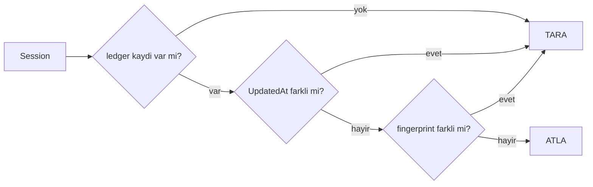
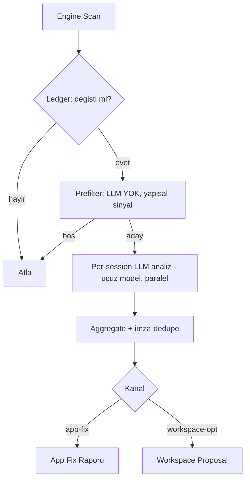
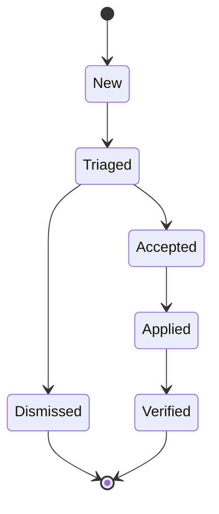

# 60 — Retrospektif Geçmiş Tarama (Insight Scan)

> **Durum:** TASLAK (Faz 1 onaylı). Canlı ilerleme `05-ILERLEME.md`'ye işlenecek.
>
> **Amaç:** Geçmiş session'ları **farklı amaçlarla (lens)** tarayan; taradığını tekrar
> taramayan (session değiştiyse yeniden tarayan); bulguları **iki kanala** yönlendiren
> generic motor:
> - **Kanal A — App Fix:** kök nedeni TionSwarm uygulamasında olan bulgular → düzeltme raporu.
> - **Kanal B — Workspace Opt:** workspace içinde koda dokunmadan çözülebilen optimizasyonlar.
>
> Hem **manuel (UI)** hem **otomatik (cron/automation)** tetiklenebilir. Paket `internal/insight`.

---

## 1. Kavramlar

| Kavram | Tanım |
|--------|-------|
| **Lens (Scan Intent)** | Tarama amacı. **Workspace'te editlenebilir dosya** (skill gibi). Prefilter + analiz promptu + kanal + kapsam taşır. |
| **Ledger** | `(lensId, sessionId)` başına inkremental durum. `UpdatedAt` **+ fingerprint** ile "değişti mi?" kararı. |
| **Finding (Bulgu)** | Tek kanonik şema; imza-dedupe ile tekrarlar `occurrences` biriktirir. |
| **Channel** | `app-fix` \| `workspace-opt`. Bulgunun yönlendirileceği kanal. |

---

## 2. Lens = Editlenebilir Dosya (skill deseni)

Skill sistemiyle **aynı tier + seed** yaklaşımı (`internal/skills` emsali):

- **Konum:** `<workspace>/insight/lenses/<lensId>.md`
- **Gömülü default'lar:** `internal/insight/defaults/*.md` (`//go:embed`) → workspace'e
  **seed** edilir; sürüm+frontmatter-farkındalı (kullanıcı fm'i korunur, gövde tazelenir) —
  `internal/skills` seed mantığının birebir kopyası.
- **Kullanıcı editler:** prompt gövdesini ve frontmatter'ı serbestçe değiştirir; yeni lens
  ekleyebilir. Registry açılışta workspace tier'ından yükler.

### Dosya formatı (frontmatter + gövde)

```markdown
---
id: tool-errors
name: "Tool Hataları"
description: "Tool hatalarını bulup kök nedeni uygulamaya fix olarak raporlar."
channel: app-fix           # app-fix | workspace-opt
enabled: true
model: claude-cli          # ucuz model; analiz per-session
scope: [steps, debug]      # okunacak yüzeyler: steps|debug|toolCalls|skills|context
prefilter:
  requiresAny: [error]     # bu step-kind / debug-event yoksa LLM'e gitme (bedava eleme)
---

# Analiz Talimatı (LLM prompt gövdesi)

Sana bir session'ın hata adımları ve debug olayları verildi. Her tool hatasının
kök nedenini belirle. Kök neden TionSwarm uygulamasındaysa `app-fix` bulgusu üret:
başlık, kök neden, kanıt (satır/olay), önerilen düzeltme ve ilgili dosya işaretçisi.
Geçici/kullanıcı-kaynaklı hataları ELE.
```

> **Neden ortak Finding şeması, lens'te değil:** lens dosyaları basit/editlenebilir kalsın
> diye JSON şemayı her lens tanımlamaz; motor tek kanonik `Finding` şemasını structured
> output olarak dayatır. Lens yalnız prompt + kanal + prefilter + scope verir.

### Başlangıç default lensleri
`tool-errors` (app-fix), `tool-usage-opt`, `skill-usage-opt`, `context-hygiene`,
`context-cache-opt`, `lessons-mining` (hepsi workspace-opt). Genişletme: `autonomy-safety`,
`cost-hotspots`, `permission-friction`, `coordination-stalls`, `handoff-quality`.

---

## 3. İnkremental Ledger (fingerprint baştan)

**Konum:** `<store>/insight/ledger.jsonl` (dosya-tabanlı, DB-yok mimarisine uygun).

**Kayıt:**
```json
{ "lensId": "...", "sessionId": "...", "seenUpdatedAt": 0,
  "seenFingerprint": "...", "scannedAt": 0, "findingCount": 0, "status": "clean|error" }
```

**Fingerprint (baştan dahil):** `msgCount:lastMsgId:lastMsgCreatedAt` — `UpdatedAt`
metadata-only bump'larını eler; birincil sinyal `UpdatedAt`, sağlamlık için fingerprint.

**Karar:**


- **Per-lens** tutulur (farklı lens farklı yüzey okur).
- Yeni lens → o `(lens, session)` ledger boş → otomatik backfill.
- Archived: manuel taramada dahil, gece-oto taramada hariç (konfigüre).

---

## 4. Pipeline (3 aşama, maliyet kontrolü)



1. **Prefilter (LLM yok):** lens `prefilter.requiresAny` sinyalini `debug.jsonl`/steps'ten
   kontrol et. Yoksa atla → bedava eleme.
2. **Analiz (LLM):** eleyen session'ın **ilgili dilimini** (tüm transkript değil) ucuz
   modele ver → kanonik `Finding[]`. Session'lar paralel.
3. **Aggregate + dedupe:** imzayla birleştir (lessons dedupe emsali); tekrar → `occurrences++`
   + kanıt `sessionIds`.

---

## 5. Finding Modeli + Yaşam Döngüsü

```json
{ "id": "...", "lensId": "...", "channel": "app-fix",
  "signature": "...", "title": "...", "rootCause": "...",
  "evidenceSessionIds": ["..."], "occurrences": 1, "severity": "low|med|high",
  "proposedFix": "...", "filePointer": "internal/...", "status": "new",
  "appliedAt": 0, "verifiedAt": 0 }
```



**Konum:** `<store>/insight/findings.jsonl`.

---

## 6. İki Kanal

- **Kanal A — App Fix:** kök neden uygulamada. Çıktı = App Fix Raporu artifact'i
  (kök neden + kanıt session'lar + önerilen düzeltme + dosya işaretçisi). **Asla oto-apply.**
  Sink seçenekleri: repo `_Docs` backlog / cwd=TionSwarm coder ajanı spawn / GitHub issue.
- **Kanal B — Workspace Opt:** self-management araçlarına maplenir (skill buda,
  `BlockedTools`/`DisabledTools`, config prompt, agent soul, `update_settings`, eksik
  CLAUDE.md). **Guarded auto-apply:** düşük-risk oto, yüksek-risk `needs-review`.

---

## 7. Kod Yerleşimi + Yeniden Kullanım

| Yeni | İçerik |
|------|--------|
| `internal/insight/intent.go` | Lens registry (workspace tier + embed seed) |
| `internal/insight/defaults/*.md` | Gömülü default lensler (`//go:embed`) |
| `internal/insight/ledger.go` | İnkremental durum (`UpdatedAt` + fingerprint) |
| `internal/insight/scanner.go` | 3-aşamalı pipeline |
| `internal/insight/finding.go` | Finding modeli + imza-dedupe |
| `internal/insight/router.go` | Kanal yönlendirme |
| `internal/insight/apply.go` | Workspace guarded auto-apply (Faz 2) |
| `internal/api/insight.go` | REST uçları |
| `frontend/src/features/insight/` | UI (Faz 1: read-only pano) |
| ajan araçları | `insight_scan`, `insight_list_findings`, `insight_apply_finding` |

**Yeniden kullanım:** `db.ListSessions` (+`UpdatedAt`), debug journal reader
(`read_session_debug`), `call_llm`/`run_subagent`, `internal/skills` seed deseni,
lessons imza-dedupe, scheduler + `AutomationEngine`.

**Lessons ilişkisi:** Lessons = per-agent reaktif runtime hafızası; Insight = fleet-geneli
retrospektif offline analiz. `lessons-mining` lensi lessons store'u besler (kopya değil).

---

## 8. API + Araçlar (hedef yüzey)

- `GET  /api/insight/lenses` — lens listesi (enabled/channel)
- `POST /api/insight/scan` — `{ lensIds[], scope, channel }` → SSE canlı ilerleme
- `GET  /api/insight/findings` — filtre: lens/channel/status
- `POST /api/insight/findings/{id}/apply` — workspace-opt guarded apply (Faz 2)
- `POST /api/insight/findings/{id}/dismiss`

---

## 9. Tetikleme

- **Manuel (Faz 1):** UI ekranı → lens + kapsam + kanal seç → `POST /scan` → SSE.
- **Otomatik (Faz 3):** `AutomationEngine`'e yeni `insight-scan` tetik türü + cron.
  İkisi de aynı `Engine.Scan(scope, lensIds, channel)`'ı çağırır.

---

## 10. Uygulama TODO

### Faz 1 — İskelet (onaylı)
- [ ] `internal/insight/` paket iskeleti + `Finding` kanonik modeli (`finding.go`).
- [ ] Lens dosya formatı parser'ı (frontmatter + gövde) — `intent.go`.
- [ ] Gömülü default lens: `defaults/tool-errors.md` + `//go:embed` seed (skills seed
      mantığını uyarla: sürüm+fm-farkındalı, kullanıcı fm korunur).
- [ ] Workspace tier loader: `<workspace>/insight/lenses/` → registry.
- [ ] Ledger (`ledger.go`): `<store>/insight/ledger.jsonl`, `UpdatedAt` + fingerprint
      (`msgCount:lastMsgId:lastMsgCreatedAt`) hesabı + oku/yaz + "değişti mi?" kararı.
- [ ] Prefilter: lens `prefilter.requiresAny` → `debug.jsonl`/steps yapısal kontrol (LLM yok).
- [ ] Per-session analiz: ilgili dilimi topla → `call_llm`/claude-cli → kanonik `Finding[]`
      (structured output). Session'lar paralel + bütçe tavanı.
- [ ] Aggregate + imza-dedupe → `<store>/insight/findings.jsonl`.
- [ ] Kanal A router: App Fix Raporu artifact'i (read-only; kanıt + dosya işaretçisi).
- [ ] `internal/api/insight.go`: `GET /lenses`, `POST /scan` (SSE), `GET /findings`.
- [ ] Frontend `features/insight/`: lens seç + kapsam + "Tara" + canlı ilerleme + bulgu panosu (read-only).
- [ ] Ajan aracı `insight_scan` + `insight_list_findings` (self-management).
- [ ] Bütçe/guardrail: max session, max token per scan-run; archived default hariç (oto).

### Faz 2 — Workspace kanalı
- [ ] `skill-usage-opt` + `context-hygiene` default lensleri.
- [ ] `apply.go`: workspace-opt guarded auto-apply (düşük-risk oto, yüksek-risk `needs-review`).
- [ ] `POST /findings/{id}/apply|dismiss` + UI accept/dismiss/apply.
- [ ] Ajan aracı `insight_apply_finding`.

### Faz 3 — Otomasyon
- [ ] `AutomationEngine` `insight-scan` tetik türü + cron config.
- [ ] Gece taraması: değişmiş session'lar → route → app-fix rapor + düşük-risk apply +
      yüksek-risk `needs-review`.

### Faz 4 — Genişletme
- [ ] Kalan default lensler (`tool-usage-opt`, `context-cache-opt`, `lessons-mining`, +ekstralar).
- [ ] `lessons-mining` → lessons store besleme sinerjisi.
- [ ] Bulgu panosu: pattern/occurrence görselleştirme.

---

## 11. Açık Sorular
- Kanal A sink varsayılanı: repo `_Docs` backlog mı, coder ajanı spawn mı, GitHub issue mı?
- Prefilter dil düzeyi: `requiresAny` yeterli mi, yoksa küçük ifade dili mi gerekli?
- Cross-workspace tarama gerekli mi (şimdilik workspace-scoped)?
