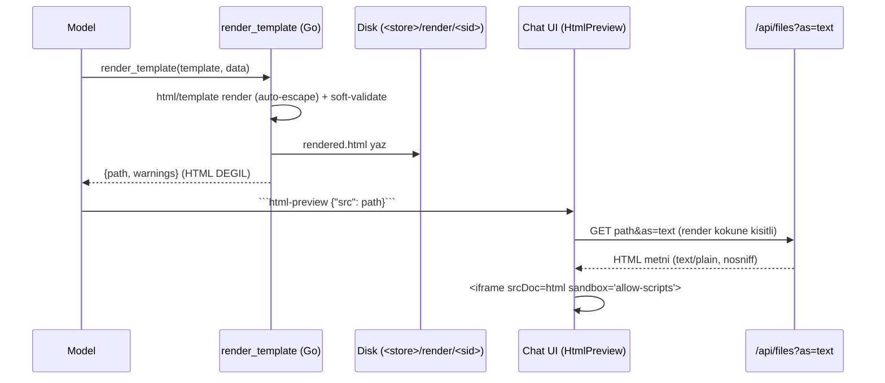

# 63 — `render_template` + `html-preview` (Şablonlu HTML Render)

> *Numara notu: bu doküman 2026-07-27'de **53 → 63** olarak yeniden numaralandı
> (53, the external agent project prompt paritesi dokümanıyla çakışıyordu).*

> Durum: ✅ **Uygulandı** (2026-07-06). the external agent project'ın "Source Templates / `render_template`"
> özelliğinin TionHarness-native karşılığı.
> İlgili: `_Docs/41-ARAC-BOSLUKLARI-YAPILACAKLAR.md` §8, `_Docs/07-CHAT-UX.md`.

## 0. Amaç

LLM'in **aynı markalı HTML'i her seferinde yeniden üretmemesi**. Layout sabit, yalnız
veri değişiyorsa: motor şablonu doldurur, araç modele **sadece dosya yolu** döndürür
(HTML değil → token tasarrufu), sohbette **inline** izole iframe'de gösterilir.

the external agent project'ta şablon bir "source"a aitti. TionHarness'da **source kavramı yok** → şablonlar
**skill'e bundle** edilir (`tionharness-templates`). Yeni bir "template store" alt-sistemi
KURULMADI (over-engineering); mevcut `${SKILL_DIR}` + bundled-files mekanizması yeterli.

## 1. Uçtan uca akış



## 2. Motor + soft-validation

- **Motor:** Go **`html/template`** (stdlib) — auto-escaping/XSS-güvenli. Ajan-yazımı şablon
  + ajan-sağlamı veri karışımında escaping şart; naive `{{x}}` string-ikamesi enjeksiyon açar.
- **Sözdizimi:** `{{.field}}`, `{{if .x}}…{{end}}`, `{{range .items}}…{{end}}`.
- **Zorunlu alan bildirimi:** sidecar `<template>.meta.json`:
  `{ "id": "report", "requiredFields": ["title","items"], "description": "…" }`.
  Sidecar gövdeye gömülmez (motoru kirletmez); hem araç hem keşif okur.
- **Soft-validation (iş kuralı):** eksik/boş `requiredField` → **render eder + warning** döner.
  `isEmptyValue`: `nil`, boş string, boş dizi/obje "eksik" sayılır; `0`/`false` gerçek değerdir.
- **Hard-fail (teknik hata):** okunamayan/eksik şablon, parse/execute hatası, **bozuk sidecar**,
  yazma hatası, session yok → hata döner (CLAUDE.md: "hata vermesi gereken yerde sessizce yutma").

## 3. Güvenlik modeli (iki katman)

1. **İçerik izolasyonu:** Frontend dosya **metnini** fetch eder → `<iframe srcDoc={html}
   sandbox="allow-scripts">`. `allow-same-origin` YOK ⇒ **opaque origin**: script çalışır ama
   parent DOM/cookie/workspace-API'ye erişemez. `ArtifactView.tsx` `case 'html'` deseninin aynısı.
2. **Dosya erişimi:** `GET /api/files?path=<abs>&as=text` dosyayı **`text/plain; charset=utf-8`**
   + `X-Content-Type-Options: nosniff` ile döndürür — **asla `text/html`**. Yani HTML hiçbir zaman
   same-origin çalıştırılabilir sayfa olarak servis edilmez. Ayrıca `as=text` yalnız **workspace
   render kökü** (`<store>/render/`) altını servis eder (`underDir` whitelist) → keyfi disk okuması yok.

## 4. Depolama + çıktı konumu

- **Şablonlar:** skill-bundled → `internal/skills/defaults/tionharness-templates/templates/*.html`
  (+ `*.meta.json`). `${SKILL_DIR}` `use_skill` anında mutlak dizine genişler; araç genişlemiş yolu alır.
- **Render çıktısı:** `SessionRenderDir(sid)` = `<db.Root>/render/<sid>/` — `progress/`'in kardeşi.
  Yol tek kaynak: `db.RenderDir(sid)` (yazan runtime + temizleyenler paylaşır). Session yoksa boş
  string → araç hard-fail. Çıktı adı `filepath.Base`'e indirgenir (traversal yok).
- **Ömür / temizlik (2026-07-06):** İki katman —
  1. **Session silme:** `deleteSessionFilesLocked` artık `<render>/<sid>`'i de siler (artifact dizini gibi).
  2. **Startup sweep:** `DB.Open` → `cleanupRenders` (best-effort, single-thread): session'ı kalmamış
     **orphan** render dizinlerini tümüyle siler; canlı session'larda **`renderTTL` (14 gün)**'den eski
     dosyaları toplar, boşalan dizini budar. Dosyalar: `internal/db/render_cleanup.go` (+ 3 test).
     Gerekçe: render çıktısı geçici bir görünüm (kalıcı çıktı artifact olur), bu yüzden TTL güvenli.

## 5. Dosya haritası

| Katman | Dosya | Rol |
|---|---|---|
| Motor | `internal/tools/render_template.go` | Saf: template render + sidecar oku + missing-field (test edilebilir) |
| Araç | `internal/tools/builtin_render_template.go` | `render_template` Tool (Def/Call), render dir'e bağlı |
| Test | `internal/tools/builtin_render_template_test.go` | escape, soft-warn, hard-fail'ler, traversal, no-session (8 test) |
| Session dir | `internal/agent/renderdir.go` | `SessionRenderDir` = `<db.Root>/render/<sid>` |
| Kayıt | `internal/agent/toolsetup.go` | builtins'e ekle + `MarkNameOnly("render_template")` |
| Servis | `internal/api/files.go` | `serveTextFile` (`as=text`) + `underDir` whitelist + `textServableExt` |
| Inline UI | `frontend/src/components/markdown/HtmlPreview.tsx` | ```html-preview``` → sandbox iframe (tab desteği) |
| Dispatch | `frontend/src/components/markdown/CodeBlock.tsx` | `lang==='html-preview'` → `HtmlPreview` |
| URL helper | `frontend/src/lib/attachments.tsx` | `fileTextURL` (`?as=text&ws=`) |
| Skill | `internal/skills/defaults/tionharness-templates/**` | SKILL.md + report/email şablonları + meta |
| Prompt | `internal/workspace/defaults/default-instructions.md` | "## Rendering"e `html-preview` + `render_template` |
| Guard | `internal/workspace/defaults_test.go` | `html-preview`/`render_template` yasak listesinden çıktı (artık native) |

## 6. Kullanım (ajan akışı)

1. `use_skill tionharness-templates` → footer + tablo şablonları ve alanları listeler.
2. `render_template({ "template": "<abs>/templates/report.html", "data": {...} })` → `{path, warnings}`.
3. Yanıta ```` ```html-preview {"src":"<path>"} ```` bloğu koy → inline izole render.
   Çoklu dosya: `{"items":[{"src","label"}]}` → sekmeler.

Kendi şablonun: tek-dosya self-contained `.html` (inline `<style>`; sandbox dış kaynak engeller)
+ opsiyonel `<name>.meta.json`.

## 7. Görünürlük / tier

`render_template` **name-only** tier'da (nadir kullanım; adı yeterli, şema on-demand). Shell gate'i
GEREKTİRMEZ (arbitrary code çalıştırmaz, saf render). Session-scoped: catalog/preview build'de
render dir boş → çağrılırsa hard-fail.

## 8. Bilinen sınırlar / gelecek

- `html/template` partial/include sınırlı; karmaşık şablonlar için tek-dosya self-contained varsayılır.
- Eksik alan `html/template`'te `<no value>` yazabilir; warning modeli yönlendirir (kozmetik).
- ~~Render çıktıları birikir~~ ✅ Çözüldü (2026-07-06): session-silme temizliği + startup TTL/orphan sweep
  (§4). Not: TTL yalnız startup'ta çalışır; çok uzun süre açık kalan bir süreçte biriken dosyalar bir
  sonraki açılışta toplanır (periyodik sweep gerekirse ileride eklenebilir).
