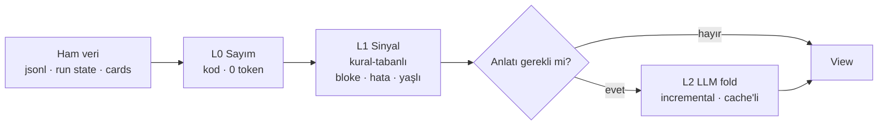

# 66 — View (Projeksiyon) Katmanı: büyük durumun bağlam-ucuz özeti

> **TASLAK / tasarım notu — kod yok.** Büyük veri yüzeylerinin (uzun session,
> çok-node'lu flow run, yüzlerce kartlı board, tüm workspace) o anki durumunu
> **deterministik, cache'lenebilir, bütçe-farkındalı** bir projeksiyona indiren tek
> primitif. Hem ajanlara (araç/suffix) hem kullanıcıya (UI paneli) **aynı çıktıyı**
> verir. Amaç: her alt sistemin kendi ad-hoc özetleyicisini yazmasını durdurmak.

## Neden

Bugün "büyük durumu küçült" işi en az dört yerde **birbirinden habersiz** yapılıyor:

| Yer | Ne yapıyor | Nerede |
|-----|-----------|--------|
| `conversation.Manager` | rolling-summary ile eski turları katlar | [35](35-CONTEXT-RESET-HANDOFF.md) |
| handoff artifact | oturumu yeni oturuma devreder | [35](35-CONTEXT-RESET-HANDOFF.md) |
| coordinator worker-state bloğu | canlı worker roster'ını her tura enjekte eder | [47](47-KOORDINATOR-COKLU-AJAN.md) |
| insight prefilter | oturumları lens'e uygun mu diye eler | [60](60-RETROSPEKTIF-TARAMA.md) |

Dördü de aynı problemi çözüyor, dördü de farklı şekilde. Beşinci müşteri (workspace
gözetmeni / supervisor ajanı) kapıda. Bu katman yazılmazsa beşinci ad-hoc özetleyici
de yazılacak.

**Kabul testi:** bu iş bittiğinde yukarıdaki dört uygulamadan en az ikisi
`internal/view`'e göç etmiş ve eski kodu **silinmiş** olmalı. Yeni bir katman eklenip
eskilerin durması = başarısızlık.

## Çekirdek fikir

Bu bir "özetleyici" değil — **projeksiyon** katmanı. İstenen çıktının büyük kısmı
LLM'siz üretilebilir ve üretilmelidir.

```
View = f(entity, level, lens)   → deterministik · cache'lenebilir · damgalı
```

`internal/view` (leaf paket, `db`+`orchestration` okur, kimseye bağımlı değil):

```go
type Ref struct {                 // neye bakıyoruz
    Kind ViewKind                 // session | flowrun | board | workspace | agent
    ID   string
    Sub  string                   // opsiyonel drill-down: "#fetch-b", "#turn41"
}

type Level string                 // bütçe tier'ı
const (
    LevelTiny Level = "tiny"      // ~50 tok  — tek satır, push'a uygun
    LevelCard Level = "card"      // ~300 tok — varsayılan
    LevelFull Level = "full"      // ~1500 tok — drill-down
)

type Lens string                  // sabit ve az sayıda (bkz. Tuzaklar/3)
const (
    LensHealth Lens = "health"    // varsayılan: durum + sinyaller
    LensStale  Lens = "stale"     // yaşlanan/bloke olan
    LensRecent Lens = "recent"    // son Δ penceresi
    LensErrors Lens = "errors"    // hata/retry/guardrail
)

type View struct {
    Ref     Ref
    Header  string      // her zaman üretilir, deterministik, ~8-12 satır
    Body    string      // level'e göre kademeli
    Handles []Handle    // drill-down referansları
    AsOf    time.Time   // tazelik damgası
    Source  string      // seq/hash — cache anahtarı + doğrulanabilirlik
    Elided  int         // GİZLENEN öğe sayısı — sessiz kesme yok
    Tokens  int         // ölçülen maliyet (UI'da gösterilir)
}

func Project(ctx context.Context, ref Ref, level Level, lens Lens) (View, error)
```

## Üç katmanlı üretim — LLM en sonda



- **L0 — sayım.** Mesaj/kart/node sayıları, süreler, durum dağılımları, token'lar.
  Ücretsiz, sub-ms, **halüsinasyon imkânsız**.
- **L1 — sinyal.** Değerin çoğu burada: 3 gündür `doing`'te duran kart, `failed`
  node, `StuckTurns>0` oturum, WIP limit aşımı, cevapsız `ask_user`.
  Kural-tabanlı, yine LLM'siz.
- **L2 — anlatı.** Yalnız `LevelFull`'de ve yalnız gerektiğinde. **Asla sayı
  üretmez** — sayılar L0'dan gelir, L2 sadece "neden"i yazar. (Sayıyı LLM yazarsa
  uydurur; kullanıcı bir kere yakalar, sisteme güven biter.)

## Incremental fold — yeniden özetleme yasak

Her sorguda baştan özetlemek sistemi öldürür. Bunun yerine:

```
digest(n) = fold(digest(n-1), events[lastSeq..n])
```

TionSwarm bu mekanik için hazır: `session.jsonl` append-only ([08](08-DEPOLAMA.md)),
`FlowRun` state'i restart-safe ([15](15-FLOW-CANVAS.md)), board mutasyonları `BoardHook`
event'li ([46](46-ETIKET-OTOMASYON.md)). Yani **checkpoint + delta** doğal olarak var.

- Cache anahtarı: `entityID + lastSeq/contentHash + level + lens`
- Değişmediyse → **0 token, sub-ms** (L2 dahil)
- Değiştiyse → yalnız delta katlanır
- Cache yeri: `<store>/views/<kind>/<id>.json` (L2 sonuçları kalıcı; L0/L1 bellek-içi)

`conversation.Manager`'ın rolling-summary'si zaten tam bu mekanik — genelleştirilecek
olan o.

## Çıktı formatı: kompakt DSL, JSON değil

JSON anahtar tekrarı token yakar. Satır-bazlı, hizalanmış, insan+model okunur format:

### Flow run (en yüksek değer/token oranı)

```
FLOW run:RUN7f2 "research-pipeline" · 6/9 node · 2m14s · RUNNING · asOf 15:41:07
start✓ → agent:collect✓(31s,4tool) → branch⑂[has_data] → parallel[3/3✓ 48s]
      → agent:synth⚡RUNNING(1m2s) → …2 pending
⚠ node:fetch-b retry×2 (429 rate_limit)        ↳ view(RUN7f2#fetch-b)
```

40 node'luk bir koşu tek ekran satırına iner; hatalı node handle ile açılır.

### Board

```
BOARD ws:main · 187 kart · asOf 15:41
todo 92 | doing 11 (WIP↑ limit 5) | review 6 | done 78
⚠ 4 kart >7g doing'de: TSK-19, TSK-44, TSK-51, TSK-88
⚠ review'da 6 kart, 2g hareketsiz
Δ24s: +7 yeni · 5 done · 2 geri düştü (TSK-31 review→doing ×3 ping-pong)
…173 kart gizlendi                              ↳ view(board, lens=stale)
```

Kart listesi **değil**, sinyal. 200 kart → 14 satır.

### Session

```
SES:SES9a1 "auth refactor" · 214 msg · 187k tok · 3g12s · agent:builder · cache🔥
Hedef: JWT→session cookie geçişi
Durum: 7/11 todo tamam · son araç hatası yok · StuckTurns 0
⚠ Açık soru: migration rollback stratejisi (turn 141, cevapsız)
Son 3 tur: …                                    ↳ view(SES9a1, level=full)
```

### Workspace

Yukarıdakilerin `tiny`'lerinin toplamı. Bu, ileride tartışılan **workspace gözetmeni
(supervisor) ajanının girdisidir** — supervisor bu katmanın bir *müşterisi* olur,
ayrı bir izleme alt sistemi değil.

## Ajanlara dağıtım: üç kanal, karıştırma

"Bütün ajanlara verilebilsin" isteğinin en riskli kısmı burası. Her ajana her şeyi
push etmek **prompt cache'i her turda kırar** → [57](57-PROMPT-EPOCH.md) çalışmasını
çöpe atar.

| Kanal | Ne | Nereye | Kural |
|-------|-----|--------|-------|
| **Pull** *(varsayılan)* | `get_view(ref, level, lens)` aracı | tool sonucu | Cache-nötr, her zaman güvenli |
| **Push** | yalnız `tiny`, yalnız ilgili oturuma | **volatile dinamik suffix** | Coordinator worker-state bloğu gibi; **asla statik prefix'e** |
| **Handle** | büyük tool çıktısı yerine `view://SES9a1@seq214` | tool sonucu | 64KB cap'e çarpan yerlerde otomatik daraltma |

Kural: push edilen şey **küçük ve stabil** olmalı. Değişkenlik varsa pull'a düşür.

## UI: aynı view, iki tüketici

Kritik tasarım tercihi: **ajanın gördüğü özetin birebir aynısı kullanıcıya da
gösterilir.** Böylece view yanlış/eksikse kullanıcı fark eder — doğrulanabilirlik
bedava gelir. Ayrı bir "insan özeti" üretilmez.

### 1. Bağlam düğmesi (her büyük ekranda)

Chat header'ı, RunView, Board ve Workspace ekranlarına küçük bir **`◱ Bağlam`**
butonu. Tıklayınca sağdan `ViewPanel` drawer'ı açılır.

### 2. `ViewPanel` (`frontend/src/features/view/`)

```
┌─ ◱ Bağlam — FLOW run:RUN7f2 ──────────────── ✕ ─┐
│ [tiny] [card] [full]      lens: [health ▾]      │  ← level + lens seçici
│ asOf 15:41:07 (7sn önce)  ~112 tok   🔄 Yenile  │  ← tazelik + ölçülen maliyet
├─────────────────────────────────────────────────┤
│ FLOW run:RUN7f2 "research-pipeline" · 6/9 …     │  ← monospace, ham DSL
│ start✓ → agent:collect✓(31s,4tool) → …          │
│ ⚠ node:fetch-b retry×2 (429 rate_limit)         │  ← tıklanabilir handle
├─────────────────────────────────────────────────┤
│ 173 öğe gizlendi                                │  ← Elided her zaman görünür
│ [📋 Kopyala]  [⤓ Ajana gönder]                  │
└─────────────────────────────────────────────────┘
```

- **Ham DSL gösterilir** — güzelleştirilmiş kart değil. Model ne görüyorsa o.
- **Token sayacı** görünür → hangi view'ın pahalı olduğu ölçülebilir.
- **Handle'lar tıklanabilir** → panel içinde drill-down (breadcrumb'lı).
- **"Ajana gönder"** → view'ı composer'a `view://…` referansı olarak yapıştırır.
- Canlı entity'lerde SSE ile otomatik tazelenir (flow run çalışırken).

### 3. Workspace Bağlam paneli

Workspace ekranında `workspace` view'ı sürekli görünür bir kart olarak; ileride
supervisor bulguları da buraya düşer.

### API

```
GET /api/views/{kind}/{id}?level=card&lens=health   → View (JSON zarf, Body ham DSL)
GET /api/views/workspace?level=tiny
```

## Tasarım tuzakları

1. **Sessiz kesme yok.** "En önemli 10 kart"ı gösterip gerisini yutmak ajanı
   sistematik yanıltır. `Elided` alanı zorunlu ve her zaman render edilir.
2. **Tazelik damgası zorunlu.** `AsOf` olmadan ajan eski durumla karar verir.
3. **Lens sayısı az.** Çok lens = ajan yanlış seçer. Dört sabit lens, genişletme
   ancak kanıtla.
4. **L2 sayı üretmez.** Sayılar L0'dan; LLM sadece anlatır.
5. **Format sabitlenmeli.** DSL grameri versiyonlanır; ajan promptları buna
   dayanacak, serbest biçim drift yaratır.
6. **Eski özetleyiciler göç etmeli** (bkz. "Neden" — kabul testi).

## Faz planı

| Faz | Kapsam | Çıktı |
|-----|--------|-------|
| **1** | `internal/view` iskelet + **yalnız L0/L1** + **tek entity: flow run** | `Project()` + `GET /api/views/flowrun/{id}` |
| **2** | `ViewPanel` + `◱ Bağlam` butonu (RunView) | UI'da görünür değer, DSL doğrulanır |
| **3** | `get_view` aracı (pull kanalı) | Ajanlar kullanır |
| **4** | `board` + `session` view'ları | Board/Chat ekranlarında buton |
| **5** | L2 incremental fold + kalıcı cache | Uzun oturumlarda anlatı |
| **6** | `workspace` view (tiny toplamı) | Supervisor ajanının girdisi hazır |

Faz 1-2 bir günlük iş ve anında görünür değer üretir. Faz 5'e ancak 1-4 kanıtlanırsa
geçilir.

## Açık sorular

- `get_view` yeni bir araç mı, yoksa mevcut `list_*` / `read_session_debug`
  araçlarına `level` parametresi mi? *(Yeni araç daha temiz görünüyor; mevcutları
  kirletmemek adına.)*
- DSL grameri nerede tanımlansın — kod içinde mi, `internal/prompts` benzeri
  versiyonlu bir şablon dosyasında mı ([61](61-MERKEZI-PROMPT-REGISTRY.md))?
- L2 fold hangi modeli kullanmalı? (Ucuz model + `internal/prompts` anahtarı.)
- Board view'ında "yaşlı kart" eşiği workspace ayarı mı, sabit mi?

## İlgili dokümanlar

[08](08-DEPOLAMA.md) depolama · [15](15-FLOW-CANVAS.md) flow motoru ·
[35](35-CONTEXT-RESET-HANDOFF.md) compaction/handoff ·
[46](46-ETIKET-OTOMASYON.md) board olayları ·
[47](47-KOORDINATOR-COKLU-AJAN.md) worker-state bloğu ·
[57](57-PROMPT-EPOCH.md) cache güvenliği ·
[60](60-RETROSPEKTIF-TARAMA.md) insight prefilter
