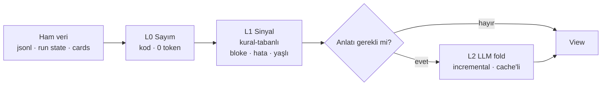

# 66 — View (Projeksiyon) Katmanı: büyük durumun bağlam-ucuz özeti

> **Faz 1-4 + 6 CANLI** (flowrun + session + board + workspace projeksiyonları,
> `ViewPanel` UI, `get_view` aracı, **Panel ekranı**); faz 5 (L2 fold) tasarım.
> Büyük veri yüzeylerinin (uzun session,
> çok-node'lu flow run, yüzlerce kartlı board, tüm workspace) o anki durumunu
> **deterministik, cache'lenebilir, bütçe-farkındalı** bir projeksiyona indiren tek
> primitif. Hem ajanlara (araç/suffix) hem kullanıcıya (UI paneli) **aynı çıktıyı**
> verir. Amaç: her alt sistemin kendi ad-hoc özetleyicisini yazmasını durdurmak.

## Neden

Bugün "büyük durumu küçült" işi en az dört yerde **birbirinden habersiz** yapılıyor:

| Yer | Ne yapıyor | Nerede |
|-----|-----------|--------|
| `conversation.Manager` | rolling-summary ile eski turları katlar | [35](35-CONTEXT-RESET-HANDOFF.md) |
| handoff artifact | oturumu yeni oturuma devreder | [35](35-CONTEXT-RESET-HANDOFF.md) |
| coordinator worker-state bloğu | canlı worker roster'ını her tura enjekte eder | [47](47-KOORDINATOR-COKLU-AJAN.md) |
| insight `buildSlice` | oturumu analyzer LLM'ine kompakt kanıt metnine indirger | [60](60-RETROSPEKTIF-TARAMA.md) |

> **Düzeltme (2026-08-04):** bu satır önce "insight prefilter" yazıyordu — **yanlış
> adaydı**. `Prefilter.Match` bir **filtre**: `SessionSignals` alır, `bool` döner,
> hiç metin üretmez; view katmanıyla paylaşacağı bir şey yok. Duplicate özetleyici
> `Scanner.buildSlice`.

Dördü de aynı problemi çözüyor, dördü de farklı şekilde. Beşinci müşteri (workspace
gözetmeni / supervisor ajanı) kapıda. Bu katman yazılmazsa beşinci ad-hoc özetleyici
de yazılacak.

**Kabul testi:** bu iş bittiğinde yukarıdaki dört uygulamadan en az ikisi
`internal/view`'e göç etmiş ve eski kodu **silinmiş** olmalı. Yeni bir katman eklenip
eskilerin durması = başarısızlık.

**Durum: 2/4 göç etti** (2026-08-04)

- **1/4 — coordinator worker-state bloğu.**
  `Runtime.coordinatorWorkerStatusBlock`'un 36 satırlık render mantığı **silindi**;
  geriye 16 satırlık veri toplama + `view.ProjectWorkers` çağrısı kaldı.
- **2/4 — handoff.** Ölü `HandoffEnv.Todos` alanı `view.LatestTodos` ile
  dolduruldu ve checklist taramasının **üç kopyası tek eve** indi (aşağıda).
- **Kısmi — insight `buildSlice`.** `View` yapılmadı, **bilerek**: farklı soru
  ("bu hipotez için kanıt ne?" vs "bunun durumu ne?"), farklı kapsam (tüm
  transkript vs son 40 mesaj), farklı içerik (yalnız hata vs sağlıklı durum +
  sinyaller). Zorlamak dosya taşımak olurdu, tekrarı yok etmek değil. Bunun
  yerine **paylaşılan primitifler** çıkarıldı ve iki duplicate **silindi**.
- Kalan aday: `conversation` summarizer (en büyük kazanç, faz 5'in L2 fold'uyla
  iç içe).

**Adım çözme artık tek evde.** `agent.TurnStep`'i yapısal çözen kod dört yerde
tekrar ediyordu (`view/session.go`, `insight/scanner.go`, `api/todos.go` ve bir
kopya daha); üçü silindi, geriye `view/step.go` kaldı.

## Çekirdek fikir

Bu bir "özetleyici" değil — **projeksiyon** katmanı. İstenen çıktının büyük kısmı
LLM'siz üretilebilir ve üretilmelidir.

```
View = f(entity, level, lens)   → deterministik · cache'lenebilir · damgalı
```

`internal/view` (leaf paket, `db`+`orchestration` okur, kimseye bağımlı değil):

```go
type Ref struct {                 // neye bakıyoruz
    Kind ViewKind                 // session | flowrun | board | workspace | agent
    ID   string
    Sub  string                   // opsiyonel drill-down: "#fetch-b", "#turn41"
}

type Level string                 // bütçe tier'ı
const (
    LevelTiny Level = "tiny"      // ~50 tok  — tek satır, push'a uygun
    LevelCard Level = "card"      // ~300 tok — varsayılan
    LevelFull Level = "full"      // ~1500 tok — drill-down
)

type Lens string                  // sabit ve az sayıda (bkz. Tuzaklar/3)
const (
    LensHealth Lens = "health"    // varsayılan: durum + sinyaller
    LensStale  Lens = "stale"     // yaşlanan/bloke olan
    LensRecent Lens = "recent"    // son Δ penceresi
    LensErrors Lens = "errors"    // hata/retry/guardrail
)

type View struct {
    Ref     Ref
    Header  string      // her zaman üretilir, deterministik, ~8-12 satır
    Body    string      // level'e göre kademeli
    Handles []Handle    // drill-down referansları
    AsOf    time.Time   // tazelik damgası
    Source  string      // seq/hash — cache anahtarı + doğrulanabilirlik
    Elided  int         // GİZLENEN öğe sayısı — sessiz kesme yok
    Tokens  int         // ölçülen maliyet (UI'da gösterilir)
}

func Project(ctx context.Context, ref Ref, level Level, lens Lens) (View, error)
```

## Üç katmanlı üretim — LLM en sonda



- **L0 — sayım.** Mesaj/kart/node sayıları, süreler, durum dağılımları, token'lar.
  Ücretsiz, sub-ms, **halüsinasyon imkânsız**.
- **L1 — sinyal.** Değerin çoğu burada: 3 gündür `doing`'te duran kart, `failed`
  node, `StuckTurns>0` oturum, WIP limit aşımı, cevapsız `ask_user`.
  Kural-tabanlı, yine LLM'siz.
- **L2 — anlatı.** Yalnız `LevelFull`'de ve yalnız gerektiğinde. **Asla sayı
  üretmez** — sayılar L0'dan gelir, L2 sadece "neden"i yazar. (Sayıyı LLM yazarsa
  uydurur; kullanıcı bir kere yakalar, sisteme güven biter.)

## Incremental fold — yeniden özetleme yasak

Her sorguda baştan özetlemek sistemi öldürür. Bunun yerine:

```
digest(n) = fold(digest(n-1), events[lastSeq..n])
```

TionSwarm bu mekanik için hazır: `session.jsonl` append-only ([08](08-DEPOLAMA.md)),
`FlowRun` state'i restart-safe ([15](15-FLOW-CANVAS.md)), board mutasyonları `BoardHook`
event'li ([46](46-ETIKET-OTOMASYON.md)). Yani **checkpoint + delta** doğal olarak var.

- Cache anahtarı: `entityID + lastSeq/contentHash + level + lens`
- Değişmediyse → **0 token, sub-ms** (L2 dahil)
- Değiştiyse → yalnız delta katlanır
- Cache yeri: `<store>/views/<kind>/<id>.json` (L2 sonuçları kalıcı; L0/L1 bellek-içi)

`conversation.Manager`'ın rolling-summary'si zaten tam bu mekanik — genelleştirilecek
olan o.

## Çıktı formatı: kompakt DSL, JSON değil

JSON anahtar tekrarı token yakar. Satır-bazlı, hizalanmış, insan+model okunur format:

### Flow run (en yüksek değer/token oranı)

```
FLOW run:RUN7f2 "research-pipeline" · 6/9 node · 2m14s · RUNNING · asOf 15:41:07
start✓ → agent:collect✓(31s,4tool) → branch⑂[has_data] → parallel[3/3✓ 48s]
      → agent:synth⚡RUNNING(1m2s) → …2 pending
⚠ node:fetch-b retry×2 (429 rate_limit)        ↳ view(RUN7f2#fetch-b)
```

40 node'luk bir koşu tek ekran satırına iner; hatalı node handle ile açılır.

### Board (gerçek çıktı — 62 token)

```
BOARD · 8 kart · 4 sütun · asOf 01:07:50
todo 4 | in_progress 2 | done 1 | failed 1
⚠ 1 kart >3g hareketsiz: T2
✗ 1 başarısız kart: T4
⛔ 1 kart bağımlılıkla bloke: T5
📅 1 kart gecikmiş: T6
Δ24s: 4 kart değişti (T3, T5, T6, T7)
• 1 kartın sahibi yok
…8 kart gizlendi  ↳ kart listesi
```

Kart listesi **değil**, sinyal. Yaşlılık yalnız **çalışan sütunlarda**
(`in_progress`/`review`) uyarıdır — hareketsiz bir backlog kartı normaldir.

### Session (gerçek çıktı — 60 token)

```
SES:SES9a1 "auth refactor" · 214 msg · 187k tok · 3g önce açıldı · agent:builder
özet: JWT'den session cookie'ye geçiş yapılıyor.
todo: 2/4 tamam · şu an: testleri güncelle
⤺ ilk 120 mesaj özete katlandı (compaction)
son hareket: 4dk önce
…174 eski mesaj gizlendi  ↳ son turlar + tam özet
```

Transkript **okunmadan** üretilir: header + usage bellek-içi, geri kalanı yalnız
son 40 mesajlık kuyruktan. Okunmayan mesaj sayısı `Elided`'e yazılır.

### Workspace (gerçek çıktı)

Diğerlerinin roll-up'ı. **Panel ekranının** üst bloğu ve ileride tartışılan
**workspace gözetmeni (supervisor) ajanının girdisi** — supervisor bu katmanın bir
*müşterisi* olur, ayrı bir izleme alt sistemi değil.

```
WORKSPACE · 2 ajan · 5 oturum (3 aktif) · 3 kart · 4 koşu · 1.2M tok bugün · $3.14 bugün · asOf 11:12:57
pano: todo 1 | in_progress 1 | failed 1
koşular: 1 çalışıyor · 1 bekliyor · 1 başarısız (son 24s: 3)
⚠ 1 oturum takılmış (StuckTurns>0): SES2
⏸ 2 oturum cevap bekliyor — en eskisi 1sa'dir: session:SES1
✗ 1 başarısız akış koşusu: RUN4
⏰ 1 zamanlama son çalışmada hata verdi
✗ 1 başarısız kart: T3
⚠ 1 kart >3g çalışan sütunda hareketsiz: T2
⇵ 1 koordinatör oturumu
```

Tamamı **bellek-içi store okumaları** — geçmiş ne kadar büyürse büyüsün disk I/O
yok, bu yüzden poll edilebilecek kadar ucuz. **Devre dışı bırakılmış** bir
zamanlamanın son hatası raporlanmaz: bilerek duraklatılmış bir şeyi "bozuk" diye
göstermek okuyucuya satırı yok saymayı öğretir.

Başlıktaki **`$X bugün`** günün USD maliyetidir — `billing.RollupOf` ile (Bütçe
ekranıyla aynı fiyatlama), abonelik sağlayıcıda `~$` (eşdeğer-API tahmini).
Fiyatlanmış harcama yoksa satır **yazılmaz**: token>0 iken `$0.00` göstermek
"ücretsiz" gibi okunurdu, oysa anlamı "bu sağlayıcının fiyatı yok" — farklı bir
gerçek. `internal/view` bunun için `billing`'i import eder (billing → db+providers,
döngü yok).

## Göç 1: coordinator worker-state bloğu (push projeksiyonu)

Katmanın ilk **müşterisi**, yeni bir yüzey değil. `internal/view/workers.go`
(`ProjectWorkers`) koordinatörün canlı worker filosunu render eder; `agent` yalnız
`ListWorkers` sonucunu `[]view.Worker`'a map'ler.

**Neden değdi — iki gerçek kazanç:**

1. **Elision cap.** Blok her koordinatör turuna enjekte edilen bir **push**
   kanalı ve eskiden **sınırsızdı** — 40 worker'lı bir filo her turda 40 satır
   basardı. Artık 20 ile sınırlı, **çalışanlar önce** tutulur (cap'in koordinatörün
   beklediği satırı düşürmesi en kötü sonuç olurdu) ve **özet satırı tüm filoyu**
   sayar, gizlenenler dahil → aritmetik bozulmaz.
2. **Geçen süre.** `WorkerInfo.StartedAt` zaten vardı ama yalnız UI banner'ı
   kullanıyordu; prompt'ta yoktu. Artık `RUNNING for 14m00s` — 14 dakikadır koşan
   bir worker, yeni başlamış olandan farklı bir karar gerektirir. Başlangıç bilinmiyorsa
   süre **basılmaz** (uydurma süre yerine sessizlik).

**Korunan davranış:** "trust THIS over the notifications in history" çerçevesi,
`DELEGATING` durumunun açık ifadesi ve filo boşaldığında verilen kapanış dürtüsü —
üçü de coalesced-notification stall'ını ([47](47-KOORDINATOR-COKLU-AJAN.md))
engellediği için **kelimesi kelimesine** taşındı ve teste bağlandı.

**Bilinçli istisna — dil:** bu projeksiyon paketteki tek **İngilizce** olanı.
Tek tüketicisi koordinatörün sistem prompt'u ve oradaki komşu bloklar (autonomous
boot reminder, shell capability, epoch note) İngilizce; tek bir prompt'un içinde dil
karıştırmak iki seçenekten de kötü olurdu. Bunun için `View.ElidedNote` eklendi:
yapısal `Elided` sayısı yine set edilir (sessiz kesme yasağı bozulmaz), yalnız
render edilen cümle override edilir.

**Yönlendirilemez:** `KindWorkers` `Projector` üzerinden çözülmez ve `get_view`'de
sunulmaz — girdisi store değil **runtime** state; ayrıca koordinatörler bu bloğu
zaten her turda alıyor, ihtiyaç hâlinde `list_workers` var.

## Göç 2 (kısmi): insight — paylaşılan primitifler

`buildSlice` **`View` yapılmadı** (gerekçe yukarıda). Bunun yerine iki gerçek
tekrar `internal/view`'e çekildi ve eski kopyalar **silindi**:

**1. `view.Step` + `DecodeSteps` (`step.go`)** — kalıcı `agent.TurnStep`'i
yapısal çözen tek ev. `view/session.go`'daki `stepLite` ve
`insight/scanner.go`'daki `rawStep` **birbirinin kopyasıydı**, ikisi de aynı
sebeple vardı (`agent` → `tools` → `view` cycle'ından kaçınmak). İkisi de gitti;
`Step.TodoItems()` legacy `todo_write` input formunu da tolere ediyor.

**2. `view.CapLines` (`cap.go`)** — bütçeyi **kayıt sınırında** uygular ve düşeni
**sayar**. `buildSlice` eskiden metni kurup `out[:sliceCap]` ile **baytdan**
kesiyordu; iki hata modu vardı:

- Satır ortasından kesiyordu → son hata kaydı **eksik ama tam görünen** bir
  şeye dönüşüyordu; analyzer kesildiğini anlayamazdı.
- `…(truncated)` sadece "bir şey düştü" diyordu, **ne kadar** düştüğünü değil.

Artık: `…(%d more error/recovery step(s) omitted for size)`. Ayrıca **adımlar
olaylara önceliklidir** — birincil kanıt onlar, debug olayları büyük ölçüde
onları tekrar ediyor.

Bu, "sessiz kesme yasak" kuralının view dışına, insight'a taşınması demek.

## Göç 3 (2/4): handoff — ölü alan + üç kopya

`internal/view/todo.go`: `TodoRollup` + `LatestTodos(msgs)` + `RenderChecklist()`.

**Bulunan hata:** `conversation.HandoffEnv.Todos` alanı **tanımlıydı, render'ı
vardı, testi vardı — ama hiç kimse doldurmuyordu.** Yani her handoff, devralan
ajanın en çok ihtiyaç duyduğu şey olmadan üretiliyordu: neyin bitmiş, neyin açık
olduğu. `agent.handoffEnv` artık zaten yüklü transkriptten (ikinci okuma yok)
dolduruyor.

**Üç kopya → tek uygulama.** "Transkriptteki en yeni checklist'i bul" üç yerde
ayrı ayrı yazılmıştı:

| Yer | Ne yapıyordu | Şimdi |
|-----|--------------|-------|
| `view/session.go` | `latestTodos` + Türkçe sayaç satırı | `LatestTodos` + yerel Türkçe format |
| `api/todos.go` | `latestSessionTodos` + `parseMessageSteps` + `stepTodos` + checkbox render | `LatestTodos` + `RenderChecklist`; üç yardımcı **silindi** |
| `agent/handoff.go` | *(hiç — alan ölüydü)* | `LatestTodos(...).RenderChecklist()` |

**Bilinçli fark — tamamlanmış liste:** sistem-prompt bloğu bitmiş listeyi
**gizler** (izlenecek bir şey kalmamıştır), handoff **gösterir** — "bunlar zaten
yapıldı" bilgisi, taze ajanın işi baştan yapmasını engelleyen şeyin ta kendisi.
Bu yüzden `RenderChecklist()` her şeyi basar, gizleme kararı çağırana bırakılır
(`AllDone()`).

**1-tabanlı indeksler korunur:** `todo_write {"set":{"3":"completed"}}` bu
indeksleri kullanıyor; onları düşüren bir renderer, ajanı az önce gösterdiği
listeyi güncelleyemez hâle getirirdi.

## Ajanlara dağıtım: üç kanal, karıştırma

"Bütün ajanlara verilebilsin" isteğinin en riskli kısmı burası. Her ajana her şeyi
push etmek **prompt cache'i her turda kırar** → [57](57-PROMPT-EPOCH.md) çalışmasını
çöpe atar.

| Kanal | Ne | Nereye | Kural |
|-------|-----|--------|-------|
| **Pull** *(varsayılan)* | `get_view(ref, level, lens)` aracı | tool sonucu | Cache-nötr, her zaman güvenli |
| **Push** | yalnız `tiny`, yalnız ilgili oturuma | **volatile dinamik suffix** | Coordinator worker-state bloğu gibi; **asla statik prefix'e** |
| **Handle** | büyük tool çıktısı yerine `view://SES9a1@seq214` | tool sonucu | 64KB cap'e çarpan yerlerde otomatik daraltma |

Kural: push edilen şey **küçük ve stabil** olmalı. Değişkenlik varsa pull'a düşür.

## UI: aynı view, iki tüketici

Kritik tasarım tercihi: **ajanın gördüğü özetin birebir aynısı kullanıcıya da
gösterilir.** Böylece view yanlış/eksikse kullanıcı fark eder — doğrulanabilirlik
bedava gelir. Ayrı bir "insan özeti" üretilmez.

### 1. `◱ Özet` düğmesi (her büyük ekranda)

Chat header'ı, Akışlar ▸ Koşular, RunView ve Görevler (board) ekranlarında küçük
bir **`◱ Özet`** butonu. Tıklayınca sağdan `ViewPanel` sheet'i açılır.

> **Neden "Bağlam" değil:** chat header'ında **zaten bir "Bağlam" butonu var** ve
> o tamamen başka bir şey yapar — sonraki turun **ham prompt'unu** önizler
> (`onOpenContextPreview`). Aynı araç çubuğunda iki "Bağlam" düğmesi, biraz daha
> soluk bir kelimeden çok daha kötü olurdu.

### 2. `ViewPanel` (`frontend/src/features/view/`)

```
┌─ ◱ Özet — flowrun:RUN7f2 ─────────────────── ✕ ─┐
│ [tiny] [card] [full]      lens: [health ▾]      │  ← level + lens seçici
│ asOf 15:41:07 (7sn önce)  ~112 tok   🔄 Yenile  │  ← tazelik + ölçülen maliyet
├─────────────────────────────────────────────────┤
│ FLOW run:RUN7f2 "research-pipeline" · 6/9 …     │  ← monospace, ham DSL
│ start✓ → agent:collect✓(31s,4tool) → …          │
│ ⚠ node:fetch-b retry×2 (429 rate_limit)         │  ← tıklanabilir handle
├─────────────────────────────────────────────────┤
│ …173 kart gizlendi                              │  ← Elided + BİRİMİ her zaman
│ [📋 Kopyala]  [⤓ Ajana gönder]                  │
└─────────────────────────────────────────────────┘
```

- **Ham DSL gösterilir** — güzelleştirilmiş kart değil. Model ne görüyorsa o.
- **Token sayacı** görünür → hangi view'ın pahalı olduğu ölçülebilir.
- **Handle'lar tıklanabilir** → panel içinde drill-down (breadcrumb'lı).
- `Elided` **birimiyle** yazılır (`kart` / `eski mesaj` / `node`): çıplak bir sayı
  belirsizdir — 174 gizli mesaj ile 174 gizli kart okuyucu için aynı şey değildir.

### 3. Panel (dashboard) ekranı — `features/dashboard/`

Sol navigasyonda **Panel** (`LayoutDashboard`, en üstte). Tek `GET /api/dashboard`
çağrısı; seriler **backend'de** toplanır — tarayıcının her oturumu/kartı/koşuyu
sayabilmek için indirmesi, bu katmanın önlemek için var olduğu maliyetin ta kendisi
olurdu.

Ekranın kurgusu tek bir fikre dayanır: üstteki metin bloğu **workspace
projeksiyonunun ta kendisi** — `get_view{kind:"workspace"}` ile birebir aynı
baytlar. Altındaki grafikler aynı gerçeklerin çizilmiş hâli, **ikinci bir bağımsız
hesap değil**. İkisi çelişirse bu, kullanıcının görebildiği bir bug'dır.

| Bölüm | İçerik |
|-------|--------|
| Stat kutuları | ajan · aktif oturum · **takılmış oturum** · açık kart · çalışan koşu · **başarısız koşu** (sorun olanlar renkli) |
| 💰 Maliyet | bugün · bu ay · günlük ort. (burn, delta'lı) · ay-sonu tahmini + önlenebilir cache israfı notu. Tümü `billing.RollupOf` ile — Bütçe ekranıyla asla çelişmez. Abonelik sağlayıcı `~` ile işaretlenir. |
| 🔔 Dikkat gereken | workspace projeksiyonunun sinyal satırlarının **tıklanabilir** kardeşi: takılmış oturum / başarısız koşu-kart (danger) + bekleyen soru / hatalı zamanlama / hareketsiz kart (warn). Satır etiketi → ilgili **tam ekran** (`nav`); sağdaki **◱** → o varlığın **`get_view` projeksiyonunu** yandan açar (oturum/koşu/kart-sub/schedule, dördü de drill-down). Workspace özeti bloğunun altında `summary.handles` de tıklanabilir ◱ çip. |
| ✅ Sonuçlar | biten kart · ort. tamamlanma süresi (cycle time) · koşu başarı oranı + biten-kart/gün trendi (tamamlanma tarafı; hacim değil) |
| ◱ Workspace özeti | ham DSL, monospace + `~N tok` + `asOf` |
| Günlük trend ×4 | açılan oturum · akış koşusu · token · **maliyet** — her biri **dönem-üstü delta** rozetiyle (maliyette artış kırmızı) |
| Kompozisyon ×3 | pano sütunları · koşu durumları · oturum türleri |
| Sıralama ×2 | en yoğun ajanlar (oturum sayısı) · **en maliyetli ajanlar ($)** |

Grafikler **elle yazılmış SVG/CSS** (`charts.tsx`) — `sessions/viz`'in zaten
kullandığı idiom. Üç şekil için büyük bir grafik kütüphanesi eklenmedi; ayrıca bu
yolla tema CSS değişkenlerini bedavaya devralıyorlar.

Grafiklerin ortak kuralı: **her biri kendi boş durumunu kelimeyle söyler.** Boş bir
grafik alanı belirsizdir ("veri yok" ile "yüklenemedi" aynı görünür) ve bu ekranın
işi ilk bakışta güvenilir olmak. Gün ekseni her zaman tam pencere kadar çizilir —
sessiz bir hafta sonu trendden silinmek yerine boşluk olarak görünür.

### API

```
GET /api/dashboard?days=14                          → sayaçlar + seriler + workspace projeksiyonu
GET /api/views/{kind}/{id}?level=card&lens=health   → View (JSON zarf, Body ham DSL)
GET /api/views/workspace?level=tiny
```

## Zaman damgası birimleri (canlı testte yakalanan hata)

Kalıcı modeller **birimleri karıştırıyor** ve tipler bunu söylemiyor:

| Alan | Birim |
|------|-------|
| `db.now()` → her entity'nin `CreatedAt`/`UpdatedAt` (Task, FlowRun, Session, SessionAsk) | **saniye** |
| `orchestration.TraceEntry.At` | **saniye** |
| `orchestration.TraceEntry.StartMs` / `EndMs` | **milisaniye** |

Son ikisi **aynı struct'ın içinde**. İlk sürüm saniyeleri milisaniye sanmıştı;
sonuç sessiz değil ama **makul görünen yanlış sayılardı** — 1 saat önce dokunulmuş
bir kart `20648g önce`, 3 saniyelik bir koşu `3ms`. "Bu sayılar hesaplanır, güvenebilirsin"
diyen bir katman için mümkün olan en kötü hata biçimi. Unit testler kaçırdı çünkü
fixture'lar gerçeği değil kendi varsayımını modelliyordu.

**Önlem:** ham `int64` artık zaman fonksiyonlarına girmiyor — `tsSec()` / `tsMs()`
dönüştürücüleri birimi çağrı yerinde yazmaya zorluyor (`dsl.go`), `age()` artık
`time.Time` alıyor. Fixture'lar gerçek birimleri kullanıyor ve `units_test.go`
her yol için **insan ölçeğinde** sonuç sabitliyor (`1sa önce`, `31s`, `1m30s`),
tam string değil. Set edilmemiş damga `?` döner — `1970` değil, çünkü bir birim
hatası tam olarak "1970'ten beri" kılığına giriyor.

## Tasarım tuzakları

1. **Sessiz kesme yok.** "En önemli 10 kart"ı gösterip gerisini yutmak ajanı
   sistematik yanıltır. `Elided` alanı zorunlu ve her zaman render edilir.
2. **Tazelik damgası zorunlu.** `AsOf` olmadan ajan eski durumla karar verir.
3. **Lens sayısı az.** Çok lens = ajan yanlış seçer. Dört sabit lens, genişletme
   ancak kanıtla.
4. **L2 sayı üretmez.** Sayılar L0'dan; LLM sadece anlatır.
5. **Format sabitlenmeli.** DSL grameri versiyonlanır; ajan promptları buna
   dayanacak, serbest biçim drift yaratır.
6. **Eski özetleyiciler göç etmeli** (bkz. "Neden" — kabul testi).

## Faz planı

| Faz | Kapsam | Durum |
|-----|--------|-------|
| **1** | `internal/view` + **yalnız L0/L1** + **tek entity: flow run** + `GET /api/views/{kind}/{id}` | ✅ |
| **2** | `ViewPanel` + `◱ Özet` butonu (Akışlar ▸ Koşular başlığı + alt koşular) | ✅ |
| **3** | `get_view` aracı (pull kanalı) | ✅ |
| **4** | `board` + `session` view'ları + Chat/Görevler ekranlarında buton | ✅ |
| **5** | L2 incremental fold + kalıcı cache | ⬜ |
| **6** | `workspace` view + **Panel (dashboard) ekranı** | ✅ |

Faz 5'e ancak 1-4 kanıtlanırsa geçilir.

## Uygulanan (Faz 1-4)

**Backend — `internal/view`** (leaf paket; `db` + `orchestration` okur):

- `view.go` — `Ref`/`Kind`/`Level`/`Lens`/`Handle`/`View` + `View.Text()` (elision
  satırı dahil tam render) + `finalize()` (token tahmini = karakter/4, `AsOf`).
- `dsl.go` — `lines` biriktirici + `dur`/`durMs`/`age`/`clip`/`collapseSpace`.
  Her projeksiyon süreleri ve kısaltmayı aynı şekilde biçimler.
- `flowrun.go` — projeksiyonun kendisi. Başlık (kimlik/ilerleme/süre/statü/asOf),
  zincir (paralel çocuklar ebeveyne katlanır, ardışık node süresi trace
  damgalarının farkından türer), L1 sinyaller, `LevelFull` node detayı,
  handle'lar. `Sub` verilince tek-node drill-down'ı (`projectFlowNode`).
- `board.go` — sütun histogramı + L1 sinyaller (çalışan sütunda yaşlanan kart,
  başarısız kart, bağımlılıkla bloke, gecikmiş, Δ24s, sahipsiz). Sütunlar
  **workspace ayarından değil, kartların kendisinden** türer: bu paketi settings
  bağımlılığından kurtarır ve view'ı dürüst tutar — var olan panoyu raporlar,
  yapılandırılmış olanı değil (yapılandırılmış-ama-boş sütun görünmez). `Sub`
  verilince **tek-kart drill-down** (`projectCard`: durum/öncelik/sahip/termin/
  bağımlılık ⛔/gecikme ⚠/son koşu; bilinmeyen kart id'si hata, boş kart değil).
- `schedule.go` — tek cron zamanlaması (armed/disabled, son-çalışma statüsü+hatası,
  sıradaki, hedef agent/flow, prompt). L0/L1 (küçük varlık, L2 yok). Roll-up'ın
  aksine **devre dışı** zamanlamanın son hatası burada gösterilir: kullanıcı bu
  zamanlamaya inmişse tam da onu soruyordur.
- `session.go` — kimlik/maliyet/coordination soyağacı başlığı + rolling summary +
  todo ilerlemesi + L1 sinyaller (StuckTurns, bekleyen soru, son hata, alarm
  etiketleri, handoff, compaction). `agent` paketi **import edilmez** (cycle:
  agent → tools → view); `TurnStep` yapısal olarak `stepLite` ile çözülür.
- `project.go` — `Store` arayüzü (`*db.DB` sağlar) + `Projector.Project`
  dispatch'i + `loadSession` (yalnız **son 40 mesaj**; `tiny` seviyede hiç dosya
  okumaz). Bilinmeyen kind ve bozuk graph/state **hata** döner, boş view değil.

**API** — `internal/api/views.go`: `GET /api/views/{kind}/{id}?level&lens&sub`.
Yanıt hem yapısal zarfı hem `text`'i taşır; panel `text`'i olduğu gibi basar.
Bilinmeyen kind → 400, olmayan entity → 404.

**Araç** — `internal/tools/builtin_view.go`: `get_view{kind,id,sub,level,lens}`
(`kind` ∈ flowrun|session|board|workspace|schedule; `sub` = flowrun'da node,
board'da kart), `toolsetup.go`'da her ajana açık (salt-okunur), kategori
`diagnostics`. Çıktı = `View.Text()` + drill-down çağrı ipuçları.

**UI** — `frontend/src/features/view/`:
`ViewButton` (◱ Özet tetikleyicisi, sağdan açılan sheet) + `ViewPanel`
(level/lens seçici, `asOf` + `~N tok` göstergesi, **ham DSL monospace**,
birimli `elided` satırı, tıklanabilir handle'lar + breadcrumb, Kopyala).
`api/views.ts` + `types/view.ts`. Bağlandığı yerler: Akışlar ▸ Koşular
`FlowsHeader`, `RunView` özet satırı (inilen alt koşular), **`AppHeader`** (chat →
`session`), **`TaskBoard`** PaneHeader (→ `board`).

Örnek çıktı (7 node'luk koşu, **47 token**):

```
FLOW run:RUN7f2 "research-pipeline" · 5/7 node · 2m00s · RUNNING · asOf 00:45:55
start✓(100ms) → agent:collect✓(31s) → parallel:fan[2/2✓ 48s] → agent:synth⚡RUNNING(40s)
      → …2 pending
```

Testler: `internal/view/{flowrun,board,session}_test.go` (paralel katlama, mevcut
node, hata + handle, waiting, lens filtreleri, elision, özel sütun sıralaması,
boş pano, coordination soyağacı, boş girdi reddi) ve `internal/api/views_test.go`
(üç kind uçtan uca + 400/404).

## Açık sorular (kalanlar)

- DSL grameri nerede versiyonlansın — bugün kod içinde; `internal/prompts` benzeri
  bir şablon dosyasına taşınmalı mı ([61](61-MERKEZI-PROMPT-REGISTRY.md))?
- L2 fold hangi modeli kullanmalı? (Ucuz model + `internal/prompts` anahtarı.)
- Board view'ında "yaşlı kart" eşiği (bugün sabit 3 gün) ve WIP tavanı (8)
  workspace ayarı olmalı mı?
- **Göç sırası — hâlâ açık ve en önemlisi.** Katman kuruldu ama hiçbir eski
  ad-hoc özetleyici henüz göç etmedi; kabul testi (bkz. "Neden") sağlanmadı.
  Aday sıra: coordinator worker-state bloğu (en küçük) → insight prefilter →
  handoff → `conversation` summarizer.
- Session view'ı 40 mesajlık kuyruk okuyor. Bu, "board gibi tamamen bellek-içi"
  olmayan tek projeksiyon — L2 fold (faz 5) gelince kuyruk yerine katlanmış
  digest'ten okumalı mı?

## İlgili dokümanlar

[08](08-DEPOLAMA.md) depolama · [15](15-FLOW-CANVAS.md) flow motoru ·
[35](35-CONTEXT-RESET-HANDOFF.md) compaction/handoff ·
[46](46-ETIKET-OTOMASYON.md) board olayları ·
[47](47-KOORDINATOR-COKLU-AJAN.md) worker-state bloğu ·
[57](57-PROMPT-EPOCH.md) cache güvenliği ·
[60](60-RETROSPEKTIF-TARAMA.md) insight prefilter
