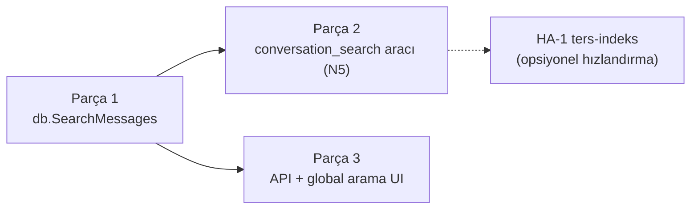

# 27 — Oturumlar-arası arama: tamamlanmış plan gövdesi (Parça 1–3, fazlama)

> Arşiv: `27-CROSS-SESSION-SEARCH.md` dosyasından taşınan, tamamlanmış plan/tasarım metni. Güncel durum için asıl dokümana bak.

## Parça 1 — DB arama çekirdeği (`db.SearchMessages`)

**Dosya:** `internal/db/store_search.go` (yeni).

```go
type SearchHit struct {
    SessionID   string
    SessionTitle string
    MessageID   string
    Role        string // user | assistant | tool
    AgentID     string
    Snippet     string // eşleşme çevresi, vurgulu
    Score       float64
    CreatedAt   int64
}

type SearchOpts struct {
    Query       string   // boşluk = AND'lenen terimler
    Kinds       []string // vars. ["chat"]; boş = tümü
    Roles       []string // boş = tümü
    ExcludeID   string   // mevcut oturumu hariç tut (opsiyonel)
    SinceUnix   int64    // 0 = sınır yok
    Limit       int      // vars. 20
}

func (d *DB) SearchMessages(ctx context.Context, o SearchOpts) ([]SearchHit, error)
```

**Algoritma (RLock altında, mevcut `ListMessages` deseni):**
1. Sorguyu küçük harfe çevir, boşlukla terimlere böl (AND semantiği).
2. `d.sessions` üzerinde gez → `Kinds`/`ExcludeID` filtreleri; eşleşen oturumun
   `d.messages[sid]`'inde her mesajın `Text`'inde (gerekirse `ReasoningContent`)
   **tüm terimleri** ara (case-insensitive `strings.Contains`).
3. **Skor** = terim-eşleşme yoğunluğu + recency tazeliği
   (`C5` felsefesiyle uyumlu: `α·matchCount + β·recency`). Basit başlar; C5 gelince
   ortak ağırlık fonksiyonuna bağlanabilir.
4. Eşleşme çevresinden **snippet** üret (ilk terim etrafında ~160 rune pencere,
   rune-sınırında kes — Türkçe güvenli, mevcut `clip` deseni).
5. Skora göre sırala, `Limit`'e kes.

**Felsefe uyumu:** dep-siz, kilit-güvenli, sıfır I/O (RAM'den okur), sıfır LLM çağrısı.

### Test
- `store_search_test.go`: çok-oturumlu seed → tek terim, çok terim (AND), rol
  filtresi, `ExcludeID`, limit, snippet rune-sınırı, boş sorgu → boş sonuç.

---

## Parça 2 — Ajan aracı `conversation_search` (= N5)

**Dosya:** `internal/tools/builtin_conversation_search.go` (yeni).

`ListSessionsTool` deseniyle birebir. Letta'nın `conversation_search` tool'unun
karşılığı; **N5'i doğrudan karşılar**.

```go
type ConversationSearchTool struct{ db *db.DB }
func NewConversationSearchTool(database *db.DB) ConversationSearchTool
```

| Alan | Şema |
|---|---|
| Ad | `conversation_search` |
| Açıklama | "Search the full message history of this workspace's sessions for a keyword or phrase. Returns matching turns with a snippet, session title and age — use it to recall what was said or decided in past conversations." |
| Girdi | `{ query: string (req), limit?: int=15, role?: "user"\|"assistant"\|"all", exclude_current?: bool }` |

`Call` → `db.SearchMessages` → her hit'i tek satır biçimle:
`- [assistant] "Session Title" · 3d ago — …snippet…`. Sonuç yoksa
"No matching messages." döndür.

### Test
- `builtin_conversation_search_test.go`: eşleşme biçimi, rol filtresi, boş sonuç,
  geçersiz girdi (boş query reddi).

---

## Parça 3 — Kullanıcı için global arama (API + UI)

**API:** `internal/api/sessions_search.go` (yeni) →
`GET /api/sessions/search?q=...&limit=...&role=...`. `withWorkspace` middleware
altında (workspace-scoped), `db.SearchMessages`'ı çağırır, `[]SearchHit` JSON döner.
Her hit `sessionId` + `messageId` taşır → UI sonuca tıklayınca oturumu açıp ilgili
mesaja kaydırır (deep-link).

**Frontend:** mevcut "/" komut paleti (`Runtime.Summarize` / talep-üzerine özetler)
veya sidebar arama kutusu içine bir **"Mesajlarda ara"** modu. Sonuç listesi:
oturum başlığı + snippet (eşleşme vurgulu) + yaş; tıkla → oturum + mesaj. Mevcut
sessions-only sidebar + okundu/okunmadı altyapısıyla uyumlu.

### Test
- `sessions_search_test.go`: endpoint workspace-izolasyonu (başka ws'in mesajı
  sızmaz), q boşsa 400, limit clamp.

---

## Geri-uyumluluk ve felsefe uyumu

- **Sıfır yeni bağımlılık** — saf-Go, RAM-içi; ripgrep/FTS5/SQLite yok.
- **Tek binary / offline korunur.**
- **Yeni veri yok** — mevcut `d.messages` üzerinden okur; migration yok.
- **Opt-in araç** — `conversation_search` lazy-load + capability gate; varsayılan
  davranış değişmez.

## Fazlama



| Adım | Efor | Bağımlılık | Değer |
|---|---|---|---|
| 1. `db.SearchMessages` çekirdek | ~yarım gün | yok | tüm üstyapının temeli |
| 2. `conversation_search` aracı (N5) | ~2 saat | Adım 1 | ajan recall'ı; N5 kapanır |
| 3. API + UI global arama | ~yarım gün | Adım 1 | kullanıcı değeri |

**Önerilen sıra:** 1 → 2 → 3. Adım 1 tek başına hiçbir şey göstermez ama 2 ve 3'ün
ortak temelidir; Adım 2 en düşük eforla en görünür ajan-değerini verir (N5'i de kapatır).

## Doğrulama

```powershell
cd <repo>
go build ./...
go test ./internal/db/... ./internal/tools/... ./internal/api/...
```
