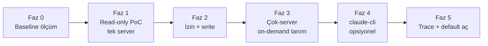

# 44 — Code execution with MCP: tamamlanmış faz planı

> Arşiv: `44-CODE-EXECUTION-MCP.md` dosyasından taşınan, tamamlanmış plan/tasarım metni. Güncel durum için asıl dokümana bak.

## 5. Fazlandırma

Her faz küçük, tek başına doğrulanabilir ve ölçülebilir kazanç üretir.

### Faz 0 — Ölçüm zemini (kod yok, sadece baseline)
- Mevcut senaryoda (ör. 3–7 MCP server etkin) tur-başı token profilini
  `debug.jsonl` / `turn-debug` ile kaydet: `in` (şema payı), `cacheRead`, `out`.
- **Kazanç metriği:** "araç şemalarının tur-başı input token payı" baseline'ı.

### Faz 1 — Read-only "MCP-as-code" PoC (tek server)
- Tek bir güvenli MCP server için binding ağacı üret (`./servers/<x>/*.py`) +
  loopback köprü (yalnız **read** araçları).
- Ajana `transform_data`'yı genişleten veya yeni `run_code` aracını ver.
- **Kazanç:** o server'ın araç şeması pencereden **tamamen çıkar**; tur-başı input
  token'da ölçülebilir düşüş. Doğrulama: aynı görev iki yolla (klasik vs kod)
  koşturulup `turn-debug` karşılaştırması.

### Faz 2 — İzin + mutasyon (write araçları)
- Köprüde per-call izin kancası; `ask` modunda kod içi mutasyon çağrıları
  TionHarness onay UI'ına düşer. Otonom ağ-mutasyon guard'ı köprüye taşınır.
- **Kazanç:** güvenli write; per-call gözlemlenebilirlik geri kazanılır.

### Faz 3 — Çok-server + on-demand tanım okuma
- N server için binding; model tanımları `Grep`/`Read` ile keşfeder.
- **Kazanç:** occupancy'nin asıl düşüşü burada (7 server senaryosunda 67K → ~birkaç K).

### Faz 4 — claude-cli entegrasyonu (opsiyonel/ileri)
- B1'i olgunlaştır (extended-tier deferral ölçümü) veya B2 köprüsü.

### Faz 5 — Trace/observability + varsayılan aç
- `run_code` içi MCP çağrılarını trace'e ayrı olay olarak yaz; UI kartı.
- Ölçülen kazanç + kabul edilir gözlemlenebilirlikte tunable default'u aç.

## 9. Özet & Önerilen İlk Faz

**Özet:** Code execution with MCP, TionHarness'in *occupancy* sorununu (mevcut tier
sistemi *deferral*'ı çözüyor ama şema gerektiğinde hâlâ pencereye giriyor) kökten
çözen tek yaklaşım. En büyük avantaj: TionHarness, deseni kurmak için gereken parçaların
çoğuna **zaten sahip** — `transform_data`'nın izole-subprocess + secret-allowlist +
"data dosyada kalır" çekirdeği, `mcp.pool.CallNamespaced` çağrı yolu, worktree
izolasyonu ve `debug.jsonl` ölçüm altyapısı. Sıfırdan inşa değil; mevcut çekirdeği
MCP çağrılarına **köprüleyip genişletme** işi.

**İki gerçek boşluk:** (1) izin taneselliği (kod bloğu içi çağrılar), (2) otonom
ağ-mutasyon guard'ının kod-moduna taşınması.

**Önerilen ilk faz — Faz 0 + Faz 1:**
1. **Faz 0:** 3–7 MCP server'lı bir senaryoda tur-başı token profilini
   `turn-debug` ile kaydet — "araç şemasının input token payı" baseline'ı.
2. **Faz 1:** Tek, güvenli, **read-only** bir MCP server için binding ağacı +
   loopback köprü PoC'si; `transform_data`'yı kaldıraç al. Aynı görevi klasik ve
   kod-modu ile koştur, `turn-debug` karşılaştır.

Kazanç ölçülüp regresyon (küçük ölçekte net zarar) elenmeden write/otonom fazlara
geçilmemeli.
