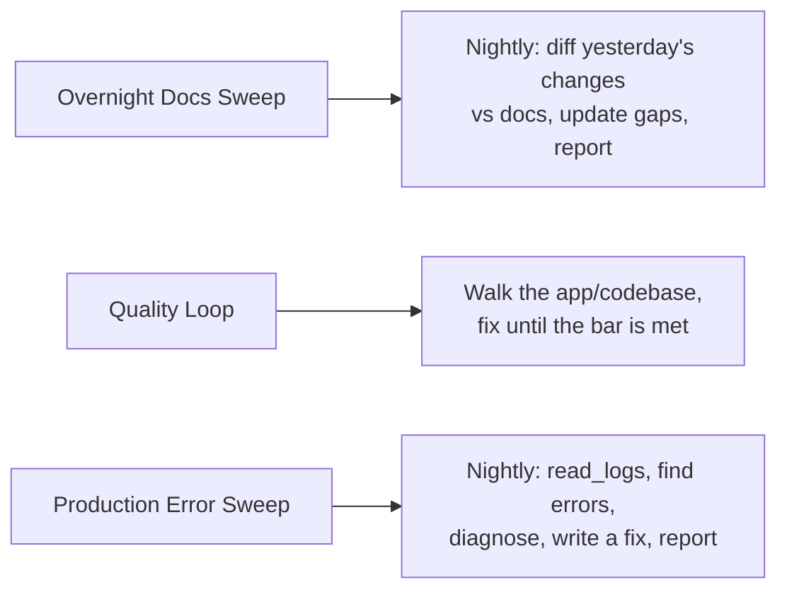
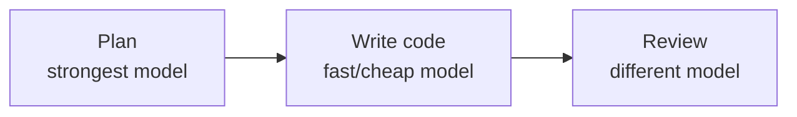

# SwarmGo — Autonomous Ops Playbook

There are levels to agentic work. **Beginners** prompt, wait, review, prompt
again — a human in every loop. **Experts** encode the loop once and let the
system run it: reusable skills, triggered automations, goal-bounded loops,
parallel fan-out, and the right model for each step. This skill is the
SwarmGo-native translation of that playbook — every pattern below maps to a real
SwarmGo primitive, not an aspiration.

> Reference context (what SwarmGo *is*): load `swarmgo-guide`.
> The tools that *do* these things: load `swarmgo-self-management`.
> Flow graph schema: load `swarmgo-flows`. App settings: `swarmgo-settings`.

## Concept map (playbook → SwarmGo)

| Expert pattern | SwarmGo primitive |
|----------------|-------------------|
| Coding agents (multiple harnesses) | **Agents** over providers: `claude-cli` (keyless), `anthropic`, `minimax`/OpenAI-compat, + custom providers |
| `agents.md` / `CLAUDE.md` rules | **Workspace config** (editable prompt/instructions) + per-agent system prompt + `swarmgo-settings` |
| Skills ("anything done twice") | **File-based skills**: `create_skill` / `use_skill`, global+workspace tiers, auto-summary |
| Automations (trigger → prompt) | **Schedules** (cron, workspace-scoped prompt delivery) for time triggers; **Hooks** (PreToolUse/PostToolUse) for event triggers |
| Loops (run until goal) | **Schedules** (cron), **`schedule_wake`** (single-shot self-wake, interactive turn only), **`run_subagent` async** (detached background run), and **Flows** (graph engine) — all budget-guarded |
| Quality gates | **Permission/approval layer** (`auto`/`ask`/`read-only`, arg-patterns) + **Hooks** |
| Auto code review (e.g. Greptile) | A dedicated **reviewer agent** invoked by a flow or schedule |
| Cloud vs local / infinite parallel | **Physical workspace isolation** + `run_subagent` (parallel isolated workers — sync or async) |
| Git worktrees (avoid conflicts) | **Per-workspace `store/` isolation** (the closest analog; see limits below) |
| Multimodal (model per task) | **Per-agent provider/model** + a **flow** whose nodes use different agents/models |
| Flywheel: perfect tests/docs/logs | Recurring **schedules** that sweep docs, tests, and `read_logs` nightly |

## 1. Agents & providers — pick the harness per job

SwarmGo runs each agent as its own runtime over a provider. You are not locked to
one vendor:

- **`claude-cli`** — local Claude CLI, keyless (uses the machine login). Drives its
  own tool loop via MCP delegation.
- **`anthropic`** — Messages API (native tool-use loop, token streaming, thinking).
- **`minimax` / OpenAI-compat** — any OpenAI-shaped endpoint via base URL.
- **Custom providers** — OpenRouter / Gemini / Kimi / Ollama, added in settings.

**Why mix them (speed + cost):** you do not need a frontier model for every step.
Reserve the strongest model for planning/review and use a cheaper, fast model for
the bulk code-writing. Set the model per agent; see the multi-model pipeline in §8.

## 2. Rules — the `agents.md` analog

Define *how* you want agents to behave once, not in every prompt:

- **Per-agent system prompt / instructions** — personality, response length
  ("short and sweet, no essays"), coding conventions, commit style.
- **Workspace config files** — editable prompt/instructions that apply to the
  whole workspace.
- **`swarmgo-settings`** — app-wide behavior an agent can read/live-apply with
  `get_settings` / `update_settings`.

Start with the model's voice and your hard preferences; refine as you learn what
you keep correcting by hand — then bake that correction into the rules.

## 3. Skills — anything you do more than once

The single highest-leverage habit: **if you do it twice, make it a skill.**
A skill is markdown instructions (optionally with reference files) that any agent
loads with `use_skill`. Author them with `create_skill` (self-management).

Use skills for:

1. **Repeated prompts** — invoke instead of re-pasting.
2. **Domain rules** — house writing style, issue templates, company facts.
3. **Tool/CLI instructions** — how tests are kicked off, how a specific API/CLI is
   called, expected responses. Define once; never re-explain the endpoints.
4. **Quality gates** — "before opening a PR run all tests, require 100% pass, fix
   failures" encoded as one invokable procedure.

Agents **auto-discover** relevant skills at runtime (auto-summary surfaces them),
so you do not always have to name one explicitly. Keep skills focused and
composable rather than one mega-skill.

## 4. Automations — triggers that prompt an agent

Two trigger families:

### Time triggers → Schedules
Cron-driven prompts delivered to an agent, scoped to a workspace
(`create_schedule`). This is the engine behind every nightly "sweep". Example
intent: *"At 01:00 daily, review the codebase, update any stale docs, and report
what changed."*

### Event triggers → Hooks
`PreToolUse` / `PostToolUse` external commands intercept native tool calls (Claude
Code hook contract) — `create_hook`. Use them to *gate* (block a risky tool before
it runs) or *react* (lint/format/log after a write). This is your event-driven
automation + part of your quality gate.

> The video's "PR opened → wait for review comments → address → push" automation
> translates to: a **schedule or flow** that triggers a **reviewer agent**, which
> waits for / reads the review output and then has the worker agent apply fixes.

## 5. Loops — run until a goal is met

A loop is just **trigger + repeated action + stopping goal** (so it does not run
forever). SwarmGo gives you these options — there is no longer a periodic
heartbeat ticker; every autonomous run requires an explicit trigger:

- **Schedules** — a cron schedule re-invokes an agent on a timer. Give it a
  goal-shaped prompt; each tick iterates toward the goal. The **daily budget
  guardrail** (`ensureBudget`) is the hard stop, so a scheduled loop cannot burn
  forever.
- **`schedule_wake`** — a single-shot self-wake timer inside an interactive chat
  turn; the agent fires once more after the delay. Good for "check back in N
  minutes" within a conversation, not for standing automation.
- **`run_subagent` (async)** — kick off a detached background run for an existing
  agent (`wait:"async"`); the current turn proceeds immediately. The subagent runs
  one autonomous turn; re-invoke with another async call if the loop needs to
  iterate.
- **Flows** — the graph engine (`agent`/`branch`/`parallel`/`delay`/`transform`)
  for a *structured* loop with explicit branch conditions and restart-safe state.

**Concrete loops to ship (schedule the autonomous variant):**

- **Overnight docs sweep** — schedule at 01:00 → agent compares the day's changes
  to docs and closes gaps.
- **Quality loop** — autonomous agent keeps optimizing until a measurable bar
  (test pass %, perf target) is met, then stops.
- **Production error sweep** — schedule → agent calls `read_logs`, analyzes each
  error, proposes a fix. "By morning the fix is already written."

## 6. Parallelism — fan out without melting the machine

- **`run_subagent` (multiple calls in one turn)** — each `run_subagent` call in
  a single turn runs in parallel (goroutine fan-out, shared atomic budget). Use
  built-in profiles (`explore`/`coder`/`reviewer`) for ephemeral isolated workers,
  or pass an existing agent name/ID for a persistent agent. Gated by the
  *Delegation* capability (`enableDelegation`). Concurrency is bounded by
  `SpawnMaxConcurrent` and `DelegationMaxCalls`.
- **Physical workspace isolation** — each workspace is a separate `store/` +
  runtime + scheduler. This is SwarmGo's "isolated environment" answer to the
  cloud-agent pitch: agents in different workspaces never collide.

**The worktree caveat (be honest):** the expert playbook uses git worktrees so
parallel agents don't clobber the same files. SwarmGo isolates at the
*workspace* level, not per-agent-within-a-workspace. So multiple agents writing
the **same files in the same workspace** can still conflict — split them across
workspaces, or give each a non-overlapping area of the codebase.

> SwarmGo has no built-in git merge/deploy orchestration — the "many agents
> racing to merge into main" problem from the playbook is out of scope here. If
> agents touch a real git repo, serialize merges yourself or batch them.

## 7. The quality flywheel

The expert claim: there is no excuse for sub-optimal code, stale docs, or blind
spots — because each can be a standing automation:

1. **Tests** — a schedule that checks coverage and writes missing tests.
2. **Docs** — the overnight docs sweep (§5).
3. **Logging** — "log everything" with a 7–30 day window, then let the production
   error sweep mine it. Full log coverage is what makes the error loop possible.

Three standing loops — tests, docs, logs — compound into a codebase that stays
healthy without you in every cycle.

## 8. Multi-model pipeline (build → write → review)

Encode model selection as a **skill + flow** so each step uses the right tool:

- **Plan** with your most capable model (sees the whole codebase, designs the
  change).
- **Write** with a fast, cheaper code model — plan is done, raw execution doesn't
  need the frontier model.
- **Review** with a *different* model than wrote it, for an independent viewpoint.

In SwarmGo: distinct agents (each pinned to its provider/model) wired as nodes in
a flow, or a skill that says which agent to hand off to at each stage.

## 9. Guardrails — keep autonomy safe

- **Per-agent budgets** — `daily_call_limit` / `daily_token_limit` (0 = unlimited)
  bound any autonomous loop's spend.
- **Permission layer** — `auto` / `ask` / `read-only` modes; arg-based patterns
  narrow a blanket "always allow" to a command family (e.g. `shell(git *)` runs
  unattended while `rm` still prompts). Run loops in a mode you trust.
- **Hooks as hard gates** — a `PreToolUse` hook can block a tool before it runs.
- **Provenance** — destructive self-management ops are limited to entities the
  agent created. Lean on it; don't work around it.

## Putting it together (a reference setup)

1. Write the **rules** (per-agent instructions) so every agent talks/codes your way.
2. Turn each repeated procedure into a **skill** (tests gate, deploy checklist, API recipe).
3. Add standing **schedules**: nightly docs sweep, coverage check, production error sweep.
4. Add **hooks** for event reactions (format-on-write) and hard gates (block destructive tools).
5. For big jobs, **fan out with `run_subagent`** (parallel profiles or agents) and/or split across **workspaces**.
6. Build the **multi-model flow** for feature work (plan → write → review).
7. Cap everything with **budgets + permission mode** so it runs unattended safely.

## Pitfalls

- **Loop with no goal** = runaway. Always state the stopping condition; rely on the
  budget guard as a backstop, not the plan.
- **Same-workspace file conflicts** — parallel agents on the same files still
  collide; isolate by workspace or by code area.
- **`run_subagent` fan-out is capped** — `DelegationMaxCalls` (default 8) per turn and `SpawnMaxConcurrent` (default 16) overall. Design fan-out within these limits.
- **MCP/server changes apply next turn** — a newly created server's tools aren't
  available until the following turn.
- **No git merge/deploy layer** — handle real-repo merges outside SwarmGo.
